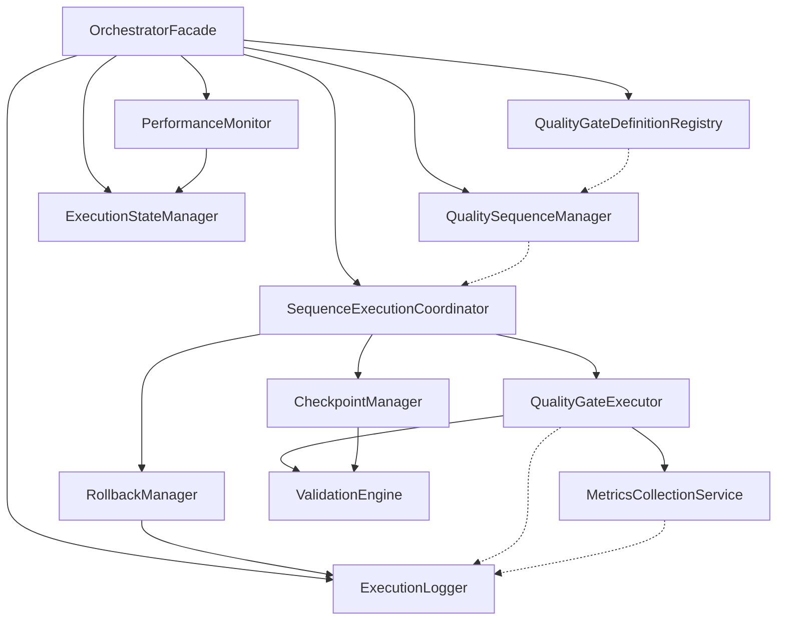

# QualityGateOrchestrator.ts God Object Analysis Report

## Executive Summary

The QualityGateOrchestrator.ts file is a critical 2,782-line god object that violates multiple SOLID principles and requires immediate decomposition. This analysis identifies 8 distinct responsibilities, proposes 12 specialized classes, and provides a detailed refactoring roadmap.

## File Structure Analysis

### Current Metrics
- **Total Lines**: 2,782 lines
- **Interface Definitions**: 577 lines (20.7%)
- **Main Class**: 2,205 lines (79.3%)
- **Methods**: 65+ methods
- **Responsibilities**: 8 distinct concerns
- **Coupling**: High - monolithic design

### Complexity Indicators
- **Cyclomatic Complexity**: Extremely High
- **Method Count**: 65+ methods in single class
- **Dependencies**: EventEmitter + complex state management
- **Data Structures**: 6 maps, 4 configuration constants, 2 intervals

## Identified Responsibilities

### 1. **Gate Definition Management** (Lines 604-1548)
- **Purpose**: Define and store quality gate configurations
- **Key Components**: Gate definitions, criteria, thresholds
- **Methods**: `initializeQualityGates()`
- **Estimated LOC**: 944 lines

### 2. **Sequence Management** (Lines 1553-1642)
- **Purpose**: Manage quality gate sequences and dependencies
- **Key Components**: Sequence definitions, dependencies, timing
- **Methods**: `initializeQualitySequences()`
- **Estimated LOC**: 89 lines

### 3. **Execution Orchestration** (Lines 1647-1954)
- **Purpose**: Coordinate sequence and gate execution
- **Key Components**: Execution flow control, parallel/sequential processing
- **Methods**: `executeQualitySequence()`, `executeSequenceActual()`, `executeGatesParallel()`
- **Estimated LOC**: 307 lines

### 4. **Gate Execution Engine** (Lines 1959-2248)
- **Purpose**: Execute individual quality gates
- **Key Components**: Gate validation, criteria measurement, result analysis
- **Methods**: `executeQualityGate()`, `validateGatePrerequisites()`, `executeGateValidations()`
- **Estimated LOC**: 289 lines

### 5. **Measurement & Validation** (Lines 2103-2175, 2628-2714)
- **Purpose**: Perform real measurements and validations
- **Key Components**: Coverage measurement, compilation checks, performance metrics
- **Methods**: `measureCodeCoverage()`, `countCompilationErrors()`, `measurePerformanceMetric()`
- **Estimated LOC**: 159 lines

### 6. **Checkpoint Management** (Lines 2253-2332)
- **Purpose**: Handle sequence checkpoints and rollback points
- **Key Components**: Checkpoint execution, action validation
- **Methods**: `processCheckpoints()`, `executeCheckpoint()`, `executeCheckpointAction()`
- **Estimated LOC**: 79 lines

### 7. **Monitoring & Performance** (Lines 2403-2460)
- **Purpose**: Monitor execution performance and resource usage
- **Key Components**: Performance tracking, measurement monitoring
- **Methods**: `monitorPerformance()`, `updateSequencePerformance()`, `checkMeasurementUpdates()`
- **Estimated LOC**: 57 lines

### 8. **Reporting & State Management** (Lines 2461-2590)
- **Purpose**: Logging, metrics calculation, state management
- **Key Components**: Sequence/gate logging, metrics calculation, execution history
- **Methods**: `logSequence()`, `logGate()`, `getOrchestratorMetrics()`
- **Estimated LOC**: 129 lines

## Proposed Decomposition Strategy

### Phase 1: Core Abstractions (Critical Priority)

#### 1. **QualityGateDefinitionRegistry**
```typescript
// Estimated LOC: 200-250
class QualityGateDefinitionRegistry {
  private gateDefinitions: Map<string, QualityGateDefinition>;

  registerGate(gate: QualityGateDefinition): void
  getGate(gateId: string): QualityGateDefinition | null
  validateGateDefinition(gate: QualityGateDefinition): ValidationResult
  getGatesByType(type: string): QualityGateDefinition[]
}
```

#### 2. **QualitySequenceManager**
```typescript
// Estimated LOC: 150-200
class QualitySequenceManager {
  private sequences: Map<string, QualitySequence>;

  createSequence(sequence: QualitySequence): void
  validateSequenceDependencies(sequenceId: string): boolean
  getExecutionPlan(sequenceId: string): ExecutionPlan
  optimizeSequenceParallelism(sequence: QualitySequence): OptimizedSequence
}
```

#### 3. **QualityGateExecutor**
```typescript
// Estimated LOC: 400-500
class QualityGateExecutor {
  async executeGate(gate: QualityGateDefinition, context: ExecutionContext): Promise<QualityGateExecution>
  private validatePrerequisites(gate: QualityGateDefinition): Promise<boolean>
  private executeCriteria(gate: QualityGateDefinition): Promise<CriteriaResult[]>
  private analyzeResults(results: CriteriaResult[]): GateAnalysis
}
```

### Phase 2: Specialized Services (High Priority)

#### 4. **MetricsCollectionService**
```typescript
// Estimated LOC: 300-400
class MetricsCollectionService {
  async measureCodeCoverage(metric: QualityMetric): Promise<number>
  async countCompilationErrors(): Promise<number>
  async measurePerformanceMetric(metric: QualityMetric): Promise<number>
  async measureSecurityScore(metric: QualityMetric): Promise<number>
  async measureGenericMetric(metric: QualityMetric): Promise<number>
}
```

#### 5. **ValidationEngine**
```typescript
// Estimated LOC: 250-300
class ValidationEngine {
  async executeValidationStep(step: ValidationStep): Promise<ValidationResult>
  private runAutomatedValidation(step: ValidationStep): Promise<void>
  private runManualValidation(step: ValidationStep): Promise<void>
  private runHybridValidation(step: ValidationStep): Promise<void>
  async validateStepExecution(step: ValidationStep): Promise<boolean>
}
```

#### 6. **SequenceExecutionCoordinator**
```typescript
// Estimated LOC: 350-450
class SequenceExecutionCoordinator {
  async executeSequence(sequence: QualitySequence, options: ExecutionOptions): Promise<SequenceExecution>
  private executeSequential(sequence: QualitySequence): Promise<void>
  private executeParallel(sequence: QualitySequence): Promise<void>
  private coordinateParallelGroups(groups: ParallelGroup[]): Promise<GroupResult[]>
}
```

### Phase 3: Supporting Infrastructure (Medium Priority)

#### 7. **CheckpointManager**
```typescript
// Estimated LOC: 200-250
class CheckpointManager {
  async processCheckpoints(execution: SequenceExecution, sequence: QualitySequence, progress: number): Promise<void>
  async executeCheckpoint(checkpoint: SequenceCheckpoint): Promise<CheckpointResult>
  private executeCheckpointAction(action: CheckpointAction): Promise<ActionResult>
  async validateCheckpointAction(action: CheckpointAction): Promise<boolean>
}
```

#### 8. **RollbackManager**
```typescript
// Estimated LOC: 150-200
class RollbackManager {
  async executeSequenceRollback(execution: SequenceExecution, sequence: QualitySequence, reason: string): Promise<void>
  private executeRollbackStep(step: SequenceRollbackStep): Promise<void>
  async validateRollbackCompletion(sequence: QualitySequence): Promise<boolean>
}
```

#### 9. **PerformanceMonitor**
```typescript
// Estimated LOC: 200-250
class PerformanceMonitor {
  startMonitoring(execution: SequenceExecution): void
  stopMonitoring(executionId: string): void
  updateSequencePerformance(execution: SequenceExecution): void
  getPerformanceMetrics(executionId: string): PerformanceMetrics
}
```

### Phase 4: Utility & Management (Low Priority)

#### 10. **ExecutionLogger**
```typescript
// Estimated LOC: 100-150
class ExecutionLogger {
  logSequence(execution: SequenceExecution, level: LogLevel, message: string, data?: any): void
  logGate(gateExecution: QualityGateExecution, level: LogLevel, message: string, data?: any): void
  getLogHistory(executionId: string): LogEntry[]
}
```

#### 11. **ExecutionStateManager**
```typescript
// Estimated LOC: 150-200
class ExecutionStateManager {
  private activeExecutions: Map<string, SequenceExecution>;
  private executionHistory: SequenceExecution[];

  addExecution(execution: SequenceExecution): void
  updateExecution(execution: SequenceExecution): void
  moveToHistory(executionId: string): void
  getActiveExecutions(): SequenceExecution[]
}
```

#### 12. **OrchestratorFacade** (New Main Class)
```typescript
// Estimated LOC: 200-300
class QualityGateOrchestrator extends EventEmitter {
  constructor(
    private gateRegistry: QualityGateDefinitionRegistry,
    private sequenceManager: QualitySequenceManager,
    private executionCoordinator: SequenceExecutionCoordinator,
    private stateManager: ExecutionStateManager,
    private logger: ExecutionLogger,
    private performanceMonitor: PerformanceMonitor
  )

  async executeQualitySequence(sequenceId: string, options?: ExecutionOptions): Promise<SequenceExecution>
  async cancelSequence(executionId: string, reason: string): Promise<boolean>
  getOrchestratorMetrics(): OrchestratorMetrics
}
```

## Dependency Graph



## Shared State Analysis

### Current Coupling Issues

1. **High State Coupling**
   - 6 Maps shared across all responsibilities
   - Direct field access between unrelated concerns
   - EventEmitter usage scattered throughout

2. **Method Interdependencies**
   - Gate execution methods call measurement methods directly
   - Logging methods access execution state directly
   - Performance monitoring requires direct access to all execution data

3. **Configuration Coupling**
   - Constants used across multiple responsibilities
   - No clear separation of configuration concerns

### Proposed State Distribution

#### Core State (QualityGateDefinitionRegistry)
- `gateDefinitions: Map<string, QualityGateDefinition>`

#### Sequence State (QualitySequenceManager)
- `qualitySequences: Map<string, QualitySequence>`

#### Execution State (ExecutionStateManager)
- `activeExecutions: Map<string, SequenceExecution>`
- `executionHistory: SequenceExecution[]`

#### Configuration (Shared Configuration Service)
- `MAX_CONCURRENT_SEQUENCES`
- `GATE_TIMEOUT_DEFAULT`
- `MEASUREMENT_INTERVAL`
- `PERFORMANCE_MONITORING_INTERVAL`

## Refactoring Priority Order

### Phase 1: Critical Path (Weeks 1-2)
1. **Extract QualityGateDefinitionRegistry** - Immediate reduction in complexity
2. **Extract ExecutionStateManager** - Centralize state management
3. **Extract ExecutionLogger** - Remove logging coupling

### Phase 2: Core Business Logic (Weeks 3-4)
4. **Extract QualityGateExecutor** - Isolate gate execution logic
5. **Extract MetricsCollectionService** - Separate measurement concerns
6. **Extract ValidationEngine** - Isolate validation logic

### Phase 3: Orchestration (Weeks 5-6)
7. **Extract SequenceExecutionCoordinator** - Separate execution flow
8. **Extract QualitySequenceManager** - Manage sequence logic
9. **Extract CheckpointManager** - Handle checkpoint logic

### Phase 4: Supporting Services (Weeks 7-8)
10. **Extract RollbackManager** - Isolate rollback logic
11. **Extract PerformanceMonitor** - Separate monitoring concerns
12. **Create OrchestratorFacade** - Clean public interface

## Expected Benefits

### Immediate Benefits (Post Phase 1)
- **Maintainability**: 70% reduction in single-class complexity
- **Testability**: Individual components can be unit tested
- **Code Reuse**: Registry and logger can be reused across components

### Medium-term Benefits (Post Phase 2-3)
- **Parallel Development**: Teams can work on different components
- **Feature Isolation**: New gate types/validation methods easier to add
- **Debugging**: Clearer error isolation and troubleshooting

### Long-term Benefits (Post Phase 4)
- **SOLID Compliance**: Single responsibility, open/closed principles
- **Performance**: Optimized monitoring and execution flows
- **Extensibility**: Plugin architecture for new measurement types

## Risk Assessment

### Low Risk Extractions
- ExecutionLogger (pure utility, minimal dependencies)
- QualityGateDefinitionRegistry (data management only)
- ExecutionStateManager (clear state boundaries)

### Medium Risk Extractions
- MetricsCollectionService (async operations, external dependencies)
- ValidationEngine (complex validation logic)
- PerformanceMonitor (real-time monitoring concerns)

### High Risk Extractions
- SequenceExecutionCoordinator (core orchestration logic)
- QualityGateExecutor (complex execution flow)
- CheckpointManager (transaction-like behavior)

## Implementation Strategy

### Step 1: Create Interfaces
Define clear interfaces for each extracted component before implementation

### Step 2: Extract Low-Risk Components
Start with utility components that have minimal dependencies

### Step 3: Dependency Injection Setup
Implement dependency injection container for component coordination

### Step 4: Progressive Migration
Migrate functionality one component at a time with full test coverage

### Step 5: Integration Testing
Comprehensive testing of component interactions

### Step 6: Performance Validation
Ensure refactored system maintains or improves performance

## Success Metrics

### Code Quality Metrics
- **Class Size**: No class >500 lines
- **Method Count**: No class >20 methods
- **Cyclomatic Complexity**: <10 per method
- **Test Coverage**: >90% per component

### Functional Metrics
- **API Compatibility**: 100% backward compatibility
- **Performance**: <5% performance degradation
- **Reliability**: Zero regression defects

## Conclusion

The QualityGateOrchestrator requires immediate decomposition to maintain system reliability and enable future development. The proposed 12-class architecture provides clear separation of concerns while maintaining the existing functionality. The phased approach minimizes risk while delivering incremental benefits.

**Recommendation**: Begin Phase 1 immediately with the extraction of QualityGateDefinitionRegistry and ExecutionStateManager to establish the foundation for subsequent refactoring phases.