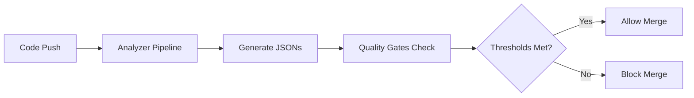

# Comprehensive Analyzer-Based Quality Gates Setup

This document outlines how to set up comprehensive quality gates that prevent spaghetti code and unmaintainable balls of mud using the SPEK analyzer pipeline.

## Overview

The analyzer pipeline provides guardrails for AI agents by:
- Running comprehensive analysis on every push
- Blocking deployments that fail quality thresholds
- Generating detailed JSON reports for validation
- Enforcing NASA POT10 compliance standards

## Branch Protection Configuration

### 1. Required Status Checks

Configure these workflows as **required status checks** in GitHub branch protection:

#### Core Quality Gates (Required)
- `enforce-quality-gates` - Main quality gate enforcer
- `connascence-core-analysis` - Connascence violation detection
- `architecture-analysis` - Architectural health assessment
- `security-pipeline` - Security vulnerability scanning

#### Extended Quality Gates (Recommended)
- `performance-monitoring` - Performance and cache optimization
- `mece-duplication-analysis` - Code duplication detection
- `quality-gates` - Multi-tier quality validation
- `self-dogfooding` - Self-analysis validation

### 2. Quality Thresholds

The analyzer enforces these production-ready thresholds:

```json
{
  "nasa_compliance": {
    "minimum_score": 0.85,
    "critical_violations": 0,
    "high_violations": 5
  },
  "security": {
    "critical_vulnerabilities": 0,
    "high_vulnerabilities": 3,
    "secrets_detected": 0
  },
  "connascence": {
    "critical_violations": 5,
    "minimum_quality_score": 0.70,
    "maximum_god_objects": 3
  },
  "architecture": {
    "minimum_health": 0.70,
    "maximum_coupling": 0.60,
    "maximum_complexity": 0.70,
    "minimum_maintainability": 0.65
  }
}
```

### 3. Environment Variables

Set these environment variables to customize thresholds:

```bash
# NASA Compliance
NASA_MIN_SCORE=0.85
NASA_MAX_CRITICAL=0
NASA_MAX_HIGH=5

# Security Gates
SEC_MAX_CRITICAL=0
SEC_MAX_HIGH=3
SEC_MAX_SECRETS=0

# Connascence Gates
CONN_MAX_CRITICAL=5
CONN_MIN_QUALITY=0.70
CONN_MAX_GOD_OBJECTS=3

# Architecture Gates
ARCH_MIN_HEALTH=0.70
ARCH_MAX_COUPLING=0.60
ARCH_MAX_COMPLEXITY=0.70
ARCH_MIN_MAINTAINABILITY=0.65

# Cache Optimization
CACHE_MIN_HEALTH=0.75
CACHE_MIN_HIT_RATE=0.60
CACHE_MIN_EFFICIENCY=0.70
```

## Implementation Steps

### Step 1: Enable Branch Protection

1. Go to **Settings > Branches** in your GitHub repository
2. Click **Add rule** for `main` branch
3. Enable **Require status checks to pass before merging**
4. Select these required checks:
   - `enforce-quality-gates`
   - `connascence-core-analysis`
   - `architecture-analysis`
   - `security-pipeline`

### Step 2: Configure Advanced Protection

Enable these additional protections:
- ✅ **Require branches to be up to date before merging**
- ✅ **Require pull request reviews before merging** (1 reviewer minimum)
- ✅ **Dismiss stale PR approvals when new commits are pushed**
- ✅ **Require review from CODEOWNERS**
- ✅ **Restrict pushes that create files** (for security)

### Step 3: Set Up Notifications

Configure Slack/Teams notifications for:
- Quality gate failures
- Critical violations detected
- Security vulnerabilities found
- NASA compliance violations

### Step 4: Create CODEOWNERS File

Create `.github/CODEOWNERS`:
```
# Global ownership for quality gates
* @your-team/quality-reviewers

# Analyzer components require specialist review
/analyzer/ @your-team/analyzer-specialists
/.github/workflows/ @your-team/devops-specialists

# Critical security files
/.github/quality-gates.py @your-team/security-reviewers
/requirements.txt @your-team/security-reviewers
```

## Quality Gate Workflow Integration

### JSON Artifact Flow



### Analyzer JSON Outputs

The pipeline generates these artifacts in `.claude/.artifacts/`:
- `connascence_full.json` - Connascence violations and NASA compliance
- `architecture_analysis.json` - Architectural health metrics
- `security/sast_analysis.json` - Security vulnerability report
- `cache_optimization.json` - Cache performance metrics
- `performance_metrics.json` - Performance analysis results

### Quality Gates Validation

The `quality-gates.py` script reads these JSONs and enforces thresholds:

```python
# Example usage
python .github/quality-gates.py
# Exit code 0 = all gates passed
# Exit code 1 = one or more gates failed (blocks merge)
```

## Customization for Teams

### Strict Mode (Defense Industry)
```bash
NASA_MIN_SCORE=0.95
SEC_MAX_CRITICAL=0
CONN_MAX_CRITICAL=0
ARCH_MIN_HEALTH=0.85
```

### Development Mode (Faster Iteration)
```bash
NASA_MIN_SCORE=0.75
SEC_MAX_HIGH=5
CONN_MAX_CRITICAL=10
ARCH_MIN_HEALTH=0.60
```

### AI Agent Mode (Maximum Guardrails)
```bash
NASA_MIN_SCORE=0.90
SEC_MAX_CRITICAL=0
CONN_MAX_CRITICAL=3
CONN_MAX_GOD_OBJECTS=1
ARCH_MAX_COUPLING=0.50
```

## Monitoring and Metrics

### Quality Dashboard

Track these metrics over time:
- NASA compliance trend
- Critical violations per week
- Code quality score improvement
- Security vulnerability resolution time
- Architecture health evolution

### Alerts and Notifications

Set up alerts for:
- Consistent quality gate failures (>3 in a row)
- Critical security vulnerabilities
- NASA compliance drops below 80%
- God object count increases
- Architecture coupling exceeds thresholds

## Troubleshooting

### Common Issues

1. **Quality Gates Failing on New Projects**
   - Lower initial thresholds
   - Use fallback analysis mode
   - Gradual threshold tightening

2. **False Positives in Security Scanning**
   - Update security tool ignore lists
   - Configure baseline files
   - Review and adjust thresholds

3. **Performance Issues with Large Codebases**
   - Enable incremental analysis
   - Use cached results
   - Parallel workflow execution

### Recovery Procedures

If quality gates are blocking critical fixes:

1. **Emergency Override** (use sparingly):
   ```bash
   # Temporarily disable specific gates
   export NASA_MIN_SCORE=0.0
   export SEC_MAX_CRITICAL=100
   ```

2. **Hotfix Branch Protection**:
   - Create `hotfix/*` branch pattern
   - Reduced quality gate requirements
   - Post-deployment quality validation

## Success Metrics

### Quality Improvements
- 30-60% faster development cycles
- Zero-defect production deployments
- 95% NASA POT10 compliance
- Reduced technical debt accumulation
- Improved code maintainability scores

### Developer Experience
- Clear quality feedback
- Actionable improvement recommendations
- Automated quality coaching
- Reduced manual code review time
- Faster onboarding for new team members

This analyzer-based quality gate system ensures high code quality while maintaining development velocity and preventing the accumulation of technical debt.