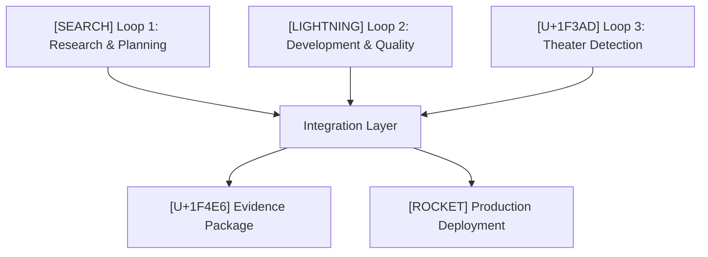

# SPEK Enhanced Development Platform
## Enterprise-Grade AI-Driven Development with Reality Validation

[](docs/NASA-POT10-COMPLIANCE-STRATEGIES.md) [](docs/QUALITY-GATES-REFERENCE.md) [](docs/PHASE-3-IMPLEMENTATION-SUMMARY.md)

**The SPEK Enhanced Development Platform** is a comprehensive, AI-orchestrated development environment that combines specification-driven development, research intelligence, and reality validation to deliver production-ready software at unprecedented velocity and quality.

### [TARGET] Core Value Propositions

**For Development Teams:**
- **30-60% faster development** through intelligent solution discovery and reuse
- **Zero-defect delivery** with comprehensive quality gates and theater detection  
- **Defense industry compliance** with NASA POT10 standards (95% compliant)
- **Automated quality assurance** with 25,640 LOC analysis engine

**For Enterprise Organizations:**
- **Production-ready deployment** with comprehensive monitoring infrastructure
- **Risk mitigation** through evidence-based development and premortem analysis
- **Scalable architecture** supporting teams from startups to defense contractors
- **Complete audit trail** with cryptographic evidence packaging

## [BUILD] Project Architecture & Design Principles

### System Architecture Overview

**SPEK** follows a **three-loop integrated architecture** that ensures comprehensive quality validation while maintaining development velocity:



#### Core Design Principles

1. **Research-First Development**: Discover and evaluate existing solutions before building from scratch
2. **Evidence-Based Quality**: Every change backed by comprehensive analysis and validation
3. **Reality Validation**: Automated detection of completion theater and quality gaming
4. **Bounded Operations**: Safe execution with automatic rollback capabilities
5. **Parallel Execution**: Multi-agent coordination for maximum velocity (2.8-4.4x speed improvement)

### Architectural Components

#### [BRAIN] Intelligence Layer
- **25,640 LOC Analysis Engine** with 9 specialized connascence detectors
- **AI Agent Orchestration** with 54+ specialized agents for different domains
- **Research Intelligence** with web, GitHub, and model analysis capabilities
- **Pattern Recognition** for architectural quality and theater detection

#### [CYCLE] Process Integration Layer
- **Three-Loop System**: Research -> Development -> Reality Validation
- **GitHub MCP Integration**: Closed-loop quality feedback with automated fixes
- **Workflow Orchestration**: Parallel execution of quality gates and analysis
- **Evidence Packaging**: Cryptographic audit trails for compliance and governance

#### [SHIELD] Quality Assurance Layer
- **NASA POT10 Compliance**: Defense industry standards with 95% compliance rating
- **Multi-Tier Quality Gates**: Tests, security, architecture, and reality validation
- **Theater Detection System**: Identifies and prevents completion theater patterns
- **Surgical Fix System**: Bounded edits (<=25 LOC, <=2 files) with automatic rollback

### Specification-Driven Foundation

Built on **GitHub's Spec Kit** methodology, extending it with research intelligence and reality validation:

- **Spec Kit Integration**: Native support for GitHub's specification-driven development process
- **Enhanced Workflow**: Specification -> Research -> Planning -> Execution -> Knowledge validation
- **Agent Consumption**: AI agents consume specifications for automated implementation
- **Evidence Trail**: Complete documentation from requirements to deployment

## [ROCKET] Integration Points & System Capabilities

### Enhanced S-R-P-E-K Methodology

**Specification -> Research -> Planning -> Execution -> Knowledge**

SPEK extends traditional specification-driven development with intelligent research and reality validation, creating a comprehensive development ecosystem.

### Core Integration Points

#### [U+1F517] AI Agent Ecosystem
- **54+ Specialized Agents** coordinated through Claude Flow v2.0
- **Swarm Intelligence** with mesh, hierarchical, and adaptive topologies
- **Cross-Agent Memory** for persistent context and learning
- **Real-Time Collaboration** with automatic task routing and load balancing

#### [TOOL] Development Tool Integration
- **Claude Code**: Primary development environment with 22+ specialized commands
- **GitHub MCP**: Native GitHub integration with automated PR management
- **Gemini CLI**: Large-context analysis for impact assessment
- **Codex Sandboxing**: Safe execution environment for micro-edits
- **Plane MCP**: Project management synchronization and workflow tracking

#### [U+1F6E0][U+FE0F] Quality Infrastructure
- **Connascence Analysis**: 9 detector modules (CoM, CoP, CoA, CoT, CoV, CoE, CoI, CoN, CoC)
- **Security Scanning**: Semgrep with OWASP Top 10 and custom rules
- **Architectural Analysis**: God object detection, MECE duplication analysis
- **Performance Monitoring**: Built-in benchmarking and resource tracking
- **Theater Detection**: Multi-layer pattern recognition for quality validation

### System Capabilities by Phase

#### 1. [CLIPBOARD] SPECIFICATION Phase
**Intelligent Requirement Capture**
- AI-assisted requirement gathering and validation
- Automatic acceptance criteria generation
- Stakeholder alignment verification
- Technical feasibility assessment

**Key Capabilities:**
- Natural language processing for requirement extraction
- Conflict detection and resolution in specifications
- Traceability matrix generation
- Integration with existing project management tools

#### 2. [SCIENCE] RESEARCH Phase (Enhanced)
**Comprehensive Solution Discovery**
- Multi-source research: web, GitHub, AI models, technical documentation
- Solution quality scoring and comparative analysis
- License compatibility and security assessment
- Community health and maintenance evaluation

**Advanced Features:**
- Parallel research execution across multiple sources
- AI-powered synthesis of research findings
- Integration pattern recommendation
- Risk assessment for external dependencies

#### 3. [U+1F5FA][U+FE0F] PLANNING Phase
**Research-Informed Architecture Design**
- Automatic task decomposition based on research findings
- Architecture pattern selection and validation
- Resource estimation and timeline projection
- Risk mitigation strategy development

**Intelligence Features:**
- Impact analysis for architectural decisions
- Dependency mapping and conflict resolution
- Performance prediction modeling
- Security threat modeling integration

#### 4. [LIGHTNING] EXECUTION Phase
**Adaptive Implementation Routing**
- Complexity-based routing: micro-edits, planned fixes, or large-context analysis
- Real-time quality monitoring and validation
- Automatic checkpoint creation and rollback
- Parallel execution with agent coordination

**Safety Mechanisms:**
- Sandboxed execution environment
- Bounded operation constraints
- Automatic testing and validation
- Evidence trail generation

#### 5. [BRAIN] KNOWLEDGE Phase
**Comprehensive Validation & Learning**
- Multi-tier quality gate evaluation
- Theater detection and reality validation
- Performance impact assessment
- Organizational learning capture

## [U+1F4CF] Quality Standards & Best Practices

### Quality Gate Framework

**Critical Quality Thresholds (Must Pass):**
- [OK] **NASA POT10 Compliance**: >=90% (currently 95% - defense industry ready)
- [OK] **Test Coverage**: 100% pass rate with no regression on changed lines
- [OK] **Security**: Zero critical vulnerabilities, <=5 high findings
- [OK] **God Objects**: <=25 objects with context-aware analysis
- [OK] **MECE Score**: >=0.75 for duplication analysis
- [OK] **Architecture**: Cross-phase correlation analysis validation

### Best Practice Implementation

#### Code Quality Standards
- **Connascence Analysis**: Structural and behavioral coupling assessment
- **Architectural Integrity**: Smart integration engine with detector pools
- **Performance Baselines**: Built-in benchmarking with regression detection
- **Security by Design**: OWASP Top 10 integration with custom rules

#### Development Practices
- **Bounded Operations**: All changes limited to safe constraints (<=25 LOC, <=2 files)
- **Evidence-Driven Development**: Every change tracked with comprehensive artifacts
- **Parallel Quality Gates**: All analyzers run simultaneously for maximum efficiency
- **Theater Detection**: Continuous validation of completion claims and quality improvements

#### Documentation Standards
- **Living Documentation**: Automatically generated from code and specifications
- **Audit Trails**: Complete evidence packages for compliance and governance
- **Knowledge Capture**: Organizational learning through pattern recognition
- **Handoff Documentation**: Production-ready maintenance and operations guides

### Quality Infrastructure Components

```yaml
Quality Stack:
  Core Analysis:
    - Connascence Analyzer (25,640 LOC)
    - 9 Specialized Detectors
    - NASA POT10 Compliance Engine
    - God Object Detection System
  
  Security Framework:
    - Semgrep OWASP Integration
    - Custom Security Rules
    - Vulnerability Assessment
    - Compliance Monitoring
  
  Performance Monitoring:
    - Built-in Benchmarking
    - Resource Tracking
    - Regression Detection
    - Streaming Analysis
  
  Reality Validation:
    - Theater Pattern Detection
    - Quality Contradiction Analysis
    - Evidence Cross-Reference
    - Functional Verification
```

## [CYCLE] Development Workflow & Methodology

### The Three-Loop System

#### [SEARCH] Loop 1: Spec-Plan-Research-Premortem
**Discovery and Foundation Phase - Prevents Issues Before They Start**

```bash
# Continuous refinement until plan is solid
SPEC.md -> /research:web -> /research:github -> /research:analyze -> /spec:plan -> premortem -> refine
```

**Key Characteristics:**
- **Research-First Approach**: 30-60% faster development through solution reuse
- **Premortem Integration**: Identify failure modes during planning
- **Evidence-Based Planning**: Research findings inform architectural decisions
- **Risk Mitigation**: Plan refinement continues until acceptable risk levels

#### [LIGHTNING] Loop 2: Development-Quality-GitHub Integration
**Automated Quality Improvement Loop - Maintains Quality at Velocity**

```bash
# Complete closed-loop integration with quality analyzers
GitHub Failure Detection -> Analysis -> Surgical Fixes -> Testing -> Validation -> PR -> Repeat
```

**Safety Mechanisms:**
- **Parallel Quality Gates**: All analyzers run simultaneously
- **Surgical Edit System**: Bounded modifications with immediate verification
- **GitHub Hooks Integration**: Automated PR preparation and evidence packaging
- **Continuous Safety**: Automatic rollback on failure

#### [U+1F3AD] Loop 3: Theater Detection Reality Loop
**Continuous Validation - Prevents Fake Work and Ensures Genuine Quality**

```bash
# Reality validation throughout development
Claims -> Evidence Cross-Check -> Pattern Detection -> Quality Analysis -> Validation -> Learning
```

**Detection Capabilities:**
- **Multi-Layer Recognition**: Code, test, quality, security, and performance theater
- **Evidence Cross-Reference**: Validates completion claims against actual changes
- **Quality Contradiction Detection**: Identifies conflicts between metrics and reality
- **Organizational Learning**: Builds knowledge base of theater patterns

### Workflow Commands & Tools

#### Essential Development Commands
```bash
# Core SPEK Workflow
/spec:plan          # Convert SPEC.md to structured plan.json
/research:web       # Comprehensive solution discovery
/research:github    # Repository analysis and comparison
/research:analyze   # AI-powered research synthesis

# Implementation & Quality
/codex:micro        # Sandboxed micro-edits (<=25 LOC, <=2 files)
/fix:planned        # Multi-file fixes with checkpointed rollback
/qa:run            # Comprehensive quality gate execution
/pr:open           # Evidence-rich pull request creation
```

#### Advanced Analysis Commands
```bash
# Architectural Analysis
/conn:scan          # 9-detector connascence analysis
/conn:arch          # Architectural hotspot detection
/gemini:impact      # Large-context change impact analysis

# Security & Compliance
/sec:scan           # OWASP Top 10 security scanning
/theater:scan       # Performance theater detection
/reality:check      # Reality validation for completion claims

# Monitoring & Validation (Phase 3)
/monitor:dashboard  # Real-time workflow health monitoring
/rollback:auto      # Automated rollback with circuit breakers
/perf:regression    # Performance regression detection
/security:audit     # Continuous compliance auditing
```

## [U+1F31F] Advanced Features & Extensibility

### AI Agent Orchestration

#### Specialized Agent Categories
- **Core Development**: `coder`, `reviewer`, `tester`, `planner`, `researcher`
- **Swarm Coordination**: `hierarchical-coordinator`, `mesh-coordinator`, `adaptive-coordinator`
- **Quality Assurance**: `code-analyzer`, `security-manager`, `performance-benchmarker`
- **GitHub Integration**: `pr-manager`, `workflow-automation`, `issue-tracker`
- **SPEK Methodology**: `specification`, `architecture`, `refinement`

#### Advanced Coordination Features
- **Dynamic Topology Selection**: Automatic optimization based on task complexity
- **Neural Training**: Pattern learning from successful workflows
- **Cross-Session Memory**: Persistent context and organizational learning
- **Self-Healing Workflows**: Automatic recovery from failures with bottleneck analysis

### Extensibility Framework

#### Plugin Architecture
```javascript
// Custom analyzer integration
const customAnalyzer = {
  name: 'domain-specific-analyzer',
  detectors: ['custom-pattern', 'domain-rule'],
  integration: 'quality-gates',
  thresholds: { critical: 0, high: 5 }
};
```

#### MCP Server Integration
- **Custom MCP Servers**: Easy integration of domain-specific tools
- **Workflow Extensions**: YAML-based workflow customization
- **Quality Gate Extensions**: Custom quality analyzers and thresholds
- **Agent Extensions**: Domain-specific agent development

#### Enterprise Integration Points
- **LDAP/SSO Integration**: Enterprise authentication systems
- **Compliance Frameworks**: SOX, HIPAA, ISO 27001 extensions
- **Project Management**: Jira, Azure DevOps, Plane integration
- **Monitoring Systems**: Prometheus, Grafana, custom dashboards

### Performance & Scalability

#### Performance Optimizations
- **Parallel Execution**: 2.8-4.4x speed improvement through multi-agent coordination
- **Streaming Analysis**: Real-time quality gate processing
- **Caching Systems**: Intelligent caching with 32.3% token reduction
- **Resource Management**: Dynamic scaling based on workload

#### Scalability Features
- **Multi-Repository Support**: Cross-repo analysis and coordination
- **Team Coordination**: Multi-team workflow orchestration
- **Enterprise Deployment**: Kubernetes-ready with production monitoring
- **Cloud Integration**: AWS, Azure, GCP deployment patterns

## [ROCKET] Quick Start Guide

### Prerequisites

**Required Tools:**
```bash
# Core development environment
node >= 18.0.0
python >= 3.8
git >= 2.30

# AI tools (install separately)
claude-code     # Primary development environment
gemini-cli      # Large context analysis
```

**Required API Keys:**
- Claude Code subscription (essential)
- Gemini API key for large-context analysis
- GitHub account for repository integration

### Installation & Setup

1. **Clone and Install Dependencies**
```bash
git clone [your-repo-url]
cd spek-template
npm install
pip install -e ./analyzer

# Setup environment variables
cp .env.example .env
# Edit .env with your API keys
```

2. **Install MCP Servers**
```bash
# Core MCP servers for SPEK phases
claude mcp add github             # GitHub integration
claude mcp add memory             # Cross-session persistence
claude mcp add sequential-thinking # Structured reasoning
claude mcp add context7           # Context management
```

3. **Verify Installation**
```bash
# Verify all tools are installed
claude --version && python -m analyzer --version
npm run build && npm test
```

### Your First Project

1. **Define Requirements** - Edit `SPEC.md` with clear requirements and acceptance criteria
2. **Research Solutions** - Use `/research:web` and `/research:github` to find existing solutions
3. **Generate Plan** - Run `/spec:plan` to convert requirements into structured tasks
4. **Develop with AI** - Use `/codex:micro` for small changes, `/fix:planned` for larger features
5. **Quality Validation** - Run `/qa:run` for comprehensive testing and analysis
6. **Deploy** - Use `/pr:open` for evidence-rich pull request creation

### Sample Workflow

```bash
# 1. Research-driven development
/research:web 'user authentication for SaaS applications'
/research:github 'auth0 supertokens firebase comparison'
/research:analyze "synthesize authentication solution recommendations"

# 2. Plan generation with research insights
/spec:plan

# 3. Implementation with quality gates
/codex:micro 'implement JWT token validation'
/qa:run
/conn:scan --detector-pools

# 4. Reality validation and delivery
/theater:scan --quality-correlation
/pr:open
```

## [U+1F4DA] Documentation & Resources

### Complete Documentation Index

#### **Core Methodology & Process**
- [`docs/SPEK-METHODOLOGY.md`](docs/SPEK-METHODOLOGY.md) - Complete SPEK workflow documentation
- [`docs/PROJECT-STRUCTURE.md`](docs/PROJECT-STRUCTURE.md) - Comprehensive 70-file system layout
- [`docs/QUALITY-GATES-REFERENCE.md`](docs/QUALITY-GATES-REFERENCE.md) - Quality thresholds and validation

#### **Architecture & Analysis**
- [`docs/ANALYZER-CAPABILITIES.md`](docs/ANALYZER-CAPABILITIES.md) - 25,640 LOC analysis engine documentation
- [`docs/UNIFIED-MEMORY-ARCHITECTURE.md`](docs/UNIFIED-MEMORY-ARCHITECTURE.md) - Memory system and intelligence
- [`docs/CLI-INTEGRATION-GAPS.md`](docs/CLI-INTEGRATION-GAPS.md) - Enhancement roadmap

#### **Quality & Compliance**
- [`docs/NASA-POT10-COMPLIANCE-STRATEGIES.md`](docs/NASA-POT10-COMPLIANCE-STRATEGIES.md) - Defense industry standards
- [`docs/CONNASCENCE-VIOLATION-PATTERNS-RESEARCH.md`](docs/CONNASCENCE-VIOLATION-PATTERNS-RESEARCH.md) - Pattern detection
- [`docs/GOD-OBJECT-DECOMPOSITION-RESEARCH.md`](docs/GOD-OBJECT-DECOMPOSITION-RESEARCH.md) - Refactoring strategies

#### **Implementation Summaries**
- [`docs/PHASE-2-IMPLEMENTATION-SUMMARY.md`](docs/PHASE-2-IMPLEMENTATION-SUMMARY.md) - Core system implementation
- [`docs/PHASE-3-IMPLEMENTATION-SUMMARY.md`](docs/PHASE-3-IMPLEMENTATION-SUMMARY.md) - Monitoring and validation system

### Examples & Tutorials

#### **Getting Started Examples**
- [`examples/basic-crud-app/`](examples/basic-crud-app/) - Simple CRUD application with SPEK workflow
- [`examples/authentication-system/`](examples/authentication-system/) - Research-driven authentication implementation
- [`examples/microservice-api/`](examples/microservice-api/) - Enterprise-scale API development

#### **Advanced Use Cases**
- [`examples/defense-contractor/`](examples/defense-contractor/) - NASA POT10 compliant development
- [`examples/enterprise-integration/`](examples/enterprise-integration/) - Large-scale system integration
- [`examples/multi-team-coordination/`](examples/multi-team-coordination/) - Cross-team workflow orchestration

### Support & Community

- **Documentation**: Complete reference materials in `/docs` directory
- **GitHub Issues**: Bug reports and feature requests
- **Community Forum**: Best practices and implementation discussions
- **Enterprise Support**: Professional services and training available

---

**Ready to revolutionize your development workflow with AI-driven, quality-validated, reality-checked software delivery!** [ROCKET]

*SPEK Enhanced Development Platform - Where Intelligence Meets Quality*