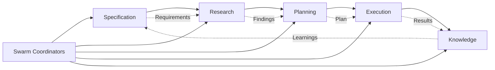

# Agent to SPEK Phase Mapping

## Visual Pipeline Flow

```
SPECIFICATION -> RESEARCH -> PLANNING -> EXECUTION -> KNOWLEDGE
     |              |           |           |            |
     v              v           v           v            v
  [Define]      [Discover]   [Design]   [Implement]   [Learn]
```

## Phase-Based Agent Organization

### PHASE 1: SPECIFICATION (Define Requirements)
**Primary Purpose**: Gather requirements, define scope, establish acceptance criteria

```yaml
Core Agents:
  - specification: Requirements gathering and constraint analysis
  - researcher: Initial solution discovery and feasibility research
  - researcher-gemini: Deep technical research with large context
  - trend-researcher: Market trend analysis and competitive intelligence
  - ux-researcher: User experience research and behavioral analysis
  - brand-guardian: Brand consistency and guideline enforcement
  - legal-compliance-checker: Legal compliance and regulatory adherence

Supporting Agents:
  - system-architect: Early architecture considerations
  - fresh-eyes-gemini: Pre-mortem risk analysis

MCP Tools:
  - memory: Requirement storage and retrieval
  - sequential-thinking: Logical requirement decomposition
  - deepwiki: Domain knowledge research

Deliverables:
  - spec.json: Complete requirements specification
  - constraints.json: Technical and business constraints
  - acceptance_criteria.json: Testable acceptance criteria
```

### PHASE 2: RESEARCH (Discover Solutions)
**Primary Purpose**: Analyze existing solutions, evaluate approaches, assess technical landscape

```yaml
Core Agents:
  - researcher: Technical research and pattern discovery
  - code-analyzer: Existing codebase analysis
  - security-manager: Security requirements and compliance research
  - performance-benchmarker: Performance baseline establishment
  - tool-evaluator: Development tool evaluation and recommendation
  - experiment-tracker: Experiment tracking and data-driven validation

Supporting Agents:
  - system-architect: Architecture pattern research
  - fresh-eyes-codex: Risk identification

MCP Tools:
  - ref: Technical documentation research
  - firecrawl: Web-based solution research
  - context7: Large-scale code analysis
  - eva: Quality metrics baseline

Deliverables:
  - research_report.json: Comprehensive research findings
  - analysis_report.json: Code quality analysis
  - security_baseline.json: Security requirements
  - performance_baseline.json: Performance targets
```

### PHASE 3: PLANNING (Design Approach)
**Primary Purpose**: Create implementation plan, allocate resources, design architecture

```yaml
Core Agents:
  - planner: Task breakdown and dependency mapping
  - sparc-coord: SPARC methodology coordination
  - task-orchestrator: Execution strategy planning
  - architecture: System design and component architecture
  - pseudocode: Algorithm design and logic flow
  - rapid-prototyper: Rapid prototyping and proof-of-concept development
  - ui-designer: Interface design and design systems
  - sprint-prioritizer: Sprint planning and task prioritization
  - studio-producer: Creative production and resource coordination

Supporting Agents:
  - hierarchical-coordinator: Swarm topology planning
  - mesh-coordinator: Distributed task planning
  - adaptive-coordinator: Dynamic resource allocation

MCP Tools:
  - plane: Project management integration
  - memory: Plan storage and versioning
  - sequential-thinking: Logical task sequencing

Deliverables:
  - plan.json: Detailed implementation plan
  - architecture.json: System architecture design
  - task_breakdown.json: MECE task division
  - resource_allocation.json: Agent and resource assignments
```

### PHASE 4: EXECUTION (Implement Solution)
**Primary Purpose**: Write code, implement features, test functionality

```yaml
Core Implementation Agents:
  - coder: Main implementation work
  - coder-codex: Micro-edits and bounded changes
  - backend-dev: Backend service implementation
  - frontend-developer: Frontend web application development
  - mobile-dev: Mobile application development
  - ai-engineer: AI/ML model development and deployment
  - ml-developer: Machine learning model development
  - cicd-engineer: Pipeline and infrastructure code
  - devops-automator: DevOps automation and infrastructure orchestration
  - base-template-generator: Boilerplate and templates
  - visual-storyteller: Visual narratives and data visualization
  - whimsy-injector: Creative personality and delightful interactions
  - infrastructure-maintainer: System maintenance and reliability
  - project-shipper: Project delivery and shipping coordination

Testing Agents:
  - tester: Test implementation and execution
  - api-tester: API testing and validation
  - tdd-london-swarm: Test-driven development
  - production-validator: Production readiness validation
  - workflow-optimizer: Development workflow optimization

Quality Agents:
  - reviewer: Real-time code review
  - code-review-swarm: Comprehensive review coordination

GitHub Integration:
  - pr-manager: Pull request creation and management
  - github-modes: GitHub workflow automation
  - workflow-automation: CI/CD pipeline creation

MCP Tools:
  - github: Version control operations
  - codex: Sandboxed code execution
  - playwright: E2E testing
  - eva: Quality metrics tracking

Deliverables:
  - implementation.json: Code changes summary
  - test_results.json: Test execution results
  - coverage_report.json: Code coverage metrics
  - pr_summary.json: Pull request details
```

### PHASE 5: KNOWLEDGE (Learn & Document)
**Primary Purpose**: Capture lessons, create documentation, transfer knowledge

```yaml
Core Agents:
  - reviewer: Final review and assessment
  - memory-coordinator: Knowledge persistence
  - api-docs: API documentation generation
  - refinement: Iterative improvement recommendations
  - feedback-synthesizer: User feedback analysis and synthesis
  - support-responder: Customer support and issue resolution
  - analytics-reporter: Analytics reporting and business intelligence
  - finance-tracker: Financial tracking and budget management
  - test-results-analyzer: Test result analysis and quality metrics

Analysis Agents:
  - fresh-eyes-codex: Post-implementation analysis
  - fresh-eyes-gemini: Large-scale impact assessment
  - perf-analyzer: Performance analysis

Marketing & Growth Agents:
  - tiktok-strategist: TikTok marketing strategy and content optimization
  - instagram-curator: Instagram content curation and aesthetic optimization
  - twitter-engager: Twitter engagement and community building
  - reddit-community-builder: Reddit community engagement and organic growth
  - app-store-optimizer: App store optimization and mobile app marketing
  - content-creator: Multi-platform content creation and storytelling
  - growth-hacker: Growth hacking and data-driven marketing optimization

Documentation Agents:
  - api-docs: API and technical documentation
  - base-template-generator: Template extraction from implementations

MCP Tools:
  - memory: Long-term knowledge storage
  - markitdown: Documentation formatting
  - github: Documentation commits

Deliverables:
  - review_report.json: Comprehensive review findings
  - lessons_learned.json: Key learnings and insights
  - documentation.json: Generated documentation
  - knowledge_base.json: Reusable patterns and templates
```

## Cross-Phase Support Agents

### Swarm Coordination (All Phases)
```yaml
Agents:
  - swarm-init: Initialize agent swarms
  - smart-agent: Intelligent agent spawning
  - hierarchical-coordinator: Queen-led coordination
  - mesh-coordinator: Peer-to-peer coordination
  - adaptive-coordinator: Dynamic topology switching

Purpose: Coordinate multi-agent workflows across all phases
```

### Consensus & Distribution (Execution & Knowledge)
```yaml
Agents:
  - byzantine-coordinator: Byzantine fault tolerance
  - raft-manager: Raft consensus protocol
  - gossip-coordinator: Gossip-based coordination
  - crdt-synchronizer: Conflict-free replication
  - quorum-manager: Quorum management

Purpose: Ensure distributed consensus in multi-agent operations
```

### GitHub Integration (Planning through Knowledge)
```yaml
Agents:
  - issue-tracker: Issue management and tracking
  - project-board-sync: Project board synchronization
  - release-manager: Release coordination
  - release-swarm: Automated release workflows
  - repo-architect: Repository structure optimization
  - multi-repo-swarm: Cross-repository coordination
  - sync-coordinator: Dependency synchronization
  - swarm-pr: PR swarm management
  - swarm-issue: Issue-based swarm coordination

Purpose: Integrate with GitHub across development lifecycle
```

### Performance & Optimization (Research through Knowledge)
```yaml
Agents:
  - perf-analyzer: Performance bottleneck analysis
  - performance-benchmarker: Benchmark execution
  - migration-planner: System migration planning

Purpose: Ensure performance and enable smooth migrations
```

## Agent Selection Matrix

| Task Type | Specification | Research | Planning | Execution | Knowledge |
|-----------|--------------|----------|----------|-----------|-----------|
| **New Feature** | specification, researcher | code-analyzer, system-architect | planner, architecture | coder, tester | reviewer, api-docs |
| **Bug Fix** | - | code-analyzer, researcher | planner | coder-codex, tester | reviewer |
| **Refactoring** | specification | code-analyzer, perf-analyzer | architecture, planner | coder, tdd-london-swarm | refinement, reviewer |
| **Performance** | - | performance-benchmarker | planner | coder, perf-analyzer | reviewer, memory-coordinator |
| **Security** | security-manager | security-manager, code-analyzer | planner | coder-codex, production-validator | reviewer, fresh-eyes-codex |
| **Documentation** | specification | researcher | planner | api-docs, base-template-generator | memory-coordinator |
| **Migration** | specification | code-analyzer, researcher | migration-planner, architecture | coder, production-validator | reviewer, memory-coordinator |

## Phase Transition Criteria

### Specification -> Research
- Requirements documented: 100%
- Acceptance criteria defined: 100%
- Stakeholder approval: Yes

### Research -> Planning
- Solution alternatives evaluated: >= 3
- Technical feasibility confirmed: Yes
- Risk assessment complete: Yes

### Planning -> Execution
- Task breakdown complete: 100%
- Resource allocation done: Yes
- Architecture approved: Yes

### Execution -> Knowledge
- All tests passing: 100%
- Code review complete: Yes
- Production validation: Pass

## Parallel Agent Execution Patterns

### Specification Phase Parallelism
```javascript
// Parallel specification gathering
Task("specification: Gather functional requirements")
Task("researcher: Research existing solutions")
Task("researcher-gemini: Analyze large-scale patterns")
```

### Research Phase Parallelism
```javascript
// Parallel research analysis
Task("code-analyzer: Analyze existing codebase")
Task("security-manager: Security compliance research")
Task("performance-benchmarker: Establish baselines")
```

### Planning Phase Parallelism
```javascript
// Parallel planning activities
Task("planner: Create task breakdown")
Task("architecture: Design system architecture")
Task("pseudocode: Design core algorithms")
```

### Execution Phase Parallelism
```javascript
// Parallel implementation
Task("coder: Implement core features")
Task("tester: Write test suite")
Task("cicd-engineer: Setup pipelines")
```

### Knowledge Phase Parallelism
```javascript
// Parallel knowledge capture
Task("reviewer: Code review and assessment")
Task("api-docs: Generate documentation")
Task("memory-coordinator: Persist learnings")
```

## Agent Communication Flow



## Quality Gates per Phase

### Specification Gates
- Requirement clarity: >= 95%
- Testability: 100%
- Scope definition: Complete

### Research Gates
- Coverage: >= 80% of solution space
- Evidence quality: High
- Risk identification: Comprehensive

### Planning Gates
- Task granularity: <= 8 hours per task
- Dependency mapping: 100%
- Resource availability: Confirmed

### Execution Gates
- Test coverage: >= 80%
- Security scan: 0 HIGH/CRITICAL
- Performance: Meets baseline

### Knowledge Gates
- Documentation: Complete
- Lessons captured: Yes
- Knowledge indexed: Yes

## Agent Resource Requirements

### Lightweight Agents (< 1MB memory)
- specification, planner, reviewer
- pseudocode, refinement

### Medium Agents (1-10MB memory)
- coder, tester, researcher
- api-docs, architecture

### Heavy Agents (> 10MB memory)
- researcher-gemini, fresh-eyes-gemini
- code-analyzer, performance-benchmarker

### Swarm Agents (Variable)
- hierarchical-coordinator: Scales with swarm size
- mesh-coordinator: O(n²) connections
- adaptive-coordinator: Dynamic allocation

## Best Practices by Phase

### Specification
1. Start with specification agent
2. Use researcher for feasibility
3. Document all constraints
4. Get early stakeholder feedback

### Research
1. Parallel research streams
2. Evidence-based findings
3. Document alternatives
4. Quantify trade-offs

### Planning
1. MECE task division
2. Clear dependencies
3. Resource allocation
4. Risk mitigation

### Execution
1. TDD approach
2. Continuous integration
3. Regular validation
4. Incremental delivery

### Knowledge
1. Capture immediately
2. Structure for reuse
3. Version documentation
4. Share learnings

---

This mapping provides clear guidance on which agents to use in each SPEK phase, ensuring optimal resource utilization and workflow efficiency.