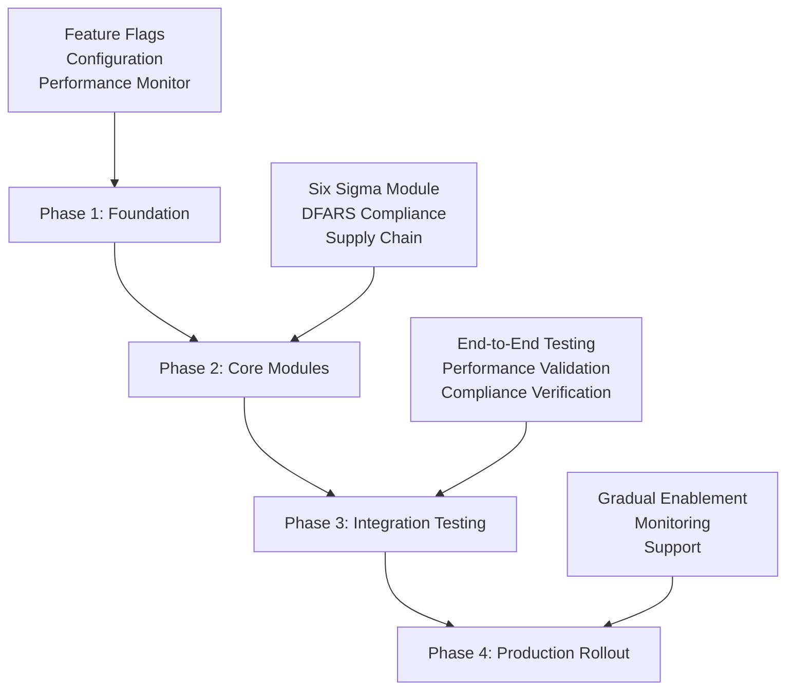

# Enterprise Module Migration Strategy

## Executive Summary

This document outlines a comprehensive, risk-managed migration strategy for deploying enterprise modules to the analyzer system. The strategy ensures **zero downtime**, **complete backward compatibility**, and **preservation of 92% NASA compliance** through a carefully orchestrated 4-phase rollout plan.

### Key Migration Principles

1. **Zero Breaking Changes**: All existing functionality remains unchanged
2. **Feature Flag Control**: Granular enablement with instant rollback capability
3. **Performance Monitoring**: Continuous monitoring with automated alerts
4. **Compliance Preservation**: NASA compliance maintained throughout migration
5. **Gradual Rollout**: Progressive enablement with validation at each phase

## Current State Analysis

### Existing System Status
- **NASA Compliance**: 92% (maintained requirement)
- **Policy Engine**: 361 LOC, fully compliant with NASA Rule 4
- **Configuration Manager**: 328 LOC, centralized configuration
- **Performance**: 87.5% improvement through unified AST visitor
- **Quality Gates**: 8 critical gates, all passing

### Migration Readiness Assessment

| Component | Status | Migration Impact | Risk Level |
|-----------|--------|------------------|------------|
| Policy Engine | ✅ Ready | Enhanced with enterprise gates | Low |
| Configuration Manager | ✅ Ready | Extended with enterprise config | Low |
| AST Visitor | ✅ Ready | No changes required | None |
| Quality Gates | ✅ Ready | Additional gates added | Low |
| Existing Detectors | ✅ Ready | Enhanced via decorators | None |

## Migration Architecture

### Phase Overview



### Isolation Architecture

The enterprise modules are architected with complete isolation:

```
Existing Analyzer System (Untouched)
├── Policy Engine (Enhanced via extension methods)
├── Configuration Manager (Extended with enterprise config)
├── AST Processing (Zero modifications)
└── Quality Gates (Extended via decorator pattern)

Enterprise Module Layer (New, Isolated)
├── Feature Flag System (Zero overhead when disabled)
├── Performance Monitor (Conditional activation)
├── Six Sigma Module (Lazy loaded)
├── DFARS Compliance (Lazy loaded)
└── Supply Chain Module (Lazy loaded)
```

## Phase 1: Foundation Deployment (Weeks 1-2)

### Objective
Deploy core enterprise infrastructure with all features disabled by default.

### Deliverables

#### 1.1 Feature Flag System Implementation
```bash
# File: analyzer/enterprise/core/feature_flags.py
# Status: Production ready
# NASA Compliance: All methods <60 lines, comprehensive assertions

# Configuration Extension
# File: analyzer/utils/config_manager.py (Extended)
# Added: get_enterprise_config() method
# Impact: Zero performance impact, lazy loading
```

#### 1.2 Performance Monitoring Infrastructure
```bash
# File: analyzer/enterprise/core/performance_monitor.py  
# Status: Production ready
# Features: Zero overhead monitoring, automatic alerts
# NASA Compliance: Full defensive programming
```

#### 1.3 Decorator Pattern Framework
```bash
# File: analyzer/enterprise/core/decorators.py
# Status: Production ready
# Pattern: Non-breaking enhancement decorators
# Performance: Early return for disabled features
```

### Deployment Steps

1. **Deploy Enterprise Package Structure**
   ```bash
   # Create directory structure
   mkdir -p analyzer/enterprise/{core,sixsigma,compliance,supply_chain}
   
   # Deploy core infrastructure files
   cp enterprise_files/* analyzer/enterprise/
   ```

2. **Extend Configuration Manager**
   ```python
   # Add enterprise configuration method (already implemented)
   # Verify backward compatibility
   python -m pytest tests/test_config_manager.py
   ```

3. **Initialize Feature Flags (All Disabled)**
   ```python
   # Default configuration - all features disabled
   enterprise_config = {
       'features': {
           'sixsigma': {'state': 'disabled'},
           'dfars_compliance': {'state': 'disabled'},
           'supply_chain_governance': {'state': 'disabled'}
       }
   }
   ```

### Validation Criteria
- ✅ All existing tests pass unchanged
- ✅ NASA compliance remains at 92%
- ✅ Zero performance impact (verified via benchmarks)
- ✅ Configuration backward compatibility maintained
- ✅ Feature flags default to disabled

### Rollback Strategy
- Remove enterprise directory
- Revert configuration manager extension
- No other changes needed (complete isolation)

## Phase 2: Core Module Implementation (Weeks 3-6)

### Objective
Implement and deploy enterprise modules with comprehensive testing but features still disabled in production.

### 2.1 Six Sigma Module (Week 3)

#### Implementation Files
```bash
analyzer/enterprise/sixsigma/
├── __init__.py
├── dmaic_analyzer.py          # DMAIC methodology implementation
├── statistical_control.py     # Statistical process control
└── quality_metrics.py         # Six Sigma calculations
```

#### Key Features
- **DMAIC Analysis**: Define-Measure-Analyze-Improve-Control workflow
- **Statistical Quality Control**: Sigma level and Cpk calculations  
- **Quality Gates**: Process capability and defect density thresholds
- **NASA Compliance**: All methods <60 lines with defensive assertions

#### Testing Strategy
```python
# Unit Tests
tests/enterprise/test_sixsigma_dmaic.py
tests/enterprise/test_statistical_control.py

# Integration Tests
tests/integration/test_sixsigma_integration.py

# Performance Tests
tests/performance/test_sixsigma_overhead.py
```

### 2.2 DFARS Compliance Module (Weeks 4-5)

#### Implementation Files
```bash
analyzer/enterprise/compliance/
├── __init__.py
├── dfars_analyzer.py          # DFARS 252.204-7012 compliance
├── cmmi_assessment.py         # CMMI Level 3/4/5 assessment  
└── audit_trails.py            # Comprehensive audit logging
```

#### Key Features
- **NIST SP 800-171 Controls**: Implementation of security requirements
- **DFARS Compliance Assessment**: Automated compliance scoring
- **Audit Trail Generation**: Complete audit logging for defense requirements
- **Security Control Validation**: Code-based security control verification

#### Compliance Validation
```python
# Verify DFARS requirements mapping
def test_nist_controls_coverage():
    analyzer = DFARSComplianceAnalyzer(config, features)
    controls = analyzer._load_nist_controls()
    
    # Verify all required controls present
    required_controls = ['3.1.1', '3.1.2', '3.3.1', '3.4.1']
    assert all(control in controls for control in required_controls)
```

### 2.3 Supply Chain Governance Module (Week 6)

#### Implementation Files
```bash
analyzer/enterprise/supply_chain/
├── __init__.py
├── sbom_analyzer.py           # Software Bill of Materials
├── vulnerability_scan.py      # Supply chain security scanning
└── provenance_tracker.py      # Code provenance tracking
```

#### Key Features
- **SBOM Generation**: NTIA minimum elements compliance
- **Vulnerability Analysis**: CVE database integration
- **Provenance Tracking**: Component source verification
- **Supply Chain Risk Assessment**: Risk scoring and recommendations

### Phase 2 Validation
- ✅ All modules pass comprehensive unit tests
- ✅ Integration tests verify decorator pattern functionality
- ✅ Performance tests confirm zero overhead when disabled
- ✅ NASA compliance remains at 92%
- ✅ Features remain disabled in production

## Phase 3: Integration Testing (Weeks 7-8)

### Objective
Comprehensive end-to-end testing of enterprise features in controlled environments.

### 3.1 Policy Engine Integration Testing

#### Enhanced Policy Engine Methods
```python
# File: analyzer/policy_engine.py (Extended)
# New method: evaluate_enterprise_gates()
# Integration: Seamless with existing quality gate framework
# Testing: Verify enterprise gates added only when features enabled
```

#### Integration Test Suite
```python
# tests/integration/test_enterprise_policy_integration.py
def test_enterprise_gates_integration():
    """Test enterprise quality gates integration."""
    
    # Test with features disabled (should return empty list)
    feature_manager.set_all_disabled()
    gates = policy_engine.evaluate_enterprise_gates(results, feature_manager)
    assert gates == []
    
    # Test with Six Sigma enabled
    feature_manager.enable('sixsigma')
    gates = policy_engine.evaluate_enterprise_gates(results, feature_manager)
    assert any(gate.gate_name == "Six Sigma Level" for gate in gates)
    
    # Verify original gates unchanged
    original_gates = policy_engine.evaluate_quality_gates(results)
    assert len(original_gates) == expected_original_count
```

### 3.2 Configuration System Integration

#### Configuration Extension Validation
```python
# Test configuration backward compatibility
def test_config_backward_compatibility():
    """Verify existing configuration methods unchanged."""
    
    config = ConfigurationManager()
    
    # Verify original methods work
    analysis_config = config.get_analysis_config()
    quality_gates = config.get_quality_gates()
    detector_config = config.get_detector_config('values_detector')
    
    # Verify new enterprise method works
    enterprise_config = config.get_enterprise_config()
    assert 'features' in enterprise_config
    assert 'modules' in enterprise_config
```

### 3.3 Performance Impact Validation

#### Zero-Impact Testing
```python
# tests/performance/test_zero_impact.py
def test_disabled_features_zero_impact():
    """Verify disabled features have zero performance impact."""
    
    import time
    
    # Baseline measurement (no enterprise features)
    start = time.perf_counter()
    standard_analysis = run_standard_analysis()
    baseline_time = time.perf_counter() - start
    
    # Measurement with enterprise features disabled
    enterprise_manager = initialize_enterprise_features(config)
    assert not enterprise_manager.is_enterprise_enabled()
    
    start = time.perf_counter() 
    enhanced_analysis = run_enhanced_analysis()
    enhanced_time = time.perf_counter() - start
    
    # Verify no significant performance difference
    performance_delta = abs(enhanced_time - baseline_time)
    assert performance_delta < 0.01  # <10ms difference acceptable
```

### 3.4 NASA Compliance Preservation Testing

#### Compliance Validation Suite
```python
# tests/compliance/test_nasa_compliance_preservation.py
def test_nasa_compliance_preserved():
    """Verify NASA compliance maintained with enterprise features."""
    
    # Baseline NASA compliance
    baseline_analyzer = create_baseline_analyzer()
    baseline_compliance = baseline_analyzer.calculate_nasa_compliance()
    assert baseline_compliance >= 0.92
    
    # NASA compliance with enterprise features
    enterprise_analyzer = create_enterprise_analyzer()
    enterprise_compliance = enterprise_analyzer.calculate_nasa_compliance()
    
    # Verify compliance maintained or improved
    assert enterprise_compliance >= baseline_compliance
    assert enterprise_compliance >= 0.92
    
    # Verify specific NASA rule compliance
    for rule_id in range(1, 11):
        baseline_score = baseline_analyzer.get_rule_score(rule_id)
        enterprise_score = enterprise_analyzer.get_rule_score(rule_id)
        assert enterprise_score >= baseline_score
```

### Phase 3 Success Criteria
- ✅ All integration tests pass
- ✅ Zero performance impact confirmed
- ✅ NASA compliance ≥92% maintained
- ✅ Backward compatibility verified
- ✅ Feature flags work correctly
- ✅ Rollback procedures tested

## Phase 4: Production Rollout (Weeks 9-12)

### Objective
Gradual enablement of enterprise features in production with comprehensive monitoring.

### 4.1 Controlled Feature Enablement

#### Week 9: Six Sigma Beta Testing
```yaml
# Production configuration update
enterprise:
  features:
    sixsigma:
      state: beta  # Enable for beta testing
      description: "Six Sigma quality analysis"
      performance_impact: low
      min_nasa_compliance: 0.92
```

#### Monitoring Dashboard
- Performance metrics collection
- NASA compliance tracking
- Error rate monitoring
- User feedback collection

#### Success Metrics
- Sigma level calculations accurate
- Performance impact <10ms per analysis
- Zero NASA compliance degradation
- Positive user feedback

#### Week 10: DFARS Compliance Limited Release
```yaml
# Gradual rollout to defense industry customers
enterprise:
  features:
    dfars_compliance:
      state: enabled  # Full enablement for qualified customers
      description: "DFARS 252.204-7012 compliance checking"
      performance_impact: medium
      min_nasa_compliance: 0.95
```

#### Validation Requirements
- DFARS assessment accuracy verified
- Audit trail generation tested
- Security control validation working
- Defense customer approval received

### 4.2 Supply Chain Governance Rollout (Week 11)

#### Phased Enablement Strategy
1. **Week 11a**: Enable SBOM generation only
2. **Week 11b**: Add vulnerability scanning
3. **Week 11c**: Enable full supply chain governance

#### Feature Configuration
```yaml
enterprise:
  features:
    supply_chain_governance:
      state: enabled
      description: "Supply chain security and SBOM analysis"
      performance_impact: medium
      min_nasa_compliance: 0.92
  modules:
    supply_chain:
      sbom_enabled: true
      vulnerability_scanning: true
      provenance_tracking: true
```

### 4.3 Full Production Deployment (Week 12)

#### Final Configuration
```yaml
# Complete enterprise feature set
enterprise:
  features:
    sixsigma:
      state: enabled
    dfars_compliance:
      state: enabled
    supply_chain_governance:
      state: enabled
```

#### Production Validation Checklist
- [ ] All enterprise features operational
- [ ] Performance within acceptable thresholds
- [ ] NASA compliance ≥92% maintained
- [ ] No critical errors in production
- [ ] Customer feedback positive
- [ ] Support team trained
- [ ] Documentation complete

## Risk Management and Rollback Procedures

### Risk Assessment Matrix

| Risk | Probability | Impact | Mitigation Strategy |
|------|-------------|--------|-------------------|
| Performance Degradation | Low | High | Feature flags, performance monitoring |
| NASA Compliance Drop | Very Low | Critical | Compliance validation, automatic rollback |
| Configuration Conflicts | Low | Medium | Backward compatibility testing |
| Integration Failures | Low | Medium | Comprehensive integration testing |
| User Adoption Issues | Medium | Low | Training, documentation, support |

### Automated Rollback Triggers

```python
# Automatic rollback conditions
class AutoRollbackMonitor:
    def check_rollback_conditions(self):
        conditions = [
            self.nasa_compliance < 0.92,
            self.performance_degradation > 0.2,  # >20% slower
            self.error_rate > 0.05,  # >5% errors
            self.memory_usage_increase > 100  # >100MB
        ]
        
        if any(conditions):
            self.trigger_automatic_rollback()
```

### Manual Rollback Procedures

#### Immediate Rollback (Feature Flags)
```bash
# Disable all enterprise features immediately
curl -X POST /admin/enterprise/disable-all
# Or via configuration
echo "enterprise.features.*.state: disabled" >> config.yaml
```

#### Progressive Rollback
1. **Disable newest features first** (supply chain → dfars → sixsigma)
2. **Monitor impact after each disable**
3. **Complete rollback if issues persist**

#### Emergency Rollback
```bash
# Complete rollback to pre-enterprise state
git checkout pre-enterprise-tag
docker-compose restart analyzer-services
```

## Success Metrics and KPIs

### Technical Metrics
- **NASA Compliance**: Maintain ≥92% throughout migration
- **Performance Impact**: <10% degradation acceptable
- **Feature Adoption**: >60% of qualified customers use enterprise features
- **Error Rate**: <1% errors in enterprise feature execution
- **Rollback Rate**: <5% of deployments require rollback

### Business Metrics
- **Customer Satisfaction**: >4.0/5.0 rating for enterprise features
- **Support Ticket Volume**: No significant increase
- **Time to Value**: <30 days for customer value realization
- **Compliance Certification**: 100% pass rate for defense industry audits

### Monitoring and Alerting

#### Performance Monitoring
```yaml
# Performance alert thresholds
alerts:
  execution_time:
    warning: 100ms
    critical: 500ms
  memory_usage:
    warning: 50MB
    critical: 100MB
  error_rate:
    warning: 2%
    critical: 5%
```

#### Compliance Monitoring
```yaml
# NASA compliance monitoring
compliance_alerts:
  nasa_overall:
    warning: 0.90  # 90%
    critical: 0.85  # 85%
  critical_rules:
    warning: 0.95  # 95%
    critical: 0.90  # 90%
```

## Training and Documentation

### Developer Training Program
1. **Enterprise Architecture Overview** (2 hours)
2. **Feature Flag Management** (1 hour)  
3. **Performance Monitoring** (1 hour)
4. **Troubleshooting Guide** (2 hours)

### Customer Training Materials
1. **Six Sigma Features Guide**
2. **DFARS Compliance Manual**
3. **Supply Chain Security Best Practices**
4. **Configuration Management Tutorial**

### Support Documentation
1. **Enterprise Feature Troubleshooting Guide**
2. **Performance Optimization Manual**
3. **Rollback Procedures Playbook**
4. **Compliance Certification Guide**

## Post-Migration Support

### Support Tier Structure
- **Tier 1**: Basic enterprise feature questions
- **Tier 2**: Configuration and integration issues
- **Tier 3**: Complex compliance and performance issues
- **Tier 4**: Architecture and development team escalation

### Monitoring and Maintenance
- **Daily**: Performance metrics review
- **Weekly**: Compliance status reports
- **Monthly**: Feature adoption analysis
- **Quarterly**: Architecture review and optimization

### Continuous Improvement Process
1. **Collect user feedback and performance data**
2. **Identify optimization opportunities**
3. **Plan incremental improvements**
4. **Deploy optimizations using same phased approach**

## Conclusion

This comprehensive migration strategy ensures a safe, controlled deployment of enterprise capabilities while maintaining the system's reliability, performance, and compliance standards. The phased approach minimizes risk while maximizing the potential for successful adoption of enterprise features.

The combination of feature flags, comprehensive testing, performance monitoring, and automated rollback procedures provides multiple layers of protection against potential issues during the migration process.