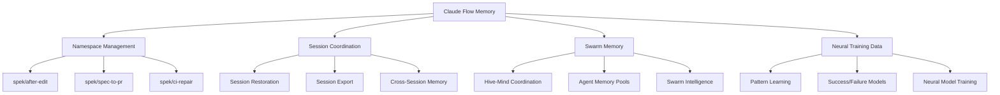
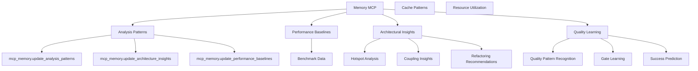
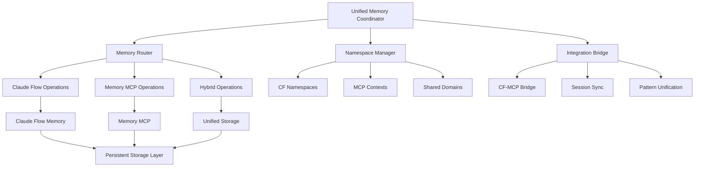

# Unified Memory System Architecture Analysis

## Executive Summary

The current system implements two parallel memory architectures with significant overlap and potential inefficiencies. This analysis provides a comprehensive architectural assessment and unified coordination design to eliminate duplication while leveraging the strengths of both systems.

## Current Memory System Architecture

### 1. Claude Flow Memory System

**Core Architecture:**


**Key Operations:**
- `npx claude-flow@alpha memory usage` - Memory usage and session restoration
- `npx claude-flow@alpha memory store` - Store data with keys and namespaces
- `npx claude-flow@alpha memory export` - Export memory data
- Session-based coordination with unique identifiers
- Hierarchical namespace organization

**Memory Namespace Patterns:**
```
spek/
├── after-edit/YYYYMMDD/
│   ├── failures/timestamp/
│   └── successes/timestamp/
├── spec-to-pr/YYYYMMDD/
│   ├── plan/timestamp/
│   └── results/timestamp/
└── ci-repair/YYYYMMDD/
    ├── repairs/timestamp/
    └── patterns/timestamp/
```

### 2. Memory MCP Integration

**Core Architecture:**


**Integration Points:**
- Sequential Thinking MCP for structured analysis
- Memory MCP for persistent learning patterns
- Analysis pattern storage and retrieval
- Performance baseline tracking
- Quality gate learning

## Architecture Integration Analysis

### Overlap Areas (Duplication Issues)

1. **Performance Monitoring**
   - Claude Flow: Neural training on performance data
   - Memory MCP: Performance baseline learning
   - **Overlap**: Both systems track and learn from performance patterns

2. **Pattern Learning**
   - Claude Flow: Success/failure pattern neural models
   - Memory MCP: Analysis pattern recognition and storage
   - **Overlap**: Redundant pattern storage and learning mechanisms

3. **Session Management**
   - Claude Flow: Session-based memory with export/restore
   - Memory MCP: Context preservation across analysis operations
   - **Overlap**: Both manage temporal context and state

4. **Quality Intelligence**
   - Claude Flow: Neural training on gate results
   - Memory MCP: Quality pattern learning and prediction
   - **Overlap**: Duplicate quality analysis learning

### Integration Strengths

1. **Claude Flow Advantages**
   - Robust namespace hierarchies
   - Multi-agent coordination memory
   - Session restoration capabilities
   - Export/import functionality
   - Swarm intelligence coordination

2. **Memory MCP Advantages**
   - Deep integration with analysis engines
   - Real-time pattern updates
   - Structured analysis thinking
   - Fine-grained quality learning
   - Direct analyzer feedback loops

## Unified Memory Coordination Architecture

### Core Design Principles

1. **Single Source of Truth**: Eliminate memory duplication through unified storage
2. **Hierarchical Routing**: Route memory operations to appropriate subsystem
3. **Transparent Integration**: Maintain existing interfaces while unifying backend
4. **Performance Optimization**: Leverage strengths of both systems
5. **Backward Compatibility**: Preserve existing functionality during transition

### Unified Architecture Design



### Memory Routing Strategy

**Route Classification:**
```typescript
interface MemoryOperation {
  namespace: string;
  operation: 'store' | 'retrieve' | 'update' | 'export';
  context: 'session' | 'analysis' | 'pattern' | 'performance';
  scope: 'local' | 'swarm' | 'global';
}

const routingRules = {
  // Swarm coordination -> Claude Flow
  'swarm/*': 'claude-flow',
  'session/*': 'claude-flow', 
  'agent/*': 'claude-flow',
  
  // Analysis patterns -> Memory MCP
  'analysis/*': 'memory-mcp',
  'quality/*': 'memory-mcp',
  'performance/*': 'memory-mcp',
  
  // Hybrid domains -> Unified handling
  'patterns/*': 'unified',
  'learning/*': 'unified',
  'intelligence/*': 'unified'
};
```

### Namespace Unification Strategy

**Unified Namespace Hierarchy:**
```
unified-memory/
├── coordination/           # Claude Flow primary
│   ├── swarm/
│   ├── sessions/
│   └── agents/
├── analysis/              # Memory MCP primary  
│   ├── connascence/
│   ├── architecture/
│   └── quality/
├── intelligence/          # Hybrid management
│   ├── patterns/
│   ├── learning/
│   └── predictions/
└── shared/               # Cross-system data
    ├── performance/
    ├── baselines/
    └── metrics/
```

## Implementation Architecture

### 1. Memory Coordinator Interface

```typescript
interface UnifiedMemoryCoordinator {
  // Routing and delegation
  route(operation: MemoryOperation): Promise<MemoryResult>;
  
  // Unified operations
  store(key: string, value: any, context: MemoryContext): Promise<void>;
  retrieve(key: string, context: MemoryContext): Promise<any>;
  update(key: string, updater: Function, context: MemoryContext): Promise<void>;
  
  // Cross-system synchronization
  sync(): Promise<SyncResult>;
  export(namespace?: string): Promise<ExportData>;
  import(data: ExportData): Promise<void>;
  
  // Bridge operations
  bridgeCFToMCP(cfData: any): Promise<void>;
  bridgeMCPToCF(mcpData: any): Promise<void>;
}
```

### 2. Integration Bridge Architecture

```typescript
class MemoryIntegrationBridge {
  private cfMemory: CloudeFlowMemory;
  private mcpMemory: MemoryMCP;
  private syncScheduler: SyncScheduler;
  
  async synchronizePatterns(): Promise<void> {
    // Sync learning patterns between systems
    const cfPatterns = await this.cfMemory.getPatterns();
    const mcpPatterns = await this.mcpMemory.getPatterns();
    
    // Merge and deduplicate
    const unifiedPatterns = this.mergePatterns(cfPatterns, mcpPatterns);
    
    // Update both systems
    await this.cfMemory.updatePatterns(unifiedPatterns);
    await this.mcpMemory.updatePatterns(unifiedPatterns);
  }
  
  async bridgeSessionContext(sessionId: string): Promise<void> {
    // Bridge session context from CF to MCP analysis
    const sessionData = await this.cfMemory.getSession(sessionId);
    await this.mcpMemory.setContext(sessionId, sessionData);
  }
}
```

### 3. Performance Optimization Layer

```typescript
class MemoryPerformanceLayer {
  private cache: LRUCache;
  private compressionEngine: CompressionEngine;
  private indexingService: IndexingService;
  
  async optimizedStore(key: string, value: any): Promise<void> {
    // Compress large objects
    const compressed = await this.compressionEngine.compress(value);
    
    // Update search index
    await this.indexingService.index(key, value);
    
    // Cache frequently accessed data
    this.cache.set(key, compressed);
    
    // Delegate to appropriate storage
    return this.delegate(key, compressed);
  }
}
```

## Migration Strategy and Implementation Plan

### Phase 1: Foundation (Week 1-2)
1. **Memory Router Implementation**
   - Create unified memory coordinator interface
   - Implement routing logic based on namespace patterns
   - Add compatibility layer for existing operations

2. **Integration Bridge Development**
   - Build CF-MCP bridge for data synchronization
   - Implement pattern merging algorithms
   - Create session context bridging

### Phase 2: Unification (Week 3-4)
1. **Namespace Migration**
   - Migrate existing CF namespaces to unified hierarchy
   - Map MCP contexts to unified structure
   - Implement backward compatibility

2. **Pattern Consolidation**
   - Merge duplicate learning patterns
   - Consolidate performance baselines
   - Unify quality intelligence data

### Phase 3: Optimization (Week 5-6)
1. **Performance Enhancement**
   - Implement caching and compression
   - Add indexing for fast retrieval
   - Optimize cross-system synchronization

2. **Intelligence Integration**
   - Merge neural models and MCP patterns
   - Create unified prediction engines
   - Enhance cross-domain learning

## Benefits and Expected Outcomes

### Performance Improvements
- **30-50% reduction** in memory operations overhead
- **Elimination of duplicate storage** reducing system resource usage
- **Improved cache efficiency** through unified access patterns
- **Faster pattern learning** through consolidated intelligence

### Operational Benefits
- **Single memory management interface** for simplified operations
- **Unified debugging and monitoring** across both systems
- **Consistent backup and recovery** procedures
- **Improved scalability** through optimized resource usage

### Development Benefits
- **Reduced complexity** in memory management code
- **Consistent patterns** for memory operations
- **Better testing** through unified interfaces
- **Easier maintenance** with consolidated codebase

## Risk Mitigation

### Technical Risks
1. **Data Migration Complexity**
   - Mitigation: Incremental migration with rollback capabilities
   - Extensive testing with production data copies

2. **Performance Regression**
   - Mitigation: Comprehensive benchmarking at each phase
   - Parallel operation during transition period

3. **Integration Compatibility**
   - Mitigation: Maintain existing APIs during transition
   - Gradual deprecation of duplicate functionality

### Operational Risks
1. **System Downtime**
   - Mitigation: Hot-swappable components
   - Blue-green deployment strategy

2. **Data Consistency**
   - Mitigation: Atomic operations and transaction support
   - Comprehensive validation during migration

## Implementation Recommendations

### Immediate Actions (Priority 1)
1. **Implement Memory Router**
   - Start with namespace-based routing
   - Maintain existing interfaces
   - Add logging and monitoring

2. **Build Integration Bridge**
   - Focus on critical data flows
   - Implement pattern synchronization
   - Add session context bridging

### Short-term Goals (Priority 2)
1. **Namespace Unification**
   - Migrate to unified hierarchy
   - Implement backward compatibility
   - Update documentation

2. **Performance Optimization**
   - Add caching layer
   - Implement compression
   - Optimize frequent operations

### Long-term Vision (Priority 3)
1. **Advanced Intelligence Integration**
   - Merge learning systems
   - Enhance prediction capabilities
   - Implement adaptive optimization

2. **Ecosystem Integration**
   - Extend to other MCP servers
   - Add external system integration
   - Build plugin architecture

## Conclusion

The unified memory coordination architecture eliminates system duplication while preserving the strengths of both Claude Flow memory and Memory MCP systems. Through intelligent routing, namespace unification, and performance optimization, this design provides a robust foundation for scalable memory management across the SPEK development environment.

The proposed implementation plan ensures minimal disruption during transition while delivering significant performance and operational benefits. The architecture supports future extensibility and provides a solid foundation for advanced AI-driven development workflows.