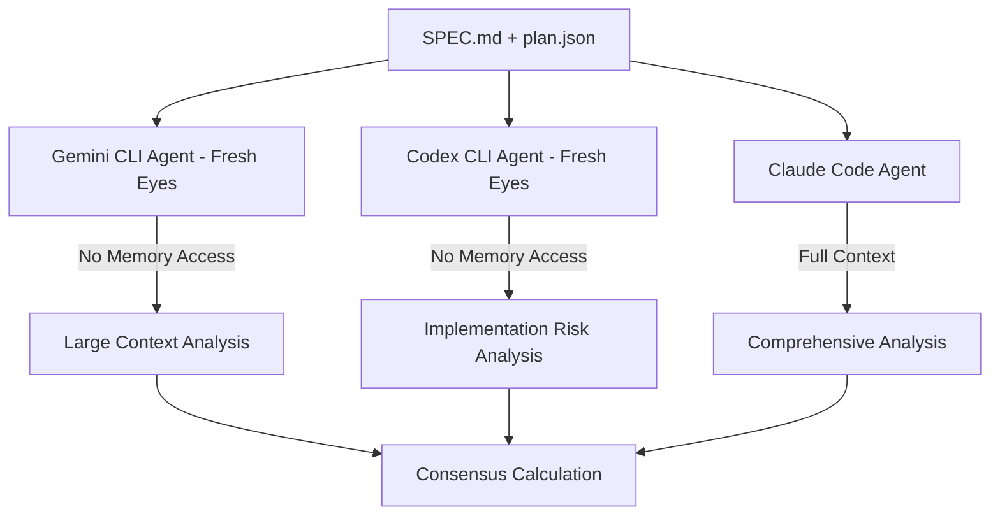

# Pre-mortem Methodology Integration with S-R-P-E-K

## 🎯 Overview

The pre-mortem loop integrates with the S-R-P-E-K methodology to provide proactive risk assessment using diversity of thought from multiple AI agents. This methodology leverages Claude Code, Gemini CLI, and Codex CLI with fresh-eyes analysis to achieve <3% failure rates before implementation begins.

## 🧠 Fresh-Eyes Analysis Concept

### Core Principle
Each agent analyzes specifications and plans with **complete isolation** from project context and memory, simulating the perspective of a new team member reviewing the project for the first time.

### Agent Specializations
- **Claude Code**: Full system context with memory for comprehensive orchestration
- **Gemini CLI**: Large context window for cross-cutting concern analysis (fresh-eyes)
- **Codex CLI**: Implementation-focused technical risk assessment (fresh-eyes)

## 🔄 Pre-mortem Loop Process

### Phase 1: Multi-Agent Fresh-Eyes Analysis


### Phase 2: Consensus Calculation
- Weighted averaging based on agent confidence levels
- Agreement level analysis using standard deviation
- Confidence range assessment (min-max spread)

### Phase 3: Convergence Check
- Target: ≤3% consensus failure rate
- If not achieved: Generate improvements and iterate
- Maximum 3 iterations to prevent endless loops

### Phase 4: Improvement Synthesis & Application
- Deduplicate improvements across all agents
- Apply to SPEC.md and plan.json with automatic backups
- Validate JSON structure and create checkpoints

## 🎭 Agent Roles & Constraints

### Fresh-Eyes Gemini Agent
```yaml
Memory Access: NONE
Tools: Sequential Thinking MCP ONLY
Focus: Large context cross-cutting analysis
Perspective: "What could go wrong from a systems view?"
```

### Fresh-Eyes Codex Agent  
```yaml
Memory Access: NONE
Tools: Sequential Thinking MCP ONLY
Focus: Implementation complexity and technical debt
Perspective: "What will be difficult to implement and maintain?"
```

### Claude Code Orchestrator
```yaml
Memory Access: FULL
Tools: All MCP tools + Sequential Thinking
Focus: System integration and quality assurance
Perspective: "How does this fit with the broader system?"
```

## 📊 Success Metrics

### Convergence Indicators
- **Consensus Failure Rate**: ≤3%
- **Agreement Level**: High (std dev ≤3%), Moderate (≤7%), Low (≤12%)
- **Confidence Range**: Narrow spread indicates strong consensus
- **Iteration Count**: Fewer iterations indicate better initial specifications

### Quality Gates
- All agents report failure probability ≤3%
- High or moderate agreement level achieved
- Comprehensive improvement recommendations generated
- JSON structure validation passes

## 🔧 Integration Points

### S-R-P-E-K Phase Integration
```
Specification → Pre-mortem → Research → Pre-mortem → Pseudocode → Pre-mortem → Execution
     ↓              ↓           ↓           ↓           ↓           ↓           ↓
   Spec.md      Risk assess   Solutions   Plan valid   Implement   Final check  Deploy
```

### Command Integration
- `/pre-mortem:loop` - Run complete analysis cycle
- `/spec:plan` - Generate plan.json for pre-mortem input
- `/gemini:impact` - Separate impact analysis (not pre-mortem)
- `/qa:run` - Validation after implementation

## 🛡️ Safety Mechanisms

### Memory Isolation Enforcement
- Fresh-eyes agents cannot access project memory or context
- Enforced through Claude Flow namespace isolation
- Prevents contamination from previous analyses

### Iteration Limits
- Maximum 3 iterations prevents endless loops
- Early termination if target achieved
- Fallback recommendations if convergence fails

### Backup & Rollback
- Automatic backups before applying improvements
- Timestamp-based backup naming
- JSON validation before committing changes

## 📁 Artifacts & Output

### Generated Files
```
.claude/.artifacts/
├── claude_premortem.json      # Claude Code analysis
├── gemini_analysis.json       # Gemini fresh-eyes analysis  
├── codex_analysis.json        # Codex fresh-eyes analysis
├── improvements.json          # Synthesized improvements
├── iteration_N_results.json   # Each iteration's results
├── convergence_log.json       # Full convergence tracking
└── convergence_summary.json   # Final summary and next steps
```

### Analysis Structure
```json
{
  "agent": "agent-name",
  "overall_failure_probability": 12.5,
  "confidence_level": 0.82,
  "failure_scenarios": [...],
  "spec_improvements": [...],
  "plan_refinements": [...],
  "newly_identified_risks": [...],
  "quality_checkpoints": [...]
}
```

## 🎯 Usage Examples

### Basic Pre-mortem Analysis
```bash
# Run complete pre-mortem loop
/pre-mortem:loop

# With custom parameters  
/pre-mortem:loop target_rate=2 max_iterations=5
```

### Integration with SPEK Workflow
```bash
# 1. Create specification
/specify "User authentication system with MFA"

# 2. Generate plan
/spec:plan

# 3. Run pre-mortem analysis
/pre-mortem:loop

# 4. Research solutions (separate from pre-mortem)
/research:deep "authentication frameworks with MFA"

# 5. Continue with implementation
/codex:micro "implement JWT authentication"
```

## 📈 Benefits

### Proactive Risk Management
- Identifies issues before implementation begins
- Reduces costly late-stage changes
- Improves specification quality through iteration

### Diversity of Thought
- Multiple AI agents with different perspectives
- Fresh-eyes analysis prevents tunnel vision
- Consensus-based decision making

### Measurable Quality Improvement
- Quantified failure probability reduction
- Trackable convergence metrics
- Historical analysis pattern learning

### Integration with Existing Workflow
- Seamless S-R-P-E-K integration
- Preserves existing command structure
- Enhanced with risk assessment capabilities

---

**Key Insight**: The pre-mortem loop transforms specification writing from a one-time activity into an iterative risk-reduction process, leveraging AI agent diversity to achieve measurable quality improvements before any code is written.