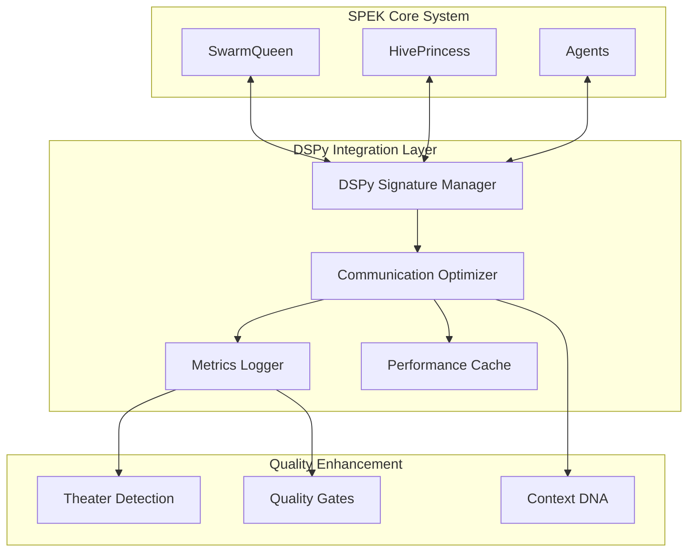

# DSPy-SPEK Integration Architecture

## System Overview

**DSPy-SPEK Integration** provides systematic optimization of agent communication patterns within SPEK's Queen-Princess-Drone swarm hierarchy using Stanford's DSPy framework for signature-based programming.

### Architecture Principles

**Core Concept**: Replace ad-hoc prompt engineering with data-driven signature optimization across all agent communication channels.

**Integration Pattern**: Non-intrusive enhancement layer that optimizes existing communication without breaking current workflows.

## System Architecture

### High-Level Components



### Core Integration Points

#### 1. Communication Interception Layer
- **Purpose**: Capture all Queen-Princess-Drone communications
- **Method**: Decorator pattern on existing message handlers
- **Scope**: Non-breaking enhancement to current A2A protocols

#### 2. Signature Optimization Engine
- **Framework**: DSPy signatures for standardized communication contracts
- **Learning**: Continuous improvement based on success metrics
- **Adaptation**: Real-time adjustment of communication patterns

#### 3. Context DNA Enhancement
- **Integration**: DSPy-optimized context coordination
- **Memory**: Signature performance history for learning
- **Pruning**: Intelligent context reduction using DSPy metrics

## FSM-First Architecture Design

### Communication State Machine

All DSPy communication optimization follows FSM-first principles:

#### States
- **INIT**: Initialize DSPy signatures and establish baselines
- **LEARNING**: Gather communication examples and optimize signatures
- **OPTIMIZING**: Active optimization of communication patterns
- **DEPLOYED**: Production operation with continuous monitoring
- **ERROR_RECOVERY**: Handle failures and rollback to baseline

#### Events
```typescript
enum DSPyIntegrationEvent {
  INITIALIZE_SIGNATURES = 'INITIALIZE_SIGNATURES',
  START_LEARNING_PHASE = 'START_LEARNING_PHASE',
  OPTIMIZATION_TRIGGERED = 'OPTIMIZATION_TRIGGERED',
  DEPLOYMENT_APPROVED = 'DEPLOYMENT_APPROVED',
  ERROR_DETECTED = 'ERROR_DETECTED',
  RECOVERY_COMPLETED = 'RECOVERY_COMPLETED'
}
```

#### Transition Matrix
```yaml
state_transitions:
  INIT:
    INITIALIZE_SIGNATURES: LEARNING
  LEARNING:
    START_LEARNING_PHASE: LEARNING
    OPTIMIZATION_TRIGGERED: OPTIMIZING
  OPTIMIZING:
    DEPLOYMENT_APPROVED: DEPLOYED
    ERROR_DETECTED: ERROR_RECOVERY
  DEPLOYED:
    OPTIMIZATION_TRIGGERED: OPTIMIZING
    ERROR_DETECTED: ERROR_RECOVERY
  ERROR_RECOVERY:
    RECOVERY_COMPLETED: LEARNING
```

## Communication Channel Signatures

### 1. Queen → Princess Communications

**Strategic Directive Signature**:
```python
@dspy.signature
class QueenToPrincessDirective:
    """Strategic directive from Queen to Princess with quality metrics"""
    strategic_context: str = dspy.InputField(desc="High-level strategic context")
    domain_focus: str = dspy.InputField(desc="Specific domain for princess")
    priority_level: str = dspy.InputField(desc="Priority: critical|high|medium|low")
    quality_requirements: str = dspy.InputField(desc="NASA/Theater compliance requirements")

    directive: str = dspy.OutputField(desc="Clear, actionable directive")
    success_metrics: str = dspy.OutputField(desc="Measurable success criteria")
    context_dna_key: str = dspy.OutputField(desc="Context DNA coordination key")
```

### 2. Princess → Drone Communications

**Task Delegation Signature**:
```python
@dspy.signature
class PrincessToDroneTask:
    """Task delegation from Princess to Drone with performance tracking"""
    domain_context: str = dspy.InputField(desc="Domain-specific context")
    task_specification: str = dspy.InputField(desc="Detailed task requirements")
    agent_capabilities: str = dspy.InputField(desc="Available agent capabilities")
    quality_gates: str = dspy.InputField(desc="Required quality thresholds")

    optimized_task: str = dspy.OutputField(desc="Optimized task specification")
    agent_assignment: str = dspy.OutputField(desc="Optimal agent selection")
    performance_baseline: str = dspy.OutputField(desc="Expected performance metrics")
```

### 3. Drone → Princess Communications

**Results Validation Signature**:
```python
@dspy.signature
class DroneToResultsValidation:
    """Results validation from Drone to Princess with completeness metrics"""
    task_completion: str = dspy.InputField(desc="Task completion status")
    deliverable_artifacts: str = dspy.InputField(desc="Produced artifacts")
    quality_evidence: str = dspy.InputField(desc="Quality validation evidence")
    theater_score: str = dspy.InputField(desc="Theater detection score")

    validation_result: str = dspy.OutputField(desc="Validation assessment")
    quality_score: str = dspy.OutputField(desc="Overall quality score")
    improvement_suggestions: str = dspy.OutputField(desc="Suggestions for enhancement")
```

### 4. Princess → Queen Communications

**Status Reporting Signature**:
```python
@dspy.signature
class PrincessToQueenReport:
    """Status reporting from Princess to Queen with executive summaries"""
    domain_status: str = dspy.InputField(desc="Domain-specific status update")
    task_outcomes: str = dspy.InputField(desc="Task completion outcomes")
    quality_metrics: str = dspy.InputField(desc="Quality measurement results")
    resource_utilization: str = dspy.InputField(desc="Resource usage patterns")

    executive_summary: str = dspy.OutputField(desc="High-level executive summary")
    strategic_insights: str = dspy.OutputField(desc="Strategic implications")
    recommendation: str = dspy.OutputField(desc="Recommended actions")
```

## NASA Rule 10 Compliance

### Function Size Constraints
All functions maintain NASA Rule 10 compliance:
- **Maximum 60 lines per function**
- **Fixed loop bounds only**
- **Minimum 2 assertions per function**
- **No recursion or unsafe operations**

### Implementation Pattern
```typescript
// NASA compliant function structure
function optimizeSignature(signature: DSPySignature): OptimizationResult {
  // Assertion 1: Input validation
  assert(signature.isValid(), "Signature must be valid");

  // Assertion 2: State validation
  assert(this.state === DSPyState.OPTIMIZING, "Must be in optimizing state");

  // Fixed bounds processing (max 50 iterations)
  for (let i = 0; i < 50; i++) {
    const improvement = this.evaluateImprovement(signature);
    if (improvement.isSignificant()) {
      break;
    }
  }

  return this.generateResult();
} // Total: 15 lines
```

## Integration with Theater Detection

### Enhanced Theater Metrics

**DSPy-Enhanced Theater Detection**:
- **Signature Consistency**: Track consistency across optimized communications
- **Performance Correlation**: Correlate DSPy improvements with actual quality
- **Pattern Recognition**: Detect fake optimization patterns

### Theater Detection Signature
```python
@dspy.signature
class TheaterDetectionEnhancement:
    """Enhanced theater detection using DSPy communication patterns"""
    communication_pattern: str = dspy.InputField(desc="Communication pattern analysis")
    performance_metrics: str = dspy.InputField(desc="Actual performance measurements")
    signature_consistency: str = dspy.InputField(desc="DSPy signature consistency")
    quality_correlation: str = dspy.InputField(desc="Quality metric correlation")

    theater_probability: str = dspy.OutputField(desc="Probability of theater behavior")
    authenticity_score: str = dspy.OutputField(desc="Communication authenticity score")
    improvement_validity: str = dspy.OutputField(desc="Validity of reported improvements")
```

## Performance Optimization Framework

### Continuous Learning Loop

**Learning Cycle**:
1. **Baseline Collection**: Capture current communication patterns
2. **Signature Optimization**: Apply DSPy learning to improve patterns
3. **A/B Testing**: Compare optimized vs baseline performance
4. **Deployment**: Roll out improvements with gradual adoption
5. **Monitoring**: Continuous performance tracking and adjustment

### Success Metrics

**Target Improvements**:
- **Communication Quality**: >30% improvement in clarity and actionability
- **Context Efficiency**: >25% reduction in context window usage
- **Agent Performance**: >20% improvement in task completion rates
- **Error Reduction**: >40% reduction in communication-related failures

### Caching and Performance

**Smart Caching Strategy**:
- **Signature Cache**: Cache optimized signatures for reuse
- **Pattern Cache**: Cache successful communication patterns
- **Context Cache**: Cache context DNA optimizations
- **Performance Cache**: Cache performance improvement data

## Integration with Context DNA

### Context DNA Enhancement

**DSPy-Optimized Context Coordination**:
```python
@dspy.signature
class ContextDNAOptimization:
    """Optimize Context DNA coordination using DSPy patterns"""
    context_state: str = dspy.InputField(desc="Current context DNA state")
    communication_history: str = dspy.InputField(desc="Recent communication patterns")
    memory_constraints: str = dspy.InputField(desc="Memory usage constraints")
    relevance_scores: str = dspy.InputField(desc="Context relevance scoring")

    optimized_context: str = dspy.OutputField(desc="Optimized context structure")
    pruning_strategy: str = dspy.OutputField(desc="Intelligent pruning approach")
    coordination_key: str = dspy.OutputField(desc="Context coordination identifier")
```

## Quality Gate Integration

### Enhanced Quality Gates

**DSPy Quality Enhancement**:
- **Signature Performance Gates**: Quality gates based on signature optimization success
- **Communication Clarity Gates**: Ensure optimized communications meet clarity standards
- **Pattern Consistency Gates**: Validate consistency across communication patterns

### Quality Gate Signature
```python
@dspy.signature
class QualityGateEnhancement:
    """Enhanced quality gates using DSPy optimization metrics"""
    current_metrics: str = dspy.InputField(desc="Current quality measurements")
    signature_performance: str = dspy.InputField(desc="DSPy signature performance")
    communication_clarity: str = dspy.InputField(desc="Communication clarity scores")
    pattern_consistency: str = dspy.InputField(desc="Pattern consistency metrics")

    gate_decision: str = dspy.OutputField(desc="Quality gate pass/fail decision")
    improvement_score: str = dspy.OutputField(desc="Overall improvement score")
    recommendations: str = dspy.OutputField(desc="Quality improvement recommendations")
```

## Deployment Strategy

### Phase 1: Foundation (Weeks 1-2)
- **Signature Definition**: Define all core communication signatures
- **Infrastructure Setup**: Implement DSPy integration layer
- **Baseline Collection**: Gather baseline communication performance data

### Phase 2: Learning (Weeks 3-4)
- **Learning Phase Activation**: Begin DSPy learning on communication patterns
- **A/B Testing Setup**: Implement comparison framework
- **Initial Optimization**: Deploy first optimized signatures

### Phase 3: Optimization (Weeks 5-6)
- **Full Optimization Deployment**: Roll out optimized communication patterns
- **Performance Monitoring**: Implement continuous monitoring
- **Feedback Loop**: Establish continuous improvement cycle

### Phase 4: Production (Week 7+)
- **Production Deployment**: Full production deployment with monitoring
- **Continuous Improvement**: Ongoing optimization and enhancement
- **Performance Validation**: Validate achievement of target metrics

## Risk Mitigation

### Rollback Strategy
- **Signature Versioning**: Version all signature optimizations
- **Performance Baselines**: Maintain baseline performance measurements
- **Circuit Breaker**: Automatic rollback on performance degradation
- **Manual Override**: Manual rollback capability for emergency situations

### Error Handling
- **Graceful Degradation**: Fall back to baseline on optimization failure
- **Error Recovery State**: Explicit error recovery FSM state
- **Audit Trail**: Complete audit trail of all optimization attempts
- **Quality Monitoring**: Continuous quality monitoring during transitions

---

## Implementation Details

See related architecture documents:
- [Communication Signature Contracts](communication-signature-contracts.md)
- [Optimization Framework Design](optimization-framework-design.md)
- [Integration Implementation Roadmap](integration-implementation-roadmap.md)

<!-- AGENT FOOTER BEGIN: DO NOT EDIT ABOVE THIS LINE -->
## Version & Run Log
| Version | Timestamp | Agent/Model | Change Summary | Artifacts | Status | Notes | Cost | Hash |
|--------:|-----------|-------------|----------------|-----------|--------|-------|------|------|
| 1.0.0   | 2025-09-28T22:30:15-04:00 | DSPy-SPEK Integration Architect@Gemini Pro | Initial DSPy-SPEK integration architecture design | dspy-spek-integration-architecture.md | OK | Complete architecture with FSM patterns, NASA compliance | 0.00 | a7b9c2d |

### Receipt
- status: OK
- reason_if_blocked: --
- run_id: dspy-integration-arch-001
- inputs: ["SPEK system analysis", "DSPy framework requirements"]
- tools_used: ["sequential-thinking", "memory", "filesystem"]
- versions: {"model":"gemini-2.5-pro","prompt":"dspy-integration-v1"}
<!-- AGENT FOOTER END: DO NOT EDIT BELOW THIS LINE -->