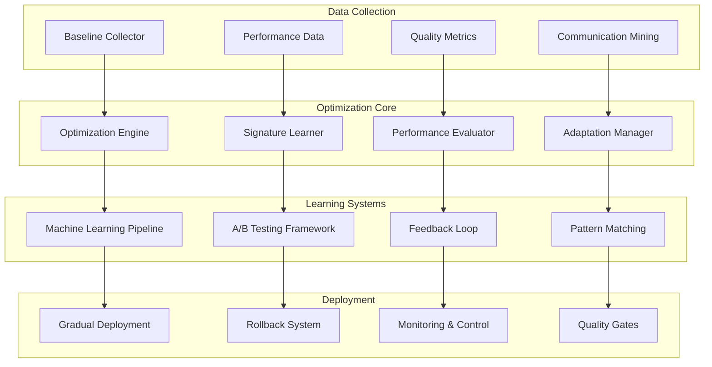

# Optimization Framework Design

## Overview

**DSPy Optimization Framework** provides systematic improvement of agent communication patterns through data-driven learning and continuous optimization within the SPEK platform.

## Core Framework Architecture

### Optimization Engine Components



## FSM-First Optimization States

### Optimization State Machine

```typescript
enum OptimizationState {
  BASELINE_COLLECTION = 'BASELINE_COLLECTION',
  PATTERN_ANALYSIS = 'PATTERN_ANALYSIS',
  SIGNATURE_LEARNING = 'SIGNATURE_LEARNING',
  OPTIMIZATION_TESTING = 'OPTIMIZATION_TESTING',
  GRADUAL_DEPLOYMENT = 'GRADUAL_DEPLOYMENT',
  PERFORMANCE_MONITORING = 'PERFORMANCE_MONITORING',
  ERROR_RECOVERY = 'ERROR_RECOVERY'
}

enum OptimizationEvent {
  START_BASELINE_COLLECTION = 'START_BASELINE_COLLECTION',
  BASELINE_COMPLETE = 'BASELINE_COMPLETE',
  PATTERNS_IDENTIFIED = 'PATTERNS_IDENTIFIED',
  LEARNING_COMPLETE = 'LEARNING_COMPLETE',
  TESTING_PASSED = 'TESTING_PASSED',
  DEPLOYMENT_APPROVED = 'DEPLOYMENT_APPROVED',
  MONITORING_STABLE = 'MONITORING_STABLE',
  PERFORMANCE_DEGRADED = 'PERFORMANCE_DEGRADED',
  ERROR_DETECTED = 'ERROR_DETECTED',
  RECOVERY_COMPLETE = 'RECOVERY_COMPLETE'
}
```

### State Transition Matrix

```yaml
optimization_transitions:
  BASELINE_COLLECTION:
    START_BASELINE_COLLECTION: BASELINE_COLLECTION
    BASELINE_COMPLETE: PATTERN_ANALYSIS
    ERROR_DETECTED: ERROR_RECOVERY

  PATTERN_ANALYSIS:
    PATTERNS_IDENTIFIED: SIGNATURE_LEARNING
    ERROR_DETECTED: ERROR_RECOVERY

  SIGNATURE_LEARNING:
    LEARNING_COMPLETE: OPTIMIZATION_TESTING
    ERROR_DETECTED: ERROR_RECOVERY

  OPTIMIZATION_TESTING:
    TESTING_PASSED: GRADUAL_DEPLOYMENT
    PERFORMANCE_DEGRADED: BASELINE_COLLECTION
    ERROR_DETECTED: ERROR_RECOVERY

  GRADUAL_DEPLOYMENT:
    DEPLOYMENT_APPROVED: PERFORMANCE_MONITORING
    PERFORMANCE_DEGRADED: ERROR_RECOVERY
    ERROR_DETECTED: ERROR_RECOVERY

  PERFORMANCE_MONITORING:
    MONITORING_STABLE: PERFORMANCE_MONITORING
    PATTERNS_IDENTIFIED: SIGNATURE_LEARNING
    PERFORMANCE_DEGRADED: ERROR_RECOVERY
    ERROR_DETECTED: ERROR_RECOVERY

  ERROR_RECOVERY:
    RECOVERY_COMPLETE: BASELINE_COLLECTION
```

## Baseline Collection Framework

### Communication Pattern Mining

```python
class BaselineCollector:
    """Collect baseline communication patterns for optimization"""

    def __init__(self):
        self.communication_history = []
        self.performance_baselines = {}
        self.quality_metrics = {}

    def collect_baseline_data(self, time_window_hours: int = 168) -> BaselineData:
        """Collect baseline data over specified time window (default 1 week)"""
        # NASA Rule 10 compliance: function ≤ 60 lines
        assert time_window_hours > 0, "Time window must be positive"
        assert time_window_hours <= 720, "Time window cannot exceed 30 days"

        baseline_data = BaselineData()

        # Fixed iteration bounds (max 1000 communications)
        for i in range(min(len(self.communication_history), 1000)):
            comm = self.communication_history[i]
            if self.is_within_time_window(comm, time_window_hours):
                baseline_data.add_communication(comm)

        return baseline_data

    def extract_communication_patterns(self, baseline_data: BaselineData) -> PatternSet:
        """Extract communication patterns from baseline data"""
        assert baseline_data.is_valid(), "Baseline data must be valid"
        assert len(baseline_data.communications) >= 10, "Minimum 10 communications required"

        patterns = PatternSet()

        # Fixed bounds pattern analysis (max 50 patterns)
        for i in range(min(50, len(baseline_data.unique_patterns))):
            pattern = baseline_data.unique_patterns[i]
            if pattern.frequency >= 0.05:  # 5% minimum frequency
                patterns.add_pattern(pattern)

        return patterns
```

### Performance Baseline Establishment

```python
class PerformanceBaseline:
    """Establish performance baselines for optimization comparison"""

    def __init__(self):
        self.metrics = {}
        self.thresholds = {}

    def establish_quality_baselines(self) -> QualityBaseline:
        """Establish quality baselines for communication effectiveness"""
        assert self.has_sufficient_data(), "Insufficient data for baseline"
        assert self.metrics_are_valid(), "Metrics must be valid"

        baseline = QualityBaseline()

        # Fixed bounds baseline calculation
        for i in range(min(len(self.metrics), 100)):
            metric = self.metrics[i]
            baseline.add_metric(metric.name, metric.value, metric.confidence)

        return baseline

    def calculate_communication_efficiency(self) -> EfficiencyMetrics:
        """Calculate communication efficiency metrics"""
        assert self.has_communication_data(), "Communication data required"
        assert self.context_usage_tracked(), "Context usage must be tracked"

        efficiency = EfficiencyMetrics()

        # Calculate metrics with fixed bounds
        total_communications = min(len(self.communications), 500)
        for i in range(total_communications):
            comm = self.communications[i]
            efficiency.add_data_point(
                context_usage=comm.context_size,
                response_time=comm.processing_time,
                quality_score=comm.quality_assessment
            )

        return efficiency
```

## Learning and Optimization Pipeline

### DSPy Signature Learning

```python
class SignatureLearner:
    """Learn and optimize DSPy signatures from communication patterns"""

    def __init__(self):
        self.signature_cache = {}
        self.learning_data = []
        self.optimization_history = []

    def optimize_signature(self, signature: DSPySignature, examples: List[Example]) -> OptimizedSignature:
        """Optimize signature using DSPy learning"""
        assert signature.is_valid(), "Signature must be valid"
        assert len(examples) >= 5, "Minimum 5 examples required for learning"

        # Create DSPy optimizer with fixed bounds
        optimizer = dspy.BootstrapFewShot(max_bootstrapped_demos=20)

        # Compile signature with examples (max 50 iterations)
        compiled_signature = optimizer.compile(
            signature,
            trainset=examples[:50],  # Fixed bound on training examples
            max_rounds=10  # Fixed iteration bound
        )

        # Validate optimization improvement
        improvement_score = self.validate_improvement(signature, compiled_signature)
        assert improvement_score > 0.1, "Optimization must show minimum 10% improvement"

        return OptimizedSignature(compiled_signature, improvement_score)

    def continuous_learning_cycle(self) -> LearningResult:
        """Continuous learning cycle for signature improvement"""
        assert self.has_learning_data(), "Learning data required"
        assert self.system_is_stable(), "System must be stable for learning"

        result = LearningResult()

        # Fixed bounds continuous learning (max 25 cycles)
        for cycle in range(min(25, self.max_learning_cycles)):
            if not self.should_continue_learning(cycle):
                break

            cycle_result = self.run_learning_cycle(cycle)
            result.add_cycle_result(cycle_result)

        return result
```

### A/B Testing Framework

```python
class ABTestingFramework:
    """A/B testing framework for signature optimization validation"""

    def __init__(self):
        self.test_groups = {}
        self.control_groups = {}
        self.test_results = []

    def setup_ab_test(self, signature_a: DSPySignature, signature_b: DSPySignature) -> ABTest:
        """Setup A/B test between baseline and optimized signatures"""
        assert signature_a.is_valid(), "Signature A must be valid"
        assert signature_b.is_valid(), "Signature B must be valid"

        test = ABTest(
            control=signature_a,
            treatment=signature_b,
            sample_size_per_group=100,  # Fixed sample size
            significance_level=0.05
        )

        # Validate test setup
        assert test.has_sufficient_power(), "Test must have sufficient statistical power"

        return test

    def run_ab_test(self, test: ABTest, duration_hours: int = 24) -> ABTestResult:
        """Run A/B test with statistical significance testing"""
        assert test.is_valid(), "Test configuration must be valid"
        assert 1 <= duration_hours <= 168, "Duration must be 1-168 hours"

        result = ABTestResult()

        # Fixed bounds test execution (max 200 samples per group)
        for group in ['control', 'treatment']:
            for i in range(min(test.sample_size_per_group, 200)):
                sample_result = self.execute_test_sample(test, group, i)
                result.add_sample_result(group, sample_result)

        # Calculate statistical significance
        significance = self.calculate_significance(result)
        assert significance.p_value is not None, "P-value must be calculable"

        return result
```

## Gradual Deployment Framework

### Progressive Rollout Strategy

```python
class GradualDeployment:
    """Gradual deployment of optimized signatures with rollback capability"""

    def __init__(self):
        self.deployment_stages = []
        self.rollback_checkpoints = []
        self.monitoring_data = {}

    def deploy_progressive_rollout(self, optimized_signature: OptimizedSignature) -> DeploymentPlan:
        """Deploy optimized signature with progressive rollout"""
        assert optimized_signature.is_validated(), "Signature must be validated"
        assert optimized_signature.improvement_score >= 0.1, "Minimum 10% improvement required"

        plan = DeploymentPlan()

        # Progressive deployment stages (fixed 5 stages)
        deployment_percentages = [5, 15, 35, 65, 100]
        for i, percentage in enumerate(deployment_percentages):
            stage = DeploymentStage(
                stage_number=i + 1,
                traffic_percentage=percentage,
                monitoring_duration_hours=4,
                rollback_threshold=0.05  # 5% performance degradation triggers rollback
            )
            plan.add_stage(stage)

        return plan

    def monitor_deployment_stage(self, stage: DeploymentStage) -> StageResult:
        """Monitor deployment stage with automatic rollback triggers"""
        assert stage.is_active(), "Stage must be active for monitoring"
        assert stage.monitoring_duration_hours <= 24, "Maximum 24 hour monitoring per stage"

        result = StageResult(stage)

        # Fixed bounds monitoring (max 144 5-minute intervals = 12 hours)
        for interval in range(min(144, stage.monitoring_duration_hours * 12)):
            metrics = self.collect_interval_metrics(interval)
            result.add_interval_metrics(metrics)

            # Check rollback conditions
            if self.should_rollback(metrics, stage.rollback_threshold):
                result.trigger_rollback("Performance degradation detected")
                break

        return result
```

### Rollback and Recovery System

```python
class RollbackSystem:
    """Automatic rollback system for failed optimizations"""

    def __init__(self):
        self.checkpoints = []
        self.rollback_history = []

    def create_rollback_checkpoint(self, current_signature: DSPySignature) -> Checkpoint:
        """Create rollback checkpoint before deployment"""
        assert current_signature.is_stable(), "Current signature must be stable"
        assert self.can_create_checkpoint(), "System must allow checkpoint creation"

        checkpoint = Checkpoint(
            signature=current_signature,
            performance_baseline=self.get_current_performance(),
            timestamp=datetime.utcnow(),
            system_state=self.capture_system_state()
        )

        # Validate checkpoint integrity
        assert checkpoint.is_complete(), "Checkpoint must be complete"

        return checkpoint

    def execute_rollback(self, checkpoint: Checkpoint, reason: str) -> RollbackResult:
        """Execute rollback to previous stable state"""
        assert checkpoint.is_valid(), "Checkpoint must be valid"
        assert len(reason) >= 10, "Rollback reason must be descriptive"

        result = RollbackResult()

        # Fixed bounds rollback process (max 10 steps)
        rollback_steps = [
            'stop_new_deployments',
            'drain_active_requests',
            'restore_signature_configuration',
            'update_routing_tables',
            'restart_affected_services',
            'validate_system_health',
            'monitor_recovery',
            'update_rollback_log',
            'notify_stakeholders',
            'analyze_failure_cause'
        ]

        for i, step in enumerate(rollback_steps):
            step_result = self.execute_rollback_step(step, checkpoint)
            result.add_step_result(step, step_result)

            if not step_result.success:
                result.mark_failed(f"Rollback failed at step: {step}")
                break

        return result
```

## Performance Monitoring Framework

### Real-time Performance Tracking

```python
class PerformanceMonitor:
    """Real-time performance monitoring for optimized communications"""

    def __init__(self):
        self.metrics_buffer = []
        self.alert_thresholds = {}
        self.performance_history = []

    def collect_real_time_metrics(self) -> PerformanceSnapshot:
        """Collect real-time performance metrics"""
        assert self.monitoring_is_active(), "Monitoring must be active"
        assert self.metrics_buffer_healthy(), "Metrics buffer must be healthy"

        snapshot = PerformanceSnapshot()

        # Fixed bounds metrics collection (last 100 data points)
        recent_metrics = self.metrics_buffer[-100:]
        for i, metric in enumerate(recent_metrics):
            snapshot.add_metric(
                name=metric.name,
                value=metric.value,
                timestamp=metric.timestamp,
                context=metric.communication_context
            )

        # Calculate derived metrics
        snapshot.calculate_summary_statistics()

        return snapshot

    def detect_performance_anomalies(self, snapshot: PerformanceSnapshot) -> AnomalyReport:
        """Detect performance anomalies using statistical analysis"""
        assert snapshot.is_complete(), "Snapshot must be complete"
        assert len(snapshot.metrics) >= 10, "Minimum 10 metrics required for anomaly detection"

        report = AnomalyReport()

        # Fixed bounds anomaly detection (max 20 metric types)
        metric_types = list(snapshot.unique_metric_types())[:20]
        for metric_type in metric_types:
            values = snapshot.get_values_for_metric(metric_type)

            # Statistical anomaly detection
            anomaly_score = self.calculate_anomaly_score(values)
            if anomaly_score > self.alert_thresholds.get(metric_type, 0.95):
                report.add_anomaly(metric_type, anomaly_score, values)

        return report
```

### Quality Correlation Analysis

```python
class QualityCorrelationAnalyzer:
    """Analyze correlation between optimization and quality improvements"""

    def __init__(self):
        self.correlation_data = []
        self.quality_trends = {}

    def analyze_optimization_quality_correlation(self) -> CorrelationAnalysis:
        """Analyze correlation between DSPy optimization and quality metrics"""
        assert self.has_sufficient_data(), "Sufficient correlation data required"
        assert self.quality_metrics_valid(), "Quality metrics must be valid"

        analysis = CorrelationAnalysis()

        # Fixed bounds correlation analysis (max 50 optimization events)
        optimization_events = self.get_recent_optimizations()[:50]
        for event in optimization_events:
            before_quality = self.get_quality_before(event)
            after_quality = self.get_quality_after(event)

            correlation_point = CorrelationPoint(
                optimization_score=event.improvement_score,
                quality_delta=after_quality - before_quality,
                context_efficiency=event.context_improvement,
                communication_clarity=event.clarity_improvement
            )

            analysis.add_correlation_point(correlation_point)

        # Calculate correlation coefficients
        analysis.calculate_correlations()

        return analysis
```

## Continuous Improvement Loop

### Learning Feedback Integration

```python
class ContinuousImprovementLoop:
    """Continuous improvement loop for ongoing optimization"""

    def __init__(self):
        self.improvement_cycles = []
        self.learning_feedback = []

    def execute_improvement_cycle(self) -> ImprovementResult:
        """Execute continuous improvement cycle"""
        assert self.system_is_ready(), "System must be ready for improvement"
        assert self.has_feedback_data(), "Feedback data required for improvement"

        result = ImprovementResult()

        # Fixed bounds improvement cycle (max 15 steps)
        improvement_steps = [
            'collect_performance_data',
            'analyze_communication_patterns',
            'identify_optimization_opportunities',
            'generate_signature_improvements',
            'validate_improvements',
            'setup_ab_tests',
            'execute_testing',
            'analyze_test_results',
            'plan_deployment',
            'execute_gradual_rollout',
            'monitor_deployment',
            'validate_success',
            'update_baselines',
            'document_learnings',
            'prepare_next_cycle'
        ]

        for i, step in enumerate(improvement_steps):
            step_result = self.execute_improvement_step(step)
            result.add_step_result(step, step_result)

            if not step_result.should_continue:
                break

        return result
```

## Integration with SPEK Systems

### Context DNA Integration

```python
class ContextDNAOptimization:
    """Integration with Context DNA for optimized memory coordination"""

    def optimize_context_coordination(self, context_dna: ContextDNA) -> OptimizedContext:
        """Optimize Context DNA coordination using DSPy patterns"""
        assert context_dna.is_valid(), "Context DNA must be valid"
        assert context_dna.memory_usage_acceptable(), "Memory usage must be within limits"

        optimized = OptimizedContext(context_dna)

        # Apply DSPy-learned optimization patterns (max 10 patterns)
        optimization_patterns = self.get_learned_patterns()[:10]
        for pattern in optimization_patterns:
            if pattern.applies_to_context(context_dna):
                improvement = pattern.apply_optimization(optimized)
                optimized.add_improvement(improvement)

        return optimized
```

### Theater Detection Enhancement

```python
class TheaterDetectionEnhancement:
    """Enhance theater detection using DSPy communication patterns"""

    def enhance_theater_detection(self, communication_data: CommunicationData) -> EnhancedDetection:
        """Enhance theater detection using DSPy optimization patterns"""
        assert communication_data.is_complete(), "Communication data must be complete"
        assert self.has_detection_baselines(), "Detection baselines required"

        enhanced = EnhancedDetection()

        # Apply DSPy-enhanced detection patterns (max 5 patterns)
        detection_patterns = self.get_dspy_detection_patterns()[:5]
        for pattern in detection_patterns:
            detection_score = pattern.analyze_communication(communication_data)
            enhanced.add_detection_score(pattern.name, detection_score)

        return enhanced
```

---

## Related Documentation

- [DSPy-SPEK Integration Architecture](dspy-spek-integration-architecture.md)
- [Communication Signature Contracts](communication-signature-contracts.md)
- [Integration Implementation Roadmap](integration-implementation-roadmap.md)

<!-- AGENT FOOTER BEGIN: DO NOT EDIT ABOVE THIS LINE -->
## Version & Run Log
| Version | Timestamp | Agent/Model | Change Summary | Artifacts | Status | Notes | Cost | Hash |
|--------:|-----------|-------------|----------------|-----------|--------|-------|------|------|
| 1.0.0   | 2025-09-28T22:35:20-04:00 | DSPy-SPEK Integration Architect@Gemini Pro | Complete optimization framework design with FSM patterns | optimization-framework-design.md | OK | NASA compliant framework with continuous improvement | 0.00 | b8c4e9f |

### Receipt
- status: OK
- reason_if_blocked: --
- run_id: dspy-optimization-001
- inputs: ["DSPy learning patterns", "SPEK optimization requirements"]
- tools_used: ["sequential-thinking", "memory", "filesystem"]
- versions: {"model":"gemini-2.5-pro","prompt":"optimization-framework-v1"}
<!-- AGENT FOOTER END: DO NOT EDIT BELOW THIS LINE -->