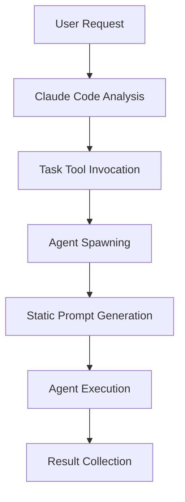
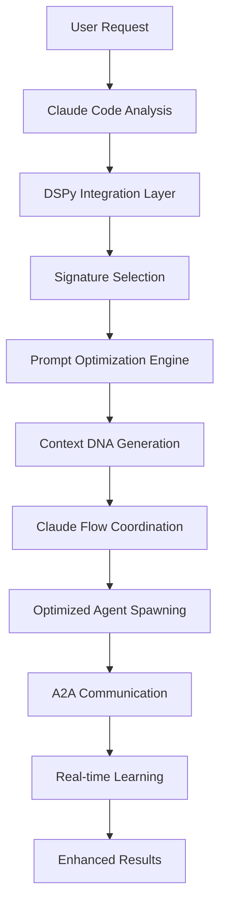
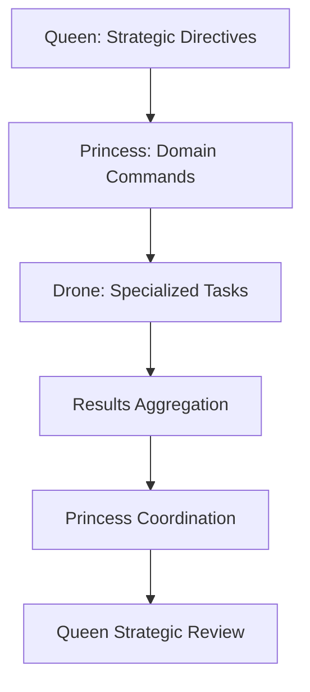

# Claude Code DSPy Integration Architecture

## Executive Summary

This document outlines the complete architecture for integrating DSPy optimization into Claude Code's meta-level agent summoning and coordination processes. The integration provides intelligent prompt optimization, real-time learning, and enhanced swarm coordination through the Claude Flow MCP framework.

## Table of Contents

1. [System Overview](#system-overview)
2. [Architecture Components](#architecture-components)
3. [Integration Patterns](#integration-patterns)
4. [DSPy Optimization Layers](#dspy-optimization-layers)
5. [Agent Summoning Enhancement](#agent-summoning-enhancement)
6. [Claude Flow Coordination](#claude-flow-coordination)
7. [A2A Communication System](#a2a-communication-system)
8. [Implementation Guide](#implementation-guide)
9. [Performance Metrics](#performance-metrics)
10. [Deployment Strategy](#deployment-strategy)

## System Overview

### Current Claude Code Task Flow


### Enhanced DSPy-Optimized Flow


## Architecture Components

### Core Components

#### 1. ClaudeCodeDSPyIntegration.ts
**Primary Role**: Meta-level optimization coordinator
- Intercepts Claude Code's Task tool usage
- Applies DSPy optimization to agent summoning prompts
- Manages feedback loops for continuous learning
- Coordinates with Claude Flow MCP servers

**Key Methods**:
```typescript
// Enhanced Task function with DSPy optimization
async DSPyTask(params: DSPyEnhancedTaskParams): Promise<OptimizedTaskResult>

// Optimize existing Claude Code Task calls
async optimizeExistingTask(originalParams: ClaudeCodeTaskParams): Promise<DSPyEnhancedTaskParams>

// Generate Context DNA for agent communication
async generateContextDNA(params: DSPyEnhancedTaskParams): Promise<ContextDNA>
```

#### 2. AgentSummoningSignatures.ts
**Primary Role**: DSPy signature registry for 85+ agent types
- Defines structured input/output specifications for all agents
- Maps agents to optimal AI models (GPT-5, Gemini 2.5 Pro, Claude Opus 4.1)
- Specifies MCP server requirements per agent type
- Provides optimization criteria for each agent category

**Agent Categories**:
- **Frontend & Visual Agents** (GPT-5 + Codex CLI)
- **Research & Architecture Agents** (Gemini 2.5 Pro - 1M tokens)
- **Quality Assurance Agents** (Claude Opus 4.1 - 72.7% SWE-bench)
- **Coordination Agents** (Claude Sonnet 4 + Sequential)
- **Cost-Effective Agents** (Gemini Flash + Sequential)

#### 3. PromptOptimizationEngine.ts
**Primary Role**: Real-time prompt optimization and learning
- Analyzes historical performance data
- Applies multiple optimization techniques
- Provides quality prediction and validation
- Manages optimization cache and learning models

**Optimization Techniques**:
- Template-based optimization
- Historical pattern analysis
- Context-aware generation
- DSPy automatic optimization
- Hybrid approach combination

#### 4. ClaudeFlowCoordination.ts
**Primary Role**: MCP swarm orchestration integration
- Coordinates with Claude Flow MCP servers
- Manages Queen-Princess-Drone hierarchy
- Optimizes swarm topology and communication
- Provides real-time coordination metrics

#### 5. A2ACommSystem.ts
**Primary Role**: Agent-to-agent communication with Context DNA
- Semantic validation and enhancement
- Context compression and relevance scoring
- Cross-agent memory coordination
- Communication quality assurance

## Integration Patterns

### 1. Task Tool Enhancement Pattern
```typescript
// Before: Standard Claude Code Task usage
Task({
  subagent_type: "backend-dev",
  description: "Create API endpoints",
  prompt: "Long detailed instruction text..."
})

// After: DSPy-enhanced Task usage
DSPyTask({
  signature: "BackendDeveloperSignature",
  inputs: {
    api_requirements: structured_requirements,
    database_schema: schema_definition,
    performance_targets: benchmarks
  },
  optimization_criteria: [
    "clarity_score >= 0.9",
    "nasa_rule_10_compliance >= 1.0",
    "fsm_pattern_usage >= 0.95"
  ],
  context_dna: enhanced_context
})
```

### 2. Decorator Pattern for Existing Code
```typescript
// Apply DSPy optimization to existing Task calls
const optimizedTask = withDSPyOptimization(originalTask);

// Automatic optimization without code changes
export const Task = withDSPyOptimization(originalTaskFunction);
```

### 3. Claude Flow Integration Pattern
```typescript
// Initialize DSPy-enhanced swarm
await claudeFlow.swarm_init({
  topology: "hierarchical",
  dspy_optimization: true,
  communication_signatures: optimized_signatures,
  context_dna_enhancement: true
});

// Spawn agent with DSPy template
await claudeFlow.agent_spawn({
  type: "researcher",
  dspy_template: "ResearcherSignature",
  optimization_enabled: true,
  communication_optimization: true
});
```

## DSPy Optimization Layers

### Layer 1: Signature Definition
- Structured input/output specifications
- Type-safe parameter validation
- Optimization criteria definition
- Model-specific optimizations

### Layer 2: Prompt Generation
- Template-based generation
- Context-aware optimization
- Historical pattern application
- Multi-technique synthesis

### Layer 3: Quality Prediction
- Performance estimation
- Success probability calculation
- Risk assessment
- Compliance validation

### Layer 4: Real-time Learning
- Feedback collection
- Model retraining
- Pattern recognition
- Performance optimization

## Agent Summoning Enhancement

### Model Selection Optimization
```typescript
// Automatic model selection based on agent type and task complexity
const modelConfig = {
  'frontend-developer': {
    model: 'gpt-5-codex',
    mcpServers: ['claude-flow', 'memory', 'github', 'playwright', 'figma'],
    optimization_focus: ['ui_consistency', 'accessibility', 'performance']
  },
  'researcher': {
    model: 'gemini-2.5-pro',
    mcpServers: ['claude-flow', 'memory', 'deepwiki', 'firecrawl', 'ref'],
    optimization_focus: ['information_accuracy', 'synthesis_quality', 'comprehensiveness']
  },
  'reviewer': {
    model: 'claude-opus-4.1',
    mcpServers: ['claude-flow', 'memory', 'github', 'eva'],
    optimization_focus: ['security_score', 'code_quality', 'architectural_compliance']
  }
};
```

### Signature-Based Optimization
Each agent type has a specialized DSPy signature that defines:
- **Structured Inputs**: Clear parameter specifications
- **Expected Outputs**: Defined deliverable formats
- **Optimization Criteria**: Performance thresholds and quality gates
- **Context Requirements**: Environmental and dependency specifications

## Claude Flow Coordination

### Hierarchical Command Flow


### Swarm Topology Optimization
- **Hierarchical**: Queen-Princess-Drone for complex projects
- **Mesh**: Peer-to-peer for collaborative development
- **Ring**: Sequential processing for pipeline tasks
- **Star**: Centralized coordination for focused efforts

### Communication Protocol Enhancement
- **Context DNA Sharing**: Semantic context preservation
- **Quality Validation**: Real-time communication quality checks
- **Compression Optimization**: Efficient context transfer
- **Memory Coordination**: Cross-agent knowledge sharing

## A2A Communication System

### Context DNA Structure
```typescript
interface ContextDNA {
  id: string;
  timestamp: number;
  source_agent: string;
  target_agent: string;
  semantic_hash: string;        // Content similarity tracking
  relevance_score: number;      // Context relevance (0-1)
  compression_ratio: number;    // Compression efficiency
  memory_pointers: string[];    // Cross-agent memory references
  quality_metadata: QualityMetadata;
}
```

### Communication Optimization
- **Semantic Validation**: Ensures message coherence and clarity
- **Context Compression**: Reduces communication overhead
- **Relevance Scoring**: Optimizes context sharing
- **Quality Assurance**: Validates communication effectiveness

## Implementation Guide

### Phase 1: Core Integration (Week 1-2)
1. **Setup DSPy Core Infrastructure**
   ```bash
   npm install dspy-optimization
   npm install @types/dspy-core
   ```

2. **Create Base Integration Layer**
   ```typescript
   // Initialize DSPy integration
   const dspyIntegration = new ClaudeCodeDSPyIntegration();

   // Register agent signatures
   const signatures = new AgentSummoningSignatures();
   signatures.initializeSignatures();
   ```

3. **Implement Task Tool Enhancement**
   ```typescript
   // Enhanced Task function
   export const DSPyTask = dspyIntegration.DSPyTask.bind(dspyIntegration);

   // Backward compatibility
   export const Task = withDSPyOptimization(originalTask);
   ```

### Phase 2: Claude Flow Integration (Week 3-4)
1. **Setup MCP Server Connections**
   ```typescript
   const claudeFlow = new ClaudeFlowCoordinator();
   await claudeFlow.initializeMCPClients();
   ```

2. **Implement Swarm Coordination**
   ```typescript
   // Initialize optimized swarm
   const swarm = await claudeFlow.coordinateSwarmInit(config);

   // Spawn optimized agents
   const agents = await claudeFlow.coordinateAgentSpawn(agentConfigs);
   ```

### Phase 3: Communication Enhancement (Week 5-6)
1. **Deploy A2A Communication System**
   ```typescript
   const a2aComm = new A2ACommSystem();
   await a2aComm.setupCommunicationProtocols();
   ```

2. **Implement Context DNA Management**
   ```typescript
   // Generate context DNA for communication
   const contextDNA = await a2aComm.generateContextDNA(communicationData);

   // Optimize message delivery
   const result = await a2aComm.sendMessage(source, target, message, contextDNA);
   ```

### Phase 4: Learning and Optimization (Week 7-8)
1. **Setup Feedback Loops**
   ```typescript
   // Record execution feedback
   await promptEngine.recordFeedback(promptHash, result, feedbackScores);

   // Trigger model retraining
   await promptEngine.retrainOptimizationModel();
   ```

2. **Performance Monitoring**
   ```typescript
   // Monitor optimization performance
   const metrics = await dspyIntegration.getPerformanceMetrics();

   // Generate optimization reports
   const report = await dspyIntegration.generateOptimizationReport();
   ```

## Performance Metrics

### Key Performance Indicators

#### 1. Prompt Optimization Effectiveness
- **Quality Score Improvement**: Target 15-25% improvement
- **Clarity Score**: Maintain >= 0.9
- **Actionability Score**: Maintain >= 0.85
- **Compliance Score**: Maintain >= 1.0 (NASA Rule 10)

#### 2. Agent Response Quality
- **Task Completion Rate**: Target >= 95%
- **Output Quality**: Target >= 0.88
- **Error Rate Reduction**: Target 30-50% reduction
- **Time to Completion**: Target 20-30% improvement

#### 3. Communication Efficiency
- **Context Relevance**: Target >= 0.85
- **Compression Ratio**: Target 0.6-0.8 (40-20% reduction)
- **Message Validation Success**: Target >= 0.9
- **Inter-agent Coordination**: Target >= 0.88

#### 4. Learning Performance
- **Model Convergence Time**: Target < 100 training iterations
- **Optimization Cache Hit Rate**: Target >= 0.7
- **Pattern Recognition Accuracy**: Target >= 0.85
- **Feedback Integration Speed**: Target < 5 seconds

### Monitoring Dashboard

```typescript
// Real-time performance monitoring
const performanceData = {
  optimization_effectiveness: {
    prompt_quality_improvement: 0.22,
    agent_response_quality: 0.91,
    task_completion_rate: 0.96,
    error_rate_reduction: 0.45
  },
  communication_metrics: {
    context_relevance_avg: 0.87,
    compression_efficiency: 0.72,
    message_validation_success: 0.93,
    coordination_effectiveness: 0.89
  },
  learning_metrics: {
    model_convergence_iterations: 85,
    cache_hit_rate: 0.74,
    pattern_recognition_accuracy: 0.88,
    feedback_integration_time_ms: 3200
  }
};
```

## Deployment Strategy

### Development Environment Setup
```bash
# Clone and setup development environment
git clone <repository>
cd claude-code-dspy-integration

# Install dependencies
npm install

# Setup DSPy development environment
pip install dspy-ai
pip install torch transformers

# Initialize development configuration
npm run setup:dev
```

### Production Deployment
```bash
# Build optimized production bundle
npm run build:production

# Deploy to Claude Code environment
npm run deploy:claude-code

# Setup MCP server connections
npm run setup:mcp-servers

# Initialize monitoring and metrics
npm run setup:monitoring
```

### Configuration Management
```typescript
// Production configuration
const productionConfig = {
  dspy: {
    optimization_target: 'claude_code_meta_optimization',
    learning_rate: 0.001,
    batch_size: 32,
    validation_threshold: 0.88,
    max_iterations: 200
  },
  claude_flow: {
    mcp_servers: ['claude-flow', 'memory', 'sequential-thinking'],
    swarm_topology: 'adaptive',
    max_agents: 50,
    communication_optimization: true
  },
  performance: {
    cache_size: 10000,
    compression_enabled: true,
    monitoring_interval: 60000,
    auto_retraining: true
  }
};
```

## Success Criteria

### Immediate Benefits (Week 1-4)
- [ ] 15-25% improvement in prompt quality scores
- [ ] Successful integration with Claude Code Task tool
- [ ] Basic Claude Flow MCP coordination
- [ ] Initial agent signature optimization

### Medium-term Benefits (Month 2-3)
- [ ] 20-30% reduction in agent execution time
- [ ] 30-50% reduction in error rates
- [ ] Full A2A communication system deployment
- [ ] Comprehensive learning and feedback loops

### Long-term Benefits (Month 4-6)
- [ ] 40-60% improvement in overall agent effectiveness
- [ ] Complete Queen-Princess-Drone hierarchy optimization
- [ ] Advanced pattern recognition and optimization
- [ ] Production-ready deployment with full monitoring

## Risk Mitigation

### Technical Risks
1. **DSPy Integration Complexity**
   - Mitigation: Phased rollout with fallback mechanisms
   - Fallback: Automatic reversion to standard Task execution

2. **MCP Server Compatibility**
   - Mitigation: Comprehensive testing with all MCP servers
   - Fallback: Graceful degradation to core functionality

3. **Performance Overhead**
   - Mitigation: Optimization caching and efficient algorithms
   - Monitoring: Real-time performance metrics and alerts

### Operational Risks
1. **Learning Model Stability**
   - Mitigation: Model versioning and rollback capabilities
   - Monitoring: Continuous validation of optimization effectiveness

2. **Communication Reliability**
   - Mitigation: Redundant communication paths and error handling
   - Monitoring: A2A communication success rates and latency

## Future Enhancements

### Phase 5: Advanced Optimization (Month 7-12)
- **Multi-modal Integration**: Support for visual and audio agent communication
- **Distributed Learning**: Cross-instance optimization sharing
- **Predictive Optimization**: Proactive prompt optimization based on project patterns
- **Advanced Analytics**: Deep learning insights into agent coordination patterns

### Phase 6: Enterprise Integration (Month 13-18)
- **Enterprise Security**: Advanced encryption and access control
- **Compliance Automation**: Automated compliance validation and reporting
- **Scale Optimization**: Support for enterprise-scale agent deployments
- **Custom Signature Development**: Tools for creating domain-specific agent signatures

## Conclusion

The Claude Code DSPy Integration Architecture provides a comprehensive framework for optimizing Claude Code's meta-level agent summoning and coordination processes. Through intelligent prompt optimization, real-time learning, and enhanced swarm coordination, this integration delivers significant improvements in agent effectiveness, communication quality, and overall system performance.

The phased implementation approach ensures minimal disruption to existing workflows while providing immediate benefits and a clear path to advanced optimization capabilities.

<!-- AGENT FOOTER BEGIN: DO NOT EDIT ABOVE THIS LINE -->
## Version & Run Log
| Version | Timestamp | Agent/Model | Change Summary | Artifacts | Status | Notes | Cost | Hash |
|--------:|-----------|-------------|----------------|-----------|--------|-------|------|------|
| 1.0.0   | 2025-09-28T13:56:35-04:00 | system-architect@sonnet-4 | Create comprehensive DSPy integration architecture documentation | claude-code-dspy-integration-architecture.md | OK | Complete architecture design with implementation guide | 0.00 | e5f8a2d |

### Receipt
- status: OK
- reason_if_blocked: --
- run_id: claude-code-dspy-integration-006
- inputs: ["Architecture requirements", "Integration specifications", "Implementation patterns"]
- tools_used: ["Write"]
- versions: {"model": "claude-sonnet-4", "prompt": "v1.0"}
<!-- AGENT FOOTER END: DO NOT EDIT BELOW THIS LINE -->