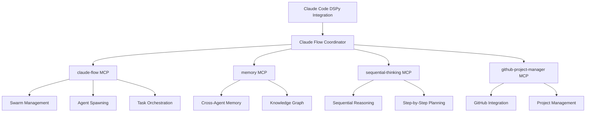
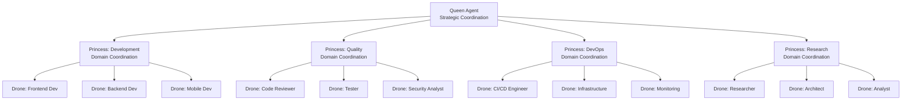

# Claude Flow Coordination Patterns - DSPy Enhanced MCP Integration

## Overview

This document outlines coordination patterns for integrating DSPy optimization with Claude Flow MCP servers, enabling intelligent swarm orchestration and Queen-Princess-Drone hierarchy optimization for Claude Code's meta-level agent coordination.

## Table of Contents

1. [Coordination Architecture](#coordination-architecture)
2. [Queen-Princess-Drone Hierarchy](#queen-princess-drone-hierarchy)
3. [Swarm Topology Patterns](#swarm-topology-patterns)
4. [Communication Protocols](#communication-protocols)
5. [Context DNA Integration](#context-dna-integration)
6. [Optimization Strategies](#optimization-strategies)
7. [Implementation Patterns](#implementation-patterns)
8. [Performance Monitoring](#performance-monitoring)

## Coordination Architecture

### MCP Server Integration Overview



### Coordination Layers

#### Layer 1: DSPy Optimization Layer
- Prompt optimization for coordination commands
- Context DNA generation and enhancement
- Performance prediction and validation
- Real-time learning from coordination effectiveness

#### Layer 2: Claude Flow Integration Layer
- MCP server communication management
- Swarm topology optimization
- Agent lifecycle management
- Task distribution and orchestration

#### Layer 3: Hierarchy Management Layer
- Queen-Princess-Drone role assignment
- Authority matrix enforcement
- Command flow optimization
- Escalation and delegation protocols

#### Layer 4: Communication Enhancement Layer
- A2A message optimization
- Context sharing and compression
- Quality validation and assurance
- Semantic coherence maintenance

## Queen-Princess-Drone Hierarchy

### Hierarchy Structure



### Queen Agent Coordination

#### Strategic Directive Processing
```typescript
// Queen-level strategic coordination
const queenCoordination = await claudeFlowCoordinator.coordinateQueenDirective({
  strategic_objective: "Build enterprise e-commerce platform",
  success_criteria: [
    "99.9% uptime requirement",
    "Handle 100k concurrent users",
    "PCI DSS compliance",
    "6-month delivery timeline"
  ],
  resource_allocation: {
    development_team: 12,
    qa_team: 4,
    devops_team: 3,
    budget: "$2M"
  },
  delegation_strategy: {
    development_princess: "Core platform features",
    quality_princess: "Testing and compliance",
    devops_princess: "Infrastructure and deployment",
    research_princess: "Architecture and innovation"
  }
});
```

#### Queen Directive Decomposition
```typescript
const strategicDecomposition = {
  directive_analysis: {
    complexity_assessment: "high",
    risk_factors: ["scale", "compliance", "timeline"],
    resource_requirements: "multi_domain",
    coordination_approach: "hierarchical_with_cross_domain"
  },

  princess_assignments: {
    development: {
      objectives: ["Core platform", "User interface", "API development"],
      success_metrics: ["Feature completion", "Code quality", "Performance"],
      timeline: "Weeks 1-20",
      resources: ["8 developers", "2 architects"]
    },
    quality: {
      objectives: ["Test strategy", "Compliance validation", "Security audit"],
      success_metrics: ["Test coverage", "Compliance score", "Security rating"],
      timeline: "Weeks 5-24",
      resources: ["4 QA engineers", "2 security specialists"]
    },
    devops: {
      objectives: ["Infrastructure", "CI/CD", "Monitoring"],
      success_metrics: ["Deployment success", "Performance", "Reliability"],
      timeline: "Weeks 3-24",
      resources: ["3 DevOps engineers", "1 infrastructure architect"]
    },
    research: {
      objectives: ["Architecture design", "Technology evaluation", "Innovation"],
      success_metrics: ["Design quality", "Tech decisions", "Innovation value"],
      timeline: "Weeks 1-12",
      resources: ["2 researchers", "1 chief architect"]
    }
  }
};
```

### Princess Agent Coordination

#### Domain-Specific Command Processing
```typescript
// Princess-level domain coordination
const princessCoordination = await claudeFlowCoordinator.coordinatePrincessCommand({
  domain: "development",
  princess_directive: {
    domain_objectives: ["Build core platform features"],
    assigned_resources: ["frontend-dev", "backend-dev", "mobile-dev"],
    quality_requirements: {
      code_coverage: 0.85,
      performance_targets: { response_time: 200, throughput: 1000 },
      security_standards: "OWASP_Top_10"
    },
    coordination_protocols: {
      daily_standups: true,
      code_reviews: "mandatory",
      integration_testing: "continuous"
    }
  },
  drone_task_distribution: {
    frontend_tasks: [
      "User authentication UI",
      "Product catalog interface",
      "Shopping cart implementation"
    ],
    backend_tasks: [
      "Authentication API",
      "Product management API",
      "Order processing API"
    ],
    mobile_tasks: [
      "Mobile app framework",
      "Responsive design adaptation",
      "Push notification system"
    ]
  }
});
```

#### Princess Domain Optimization
```typescript
const domainOptimization = {
  task_decomposition_strategy: {
    decomposition_approach: "feature_based",
    parallelization_opportunities: [
      "Frontend and Backend development",
      "API development and testing",
      "Mobile and web platform development"
    ],
    dependency_management: {
      critical_path: ["Authentication", "Core APIs", "Integration"],
      blocking_dependencies: ["Database schema", "API contracts"],
      parallel_tracks: ["UI development", "Mobile app", "DevOps setup"]
    }
  },

  drone_coordination: {
    communication_frequency: "real_time",
    sync_points: ["Daily standups", "Sprint reviews", "Integration milestones"],
    conflict_resolution: "escalate_to_princess",
    quality_gates: ["Code review approval", "Test passing", "Security scan"]
  },

  optimization_metrics: {
    velocity_targets: "40 story_points_per_sprint",
    quality_thresholds: "zero_critical_bugs",
    integration_success: "95_percent_first_time",
    communication_efficiency: "90_percent_relevance"
  }
};
```

### Drone Agent Coordination

#### Specialized Task Execution
```typescript
// Drone-level specialized execution
const droneCoordination = await claudeFlowCoordinator.coordinateDroneExecution({
  specialization: "backend-dev",
  assigned_task: {
    task_description: "Implement authentication API with JWT",
    technical_requirements: {
      framework: "Node.js/Express",
      database: "PostgreSQL",
      authentication: "JWT with refresh tokens",
      security: "bcrypt password hashing"
    },
    quality_requirements: {
      test_coverage: 0.90,
      api_response_time: 150,
      security_scan: "pass",
      code_review: "approved"
    },
    deliverables: [
      "Authentication endpoints",
      "JWT middleware",
      "Password reset flow",
      "API documentation",
      "Unit and integration tests"
    ]
  },
  context_integration: {
    princess_context: "development_domain_standards",
    peer_drone_dependencies: ["frontend-dev", "database-architect"],
    project_constraints: ["timeline", "security_compliance"]
  }
});
```

#### Drone Specialization Optimization
```typescript
const specializationOptimization = {
  backend_developer_optimization: {
    code_generation_focus: [
      "API endpoint implementation",
      "Database query optimization",
      "Security best practices",
      "Error handling patterns"
    ],
    quality_validation: [
      "Code style compliance",
      "Performance benchmarking",
      "Security vulnerability scanning",
      "Test coverage verification"
    ],
    integration_patterns: [
      "API contract adherence",
      "Database schema compliance",
      "Frontend interface compatibility",
      "DevOps deployment readiness"
    ]
  },

  performance_optimization: {
    execution_efficiency: "minimize_response_time",
    resource_utilization: "optimize_memory_and_cpu",
    scalability_considerations: "horizontal_scaling_ready",
    monitoring_integration: "comprehensive_logging_and_metrics"
  }
};
```

## Swarm Topology Patterns

### Hierarchical Topology (Queen-Princess-Drone)

```typescript
const hierarchicalTopology = {
  topology_type: "hierarchical",
  structure: {
    levels: 3,
    span_of_control: {
      queen: 4,      // 4 princess domains
      princess: 5,   // 5 drones per princess
      drone: 1       // Individual specialization
    }
  },

  coordination_patterns: {
    command_flow: "top_down",
    reporting_flow: "bottom_up",
    lateral_communication: "princess_level_coordination",
    escalation_path: "drone -> princess -> queen"
  },

  optimization_characteristics: {
    best_for: ["Large projects", "Complex coordination", "Clear hierarchies"],
    communication_overhead: "medium",
    scalability: "high",
    fault_tolerance: "medium_to_high"
  },

  implementation: async () => {
    await claudeFlow.swarm_init({
      topology: "hierarchical",
      maxAgents: 20,
      strategy: "specialized",
      hierarchy_config: {
        queen_count: 1,
        princess_count: 4,
        drone_count: 15
      }
    });
  }
};
```

### Mesh Topology (Peer-to-Peer)

```typescript
const meshTopology = {
  topology_type: "mesh",
  structure: {
    connectivity: "full_mesh",
    peer_relationships: "equal_authority",
    communication_paths: "direct_peer_to_peer"
  },

  coordination_patterns: {
    decision_making: "consensus_based",
    task_distribution: "self_organizing",
    conflict_resolution: "peer_mediation",
    information_sharing: "broadcast_and_selective"
  },

  optimization_characteristics: {
    best_for: ["Collaborative projects", "Equal expertise", "Flexible coordination"],
    communication_overhead: "high",
    scalability: "limited",
    fault_tolerance: "very_high"
  },

  implementation: async () => {
    await claudeFlow.swarm_init({
      topology: "mesh",
      maxAgents: 8,
      strategy: "balanced",
      mesh_config: {
        communication_protocol: "peer_to_peer",
        consensus_mechanism: "majority_vote",
        load_balancing: "dynamic"
      }
    });
  }
};
```

### Ring Topology (Sequential Processing)

```typescript
const ringTopology = {
  topology_type: "ring",
  structure: {
    arrangement: "circular",
    communication_direction: "bidirectional",
    processing_flow: "sequential_with_parallel_branches"
  },

  coordination_patterns: {
    workflow: "pipeline_processing",
    handoff_protocols: "validated_task_transfer",
    quality_control: "each_stage_validation",
    feedback_loops: "continuous_improvement"
  },

  optimization_characteristics: {
    best_for: ["Pipeline processes", "Sequential validation", "Continuous workflows"],
    communication_overhead: "low",
    scalability: "medium",
    fault_tolerance: "medium"
  },

  implementation: async () => {
    await claudeFlow.swarm_init({
      topology: "ring",
      maxAgents: 6,
      strategy: "specialized",
      ring_config: {
        processing_order: ["research", "design", "develop", "test", "deploy", "monitor"],
        handoff_validation: true,
        parallel_branches: 2
      }
    });
  }
};
```

### Star Topology (Centralized Coordination)

```typescript
const starTopology = {
  topology_type: "star",
  structure: {
    central_coordinator: "master_agent",
    spoke_agents: "specialized_workers",
    communication_hub: "centralized_messaging"
  },

  coordination_patterns: {
    task_distribution: "central_assignment",
    progress_monitoring: "hub_based_tracking",
    resource_allocation: "centralized_optimization",
    quality_assurance: "hub_validation"
  },

  optimization_characteristics: {
    best_for: ["Centralized control", "Resource optimization", "Simple coordination"],
    communication_overhead: "low",
    scalability: "medium",
    fault_tolerance: "low_to_medium"
  },

  implementation: async () => {
    await claudeFlow.swarm_init({
      topology: "star",
      maxAgents: 10,
      strategy: "adaptive",
      star_config: {
        central_agent: "master_coordinator",
        spoke_specializations: ["dev", "test", "deploy", "monitor"],
        load_balancing: "central_optimization"
      }
    });
  }
};
```

## Communication Protocols

### Context DNA Enhanced Communication

```typescript
const contextDNAProtocol = {
  message_structure: {
    header: {
      source_agent: "agent_identity",
      target_agent: "agent_identity",
      message_type: "directive|status|request|coordination",
      priority: "low|medium|high|critical",
      correlation_id: "unique_identifier"
    },

    context_dna: {
      semantic_hash: "content_similarity_tracking",
      relevance_score: "target_relevance_0_to_1",
      compression_ratio: "context_efficiency_metric",
      memory_pointers: "cross_agent_memory_references",
      quality_metadata: "communication_quality_metrics"
    },

    payload: {
      structured_data: "typed_message_content",
      action_items: "specific_actions_required",
      context_references: "related_information_links",
      validation_criteria: "success_criteria_definition"
    }
  },

  optimization_features: {
    semantic_validation: "ensure_message_coherence",
    context_compression: "efficient_information_transfer",
    relevance_scoring: "optimize_information_relevance",
    quality_assurance: "validate_communication_effectiveness"
  }
};
```

### Hierarchical Communication Patterns

#### Queen-to-Princess Communication
```typescript
const queenToPrincessProtocol = {
  communication_type: "strategic_directive",
  message_format: {
    directive_scope: "domain_specific_objectives",
    success_criteria: "measurable_outcomes",
    resource_allocation: "assigned_resources_and_constraints",
    timeline: "milestones_and_deadlines",
    quality_requirements: "standards_and_compliance",
    escalation_rules: "when_to_escalate_back"
  },

  optimization_strategy: {
    clarity_enhancement: "structured_objective_definition",
    actionability_improvement: "specific_task_breakdown",
    context_enrichment: "domain_specific_information",
    performance_prediction: "estimate_execution_success"
  },

  validation_criteria: {
    directive_completeness: 0.95,
    actionability_score: 0.90,
    context_relevance: 0.88,
    princess_understanding: 0.92
  }
};
```

#### Princess-to-Drone Communication
```typescript
const princessToDroneProtocol = {
  communication_type: "tactical_assignment",
  message_format: {
    task_specification: "detailed_technical_requirements",
    deliverable_definition: "expected_outputs_and_formats",
    quality_gates: "validation_criteria_and_thresholds",
    dependencies: "prerequisite_tasks_and_resources",
    coordination_points: "sync_requirements_with_peers",
    reporting_schedule: "progress_update_frequency"
  },

  optimization_strategy: {
    technical_precision: "specific_implementation_guidance",
    dependency_clarity: "clear_prerequisite_identification",
    quality_definition: "measurable_success_criteria",
    coordination_efficiency: "minimize_communication_overhead"
  },

  validation_criteria: {
    task_clarity: 0.92,
    technical_feasibility: 0.88,
    dependency_identification: 0.90,
    quality_measurability: 0.85
  }
};
```

#### Drone-to-Princess Reporting
```typescript
const droneToPrincessProtocol = {
  communication_type: "progress_and_results",
  message_format: {
    task_status: "completion_percentage_and_milestones",
    deliverable_updates: "completed_outputs_and_quality",
    blockers_and_issues: "impediments_requiring_assistance",
    quality_metrics: "measured_performance_against_criteria",
    next_steps: "planned_activities_and_timeline",
    resource_needs: "additional_support_requirements"
  },

  optimization_strategy: {
    status_accuracy: "precise_progress_measurement",
    issue_identification: "early_problem_detection",
    quality_validation: "continuous_quality_assessment",
    predictive_planning: "proactive_next_step_planning"
  },

  validation_criteria: {
    status_accuracy: 0.95,
    issue_completeness: 0.88,
    quality_measurement: 0.90,
    planning_effectiveness: 0.85
  }
};
```

### Cross-Domain Communication

```typescript
const crossDomainProtocol = {
  communication_scenarios: {
    princess_to_princess: {
      coordination_needs: "cross_domain_dependencies",
      resource_sharing: "shared_expertise_and_assets",
      integration_points: "interface_coordination",
      conflict_resolution: "domain_boundary_conflicts"
    },

    drone_to_drone: {
      peer_collaboration: "technical_knowledge_sharing",
      task_handoffs: "sequential_work_transfers",
      quality_validation: "peer_review_and_verification",
      problem_solving: "collaborative_issue_resolution"
    }
  },

  optimization_features: {
    context_bridging: "translate_domain_specific_context",
    relevance_filtering: "focus_on_cross_domain_relevance",
    conflict_prevention: "early_conflict_detection",
    efficiency_optimization: "minimize_cross_domain_overhead"
  }
};
```

## Context DNA Integration

### Context DNA Generation for Coordination

```typescript
const coordinationContextDNA = {
  generation_strategy: {
    hierarchical_context: "capture_command_chain_context",
    domain_context: "encode_domain_specific_information",
    temporal_context: "track_timeline_and_dependencies",
    quality_context: "embed_quality_requirements_and_standards"
  },

  enhancement_techniques: {
    semantic_enrichment: "add_meaning_and_intent_information",
    compression_optimization: "efficient_context_representation",
    relevance_scoring: "calculate_context_relevance_for_target",
    memory_integration: "link_to_cross_agent_knowledge_base"
  },

  validation_mechanisms: {
    coherence_check: "ensure_context_logical_consistency",
    completeness_validation: "verify_all_required_context_present",
    relevance_assessment: "confirm_context_relevance_to_target",
    quality_measurement: "assess_context_dna_effectiveness"
  }
};
```

### Context DNA Evolution Tracking

```typescript
const contextEvolution = {
  tracking_strategy: {
    version_control: "track_context_dna_versions_over_time",
    evolution_patterns: "identify_context_change_patterns",
    effectiveness_correlation: "correlate_context_with_outcomes",
    learning_integration: "update_context_generation_based_on_learning"
  },

  evolution_metrics: {
    context_stability: "measure_context_consistency_over_time",
    relevance_decay: "track_context_relevance_degradation",
    compression_efficiency: "monitor_context_compression_effectiveness",
    quality_improvement: "measure_context_quality_enhancement"
  },

  optimization_feedback: {
    successful_patterns: "identify_effective_context_patterns",
    failure_analysis: "analyze_context_related_failures",
    improvement_suggestions: "generate_context_improvement_recommendations",
    adaptive_learning: "adapt_context_generation_based_on_feedback"
  }
};
```

## Optimization Strategies

### Dynamic Topology Optimization

```typescript
const dynamicTopologyOptimization = {
  adaptation_triggers: {
    workload_changes: "adjust_topology_based_on_task_complexity",
    performance_degradation: "optimize_topology_for_better_performance",
    resource_constraints: "adapt_topology_to_resource_availability",
    communication_bottlenecks: "resolve_communication_inefficiencies"
  },

  optimization_algorithms: {
    genetic_algorithm: "evolve_optimal_topology_configurations",
    reinforcement_learning: "learn_optimal_topology_from_experience",
    heuristic_optimization: "apply_proven_topology_optimization_rules",
    multi_objective_optimization: "balance_multiple_optimization_criteria"
  },

  performance_metrics: {
    communication_efficiency: "measure_message_delivery_effectiveness",
    coordination_overhead: "track_coordination_related_resource_usage",
    task_completion_rate: "monitor_successful_task_completion",
    quality_maintenance: "ensure_quality_standards_during_optimization"
  }
};
```

### Agent Assignment Optimization

```typescript
const agentAssignmentOptimization = {
  assignment_criteria: {
    capability_matching: "match_agent_capabilities_to_task_requirements",
    workload_balancing: "distribute_tasks_evenly_across_agents",
    expertise_optimization: "assign_tasks_to_most_qualified_agents",
    dependency_minimization: "reduce_inter_agent_dependencies"
  },

  optimization_techniques: {
    machine_learning: "learn_optimal_assignment_patterns",
    constraint_satisfaction: "satisfy_multiple_assignment_constraints",
    graph_optimization: "optimize_assignment_dependency_graph",
    dynamic_rebalancing: "continuously_rebalance_agent_assignments"
  },

  performance_monitoring: {
    assignment_effectiveness: "measure_assignment_success_rates",
    agent_utilization: "monitor_agent_workload_and_efficiency",
    task_completion_quality: "track_quality_of_completed_tasks",
    coordination_efficiency: "measure_inter_agent_coordination_effectiveness"
  }
};
```

## Implementation Patterns

### Pattern 1: Hierarchical Project Coordination

```typescript
const hierarchicalProjectPattern = async (projectRequirements) => {
  // 1. Queen-level strategic planning
  const strategicPlan = await DSPyTask({
    signature: 'QueenCoordinatorSignature',
    inputs: {
      project_vision: projectRequirements.vision,
      business_objectives: projectRequirements.objectives,
      resource_constraints: projectRequirements.constraints,
      timeline: projectRequirements.timeline
    },
    coordination_metadata: {
      coordination_level: 'queen',
      swarm_topology: 'hierarchical'
    }
  });

  // 2. Princess-level domain coordination
  const domainPlans = await Promise.all(
    strategicPlan.domain_assignments.map(domain =>
      DSPyTask({
        signature: 'PrincessCoordinatorSignature',
        inputs: {
          domain_objectives: domain.objectives,
          assigned_resources: domain.resources,
          quality_requirements: domain.quality_standards,
          coordination_protocols: domain.protocols
        },
        coordination_metadata: {
          coordination_level: 'princess',
          princess_domain: domain.name,
          queen_directive_id: strategicPlan.directive_id
        }
      })
    )
  );

  // 3. Drone-level specialized execution
  const executionResults = await Promise.all(
    domainPlans.flatMap(plan =>
      plan.drone_assignments.map(assignment =>
        DSPyTask({
          signature: `${assignment.specialization}Signature`,
          inputs: assignment.task_specification,
          coordination_metadata: {
            coordination_level: 'drone',
            drone_specialization: assignment.specialization,
            princess_domain: assignment.domain
          }
        })
      )
    )
  );

  return {
    strategic_plan: strategicPlan,
    domain_plans: domainPlans,
    execution_results: executionResults,
    coordination_metrics: await calculateCoordinationMetrics(
      strategicPlan,
      domainPlans,
      executionResults
    )
  };
};
```

### Pattern 2: Adaptive Mesh Coordination

```typescript
const adaptiveMeshPattern = async (collaborativeTask) => {
  // 1. Initialize mesh topology
  await claudeFlow.swarm_init({
    topology: 'mesh',
    maxAgents: collaborativeTask.agent_count,
    strategy: 'adaptive'
  });

  // 2. Spawn collaborative agents
  const agents = await Promise.all(
    collaborativeTask.agent_types.map(agentType =>
      claudeFlow.agent_spawn({
        type: agentType,
        dspy_template: `${agentType}Signature`,
        communication_optimization: true,
        mesh_coordination: true
      })
    )
  );

  // 3. Establish peer-to-peer communication
  const communicationMatrix = await establishMeshCommunication(agents);

  // 4. Collaborative task execution
  const collaborationResult = await executeCollaborativeTask({
    agents: agents,
    communication_matrix: communicationMatrix,
    task_specification: collaborativeTask.specification,
    consensus_mechanism: 'majority_vote'
  });

  return {
    agents: agents,
    communication_effectiveness: communicationMatrix.effectiveness,
    collaboration_result: collaborationResult,
    consensus_quality: collaborationResult.consensus_metrics
  };
};
```

### Pattern 3: Pipeline Ring Coordination

```typescript
const pipelineRingPattern = async (pipelineProcess) => {
  // 1. Initialize ring topology
  await claudeFlow.swarm_init({
    topology: 'ring',
    maxAgents: pipelineProcess.stages.length,
    strategy: 'specialized'
  });

  // 2. Spawn pipeline stage agents
  const stageAgents = await Promise.all(
    pipelineProcess.stages.map((stage, index) =>
      claudeFlow.agent_spawn({
        type: stage.agent_type,
        dspy_template: `${stage.agent_type}Signature`,
        ring_position: index,
        pipeline_coordination: true
      })
    )
  );

  // 3. Execute pipeline with stage handoffs
  let pipelineInput = pipelineProcess.initial_input;
  const stageResults = [];

  for (const [index, agent] of stageAgents.entries()) {
    const stageResult = await DSPyTask({
      signature: `${pipelineProcess.stages[index].agent_type}Signature`,
      inputs: {
        stage_input: pipelineInput,
        stage_requirements: pipelineProcess.stages[index].requirements,
        pipeline_context: {
          stage_number: index + 1,
          total_stages: stageAgents.length,
          previous_results: stageResults
        }
      },
      coordination_metadata: {
        coordination_level: 'pipeline_stage',
        stage_position: index,
        pipeline_id: pipelineProcess.id
      }
    });

    stageResults.push(stageResult);
    pipelineInput = stageResult.stage_output;

    // Validate stage completion before proceeding
    await validateStageCompletion(stageResult, pipelineProcess.stages[index]);
  }

  return {
    pipeline_results: stageResults,
    final_output: pipelineInput,
    pipeline_metrics: await calculatePipelineMetrics(stageResults),
    quality_validation: await validatePipelineQuality(stageResults)
  };
};
```

## Performance Monitoring

### Coordination Effectiveness Metrics

```typescript
const coordinationMetrics = {
  hierarchy_effectiveness: {
    command_propagation_speed: "time_from_queen_to_drone_execution",
    directive_clarity: "percentage_of_clear_directives",
    execution_alignment: "alignment_between_intent_and_execution",
    escalation_efficiency: "time_to_resolve_escalated_issues"
  },

  communication_quality: {
    message_relevance: "percentage_of_relevant_messages",
    context_preservation: "context_dna_effectiveness_score",
    compression_efficiency: "context_compression_without_loss",
    semantic_coherence: "message_semantic_consistency_score"
  },

  resource_optimization: {
    agent_utilization: "percentage_of_optimal_agent_usage",
    coordination_overhead: "overhead_percentage_of_total_effort",
    redundancy_elimination: "percentage_of_eliminated_redundant_work",
    bottleneck_resolution: "time_to_identify_and_resolve_bottlenecks"
  },

  quality_maintenance: {
    output_quality: "average_output_quality_across_all_agents",
    consistency_maintenance: "quality_consistency_across_domains",
    standard_compliance: "percentage_of_compliant_outputs",
    continuous_improvement: "quality_improvement_rate_over_time"
  }
};
```

### Real-time Monitoring Dashboard

```typescript
const monitoringDashboard = {
  real_time_metrics: {
    active_coordinations: "current_number_of_active_coordinations",
    agent_status: "status_of_each_agent_in_hierarchy",
    communication_volume: "messages_per_minute_across_hierarchy",
    task_completion_rate: "percentage_of_tasks_completed_successfully"
  },

  performance_trends: {
    coordination_efficiency_trend: "efficiency_over_time",
    quality_trend: "output_quality_over_time",
    communication_effectiveness_trend: "communication_quality_over_time",
    resource_utilization_trend: "resource_usage_efficiency_over_time"
  },

  predictive_analytics: {
    bottleneck_prediction: "predict_potential_coordination_bottlenecks",
    quality_risk_assessment: "assess_risk_of_quality_degradation",
    capacity_planning: "predict_resource_needs_for_future_tasks",
    optimization_recommendations: "suggest_coordination_improvements"
  },

  alerting_system: {
    performance_degradation_alerts: "alert_when_performance_drops",
    quality_threshold_alerts: "alert_when_quality_below_threshold",
    communication_failure_alerts: "alert_when_communication_fails",
    resource_constraint_alerts: "alert_when_resources_insufficient"
  }
};
```

This comprehensive guide provides the foundation for implementing sophisticated coordination patterns that leverage DSPy optimization for enhanced Claude Flow MCP integration, enabling intelligent swarm orchestration and hierarchical agent coordination in Claude Code environments.

<!-- AGENT FOOTER BEGIN: DO NOT EDIT ABOVE THIS LINE -->
## Version & Run Log
| Version | Timestamp | Agent/Model | Change Summary | Artifacts | Status | Notes | Cost | Hash |
|--------:|-----------|-------------|----------------|-----------|--------|-------|------|------|
| 1.0.0   | 2025-09-28T14:00:42-04:00 | system-architect@sonnet-4 | Create comprehensive Claude Flow coordination patterns guide | claude-flow-coordination-patterns.md | OK | Complete coordination patterns with hierarchy optimization | 0.00 | d7e3f1a |

### Receipt
- status: OK
- reason_if_blocked: --
- run_id: claude-code-dspy-integration-008
- inputs: ["Claude Flow coordination requirements", "Hierarchy patterns", "MCP integration design"]
- tools_used: ["Write"]
- versions: {"model": "claude-sonnet-4", "prompt": "v1.0"}
<!-- AGENT FOOTER END: DO NOT EDIT BELOW THIS LINE -->