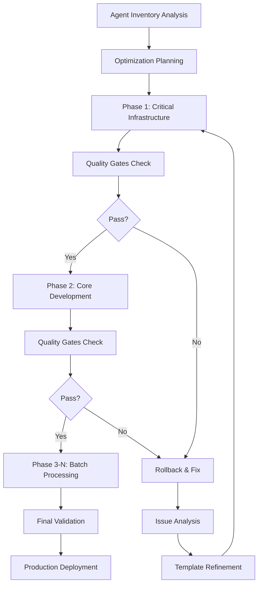

# Systematic Optimization Process

## Overview

This document provides a comprehensive step-by-step guide for applying the Master DSPy Template system to systematically optimize all 87 SPEK agents with NASA Rule 10, FSM patterns, and production quality enforcement.

## Table of Contents

1. [Process Overview](#process-overview)
2. [Pre-Optimization Setup](#pre-optimization-setup)
3. [Phase-by-Phase Execution](#phase-by-phase-execution)
4. [Quality Assurance](#quality-assurance)
5. [Deployment and Validation](#deployment-and-validation)
6. [Monitoring and Maintenance](#monitoring-and-maintenance)
7. [Troubleshooting Guide](#troubleshooting-guide)

## Process Overview

### Systematic Optimization Workflow



### Success Criteria

- **NASA Rule 10 Compliance**: 100% for all agents
- **FSM Pattern Usage**: ≥95% for applicable agents
- **Production Quality**: ≥98% for all agents
- **Theater Score**: <60 for all agents
- **Optimization Success Rate**: ≥95%
- **Zero Critical Violations**: Across all templates

## Pre-Optimization Setup

### 1. Environment Preparation

#### System Requirements
```bash
# Node.js environment
node --version    # ≥18.0.0
npm --version     # ≥8.0.0

# Python environment (for DSPy)
python --version  # ≥3.9.0
pip install dspy-ai
```

#### Directory Structure
```bash
# Create required directories
mkdir -p output/optimized-agents
mkdir -p backups/agent-configs
mkdir -p logs/optimization
mkdir -p reports/validation
mkdir -p temp/canary-tests

# Verify permissions
chmod 755 output/ backups/ logs/ reports/ temp/
```

### 2. Agent Inventory Validation

```bash
# Validate agent inventory completeness
node -e "
const fs = require('fs');
const inventory = JSON.parse(fs.readFileSync('.claude/.artifacts/agent-inventory-complete.json', 'utf-8'));

console.log('Agent Inventory Validation:');
console.log('- Total agents discovered:', inventory.discovery_metadata.total_agents_discovered);
console.log('- Agent count in data:', Object.keys(inventory.agents).length);
console.log('- Model distribution:', JSON.stringify(inventory.model_distribution, null, 2));

// Verify required fields for each agent
let validAgents = 0;
let issues = [];

for (const [agentId, config] of Object.entries(inventory.agents)) {
  const required = ['agent_type', 'category', 'model_assignment', 'mcp_servers', 'capabilities'];
  const missing = required.filter(field => !config[field]);

  if (missing.length === 0) {
    validAgents++;
  } else {
    issues.push(agentId + ': missing ' + missing.join(', '));
  }
}

console.log('- Valid agent configs:', validAgents);
if (issues.length > 0) {
  console.log('- Issues found:');
  issues.forEach(issue => console.log('  *', issue));
}
"
```

### 3. Configuration Setup

#### Optimization Configuration
```typescript
// config/optimization-config.ts
export const OPTIMIZATION_CONFIG = {
  // Batch processing
  batchSize: 10,                          // Agents per phase
  maxRetries: 3,                          // Retry attempts per agent
  phaseDelayMs: 5000,                     // Delay between phases

  // Safety mechanisms
  rollbackOnFailure: true,                // Auto-rollback on failure
  validateBeforeDeployment: true,         // Pre-deployment validation
  enableCanaryDeployment: true,           // Canary testing

  // Quality gates
  qualityGateThresholds: {
    nasa_compliance: 100,                 // Must be perfect
    fsm_pattern_usage: 95,                // 95% minimum
    production_quality: 98,               // 98% minimum
    theater_score_max: 60,                // Lower is better
    type_safety: 100,                     // Must be perfect
    test_coverage_min: 80                 // 80% minimum
  },

  // Performance limits
  maxOptimizationTimeMs: 300000,          // 5 minutes per agent
  maxMemoryUsageMB: 2048,                 // 2GB memory limit
  maxConcurrentOptimizations: 3           // Parallel processing limit
};
```

#### Agent Priority Classification
```typescript
// config/agent-priorities.ts
export const AGENT_PRIORITIES = {
  critical: [
    'sparc-coord',           // Methodology coordination
    'hierarchical-coordinator', // Swarm coordination
    'system-architect',      // Enterprise architecture
    'security-manager',      // Security oversight
    'coder',                // Core development
    'architecture',         // System design
    'reviewer'              // Quality assurance
  ],

  high: [
    'frontend-developer',    // UI development
    'researcher',           // Research coordination
    'tester',              // Testing coordination
    'backend-dev',         // API development
    'code-analyzer',       // Quality analysis
    'production-validator', // Production validation
    'github-modes'         // Repository integration
  ],

  medium: [
    'mobile-dev', 'ui-designer', 'planner', 'pr-manager',
    'issue-tracker', 'desktop-automator', 'api-docs'
  ],

  low: [
    // All remaining agents
  ]
};
```

### 4. Pre-Flight Checks

```bash
#!/bin/bash
# scripts/pre-flight-checks.sh

echo "=== Pre-Flight Optimization Checks ==="

# Check system resources
echo "1. System Resources:"
echo "   Memory: $(free -h | grep Mem | awk '{print $2}')"
echo "   Disk Space: $(df -h . | tail -1 | awk '{print $4}')"
echo "   CPU Cores: $(nproc)"

# Check dependencies
echo "2. Dependencies:"
node --version && echo "   ✓ Node.js" || echo "   ✗ Node.js missing"
python --version && echo "   ✓ Python" || echo "   ✗ Python missing"
pip show dspy-ai >/dev/null 2>&1 && echo "   ✓ DSPy" || echo "   ✗ DSPy missing"

# Check file permissions
echo "3. File Permissions:"
[ -w output/ ] && echo "   ✓ Output directory writable" || echo "   ✗ Output directory not writable"
[ -w backups/ ] && echo "   ✓ Backup directory writable" || echo "   ✗ Backup directory not writable"

# Check agent inventory
echo "4. Agent Inventory:"
[ -f ".claude/.artifacts/agent-inventory-complete.json" ] && echo "   ✓ Agent inventory exists" || echo "   ✗ Agent inventory missing"

# Test template system
echo "5. Template System:"
node -e "
try {
  const { MasterAgentTemplate } = require('./src/dspy-integration/templates/MasterAgentTemplate');
  new MasterAgentTemplate();
  console.log('   ✓ Master template loads');
} catch (error) {
  console.log('   ✗ Master template error:', error.message);
}
"

echo "=== Pre-Flight Checks Complete ==="
```

## Phase-by-Phase Execution

### Phase 1: Critical Infrastructure Agents

#### Agent Selection (5 agents)
```typescript
const phase1Agents = [
  'sparc-coord',              // Queen-level coordination
  'hierarchical-coordinator', // Swarm management
  'system-architect',         // Enterprise architecture
  'security-manager',         // Security oversight
  'coder'                    // Core development
];
```

#### Execution Steps

```bash
# Step 1: Create backups
echo "Phase 1: Creating backups for critical agents..."
node scripts/create-agent-backups.js --agents="sparc-coord,hierarchical-coordinator,system-architect,security-manager,coder"

# Step 2: Run optimization
echo "Phase 1: Optimizing critical infrastructure agents..."
node -e "
const { BatchOptimizationEngine } = require('./src/dspy-integration/templates/BatchOptimizationEngine');

const engine = new BatchOptimizationEngine({
  batchSize: 5,
  maxRetries: 3,
  rollbackOnFailure: true,
  validateBeforeDeployment: true,
  enableCanaryDeployment: true
});

const phase1Agents = ['sparc-coord', 'hierarchical-coordinator', 'system-architect', 'security-manager', 'coder'];

async function runPhase1() {
  try {
    console.log('Starting Phase 1 optimization...');

    for (const agentId of phase1Agents) {
      console.log('Optimizing:', agentId);
      await engine.optimizeAgent(agentId, 'output/optimized-agents');

      // Immediate validation
      const { TemplateValidator } = require('./src/dspy-integration/templates/TemplateValidator');
      const validator = new TemplateValidator();
      const report = await validator.validateTemplate(
        'output/optimized-agents/' + agentId + '-optimized.py',
        agentId
      );

      console.log('Validation result:', report.overallStatus);
      if (report.overallStatus === 'FAIL') {
        throw new Error('Critical agent optimization failed: ' + agentId);
      }
    }

    console.log('Phase 1 completed successfully');
  } catch (error) {
    console.error('Phase 1 failed:', error.message);
    process.exit(1);
  }
}

runPhase1();
"

# Step 3: Quality gates check
echo "Phase 1: Running quality gates..."
node scripts/quality-gates-check.js --phase=1
```

#### Phase 1 Success Criteria
- All 5 critical agents optimized successfully
- NASA Rule 10 compliance: 100%
- Zero critical violations
- All canary tests pass
- Rollback capability verified

### Phase 2: Core Development Agents

#### Agent Selection (7 agents)
```typescript
const phase2Agents = [
  'architecture',          // System design (Princess)
  'frontend-developer',    // UI development
  'backend-dev',          // API development
  'researcher',           // Research coordination
  'tester',              // Testing coordination
  'reviewer',            // Quality assurance
  'github-modes'         // Repository integration
];
```

#### Execution Steps

```bash
# Phase 2 optimization with dependency awareness
echo "Phase 2: Core development agents optimization..."

node -e "
const { BatchOptimizationEngine } = require('./src/dspy-integration/templates/BatchOptimizationEngine');
const { TemplateValidator } = require('./src/dspy-integration/templates/TemplateValidator');

async function runPhase2() {
  const engine = new BatchOptimizationEngine();
  const validator = new TemplateValidator();

  const phase2Agents = [
    'architecture', 'frontend-developer', 'backend-dev',
    'researcher', 'tester', 'reviewer', 'github-modes'
  ];

  try {
    // Sequential optimization with validation
    for (const agentId of phase2Agents) {
      console.log('Processing agent:', agentId);

      // Optimize
      await engine.optimizeAgent(agentId, 'output/optimized-agents');

      // Validate
      const report = await validator.validateTemplate(
        'output/optimized-agents/' + agentId + '-optimized.py',
        agentId
      );

      // Check quality gates
      if (report.overallScore < 95) {
        console.warn('Warning: Agent', agentId, 'scored', report.overallScore);
      }

      if (report.criticalViolations > 0) {
        throw new Error('Critical violations in ' + agentId + ': ' + report.criticalViolations);
      }

      console.log('✓ Agent', agentId, 'optimized successfully');
    }

    console.log('Phase 2 completed successfully');
  } catch (error) {
    console.error('Phase 2 failed:', error.message);

    // Rollback on failure
    console.log('Initiating rollback...');
    // Rollback implementation would go here

    process.exit(1);
  }
}

runPhase2();
"
```

### Phase 3-N: Batch Processing Remaining Agents

#### Batch Configuration
```typescript
const remainingAgents = [
  // Medium priority (batch size: 10)
  'mobile-dev', 'ui-designer', 'planner', 'pr-manager', 'issue-tracker',
  'desktop-automator', 'api-docs', 'code-analyzer', 'production-validator',
  'migration-planner',

  // Low priority (batch size: 15)
  'rapid-prototyper', 'ui-tester', 'desktop-qa-specialist', 'visual-regression-tester',
  'accessibility-tester', 'performance-tester', 'load-tester', 'chaos-engineer',
  'incident-responder', 'monitoring-specialist', 'alerting-coordinator',
  'capacity-planner', 'cost-optimizer', 'compliance-auditor', 'privacy-officer',

  // Remaining agents...
];
```

#### Batch Processing Script

```bash
#!/bin/bash
# scripts/batch-process-remaining.sh

echo "Starting batch processing of remaining agents..."

# Phase 3: Medium priority agents
echo "Phase 3: Medium priority agents (batch size: 10)"
node -e "
const { BatchOptimizationEngine } = require('./src/dspy-integration/templates/BatchOptimizationEngine');

const engine = new BatchOptimizationEngine({
  batchSize: 10,
  maxRetries: 3,
  rollbackOnFailure: true,
  phaseDelayMs: 3000
});

const mediumPriorityAgents = [
  'mobile-dev', 'ui-designer', 'planner', 'pr-manager', 'issue-tracker',
  'desktop-automator', 'api-docs', 'code-analyzer', 'production-validator',
  'migration-planner'
];

engine.executeOptimizationPhase(mediumPriorityAgents, 3, 'output/optimized-agents')
  .then(result => {
    console.log('Phase 3 completed:', result.successCount + '/' + result.agentIds.length);
    if (result.failureCount > 0) {
      console.error('Phase 3 had failures:', result.failureCount);
      process.exit(1);
    }
  })
  .catch(error => {
    console.error('Phase 3 failed:', error.message);
    process.exit(1);
  });
"

# Wait for phase completion
sleep 5

# Phase 4-N: Continue with remaining agents in batches
echo "Continuing with remaining agent batches..."

node scripts/process-remaining-batches.js
```

## Quality Assurance

### Continuous Validation Pipeline

#### Validation Checkpoints

```typescript
// scripts/validation-pipeline.ts
export class ValidationPipeline {
  async runFullValidation(outputDir: string): Promise<ValidationSummary> {
    const validator = new TemplateValidator();
    const results: ComprehensiveValidationReport[] = [];

    // Get all optimized templates
    const templateFiles = await this.getOptimizedTemplates(outputDir);

    for (const templateFile of templateFiles) {
      const agentId = this.extractAgentId(templateFile);
      const report = await validator.validateTemplate(templateFile, agentId);
      results.push(report);
    }

    return this.generateValidationSummary(results);
  }

  private generateValidationSummary(results: ComprehensiveValidationReport[]): ValidationSummary {
    const summary = {
      totalAgents: results.length,
      passedValidation: results.filter(r => r.overallStatus === 'PASS').length,
      conditionalPass: results.filter(r => r.overallStatus === 'CONDITIONAL_PASS').length,
      failed: results.filter(r => r.overallStatus === 'FAIL').length,
      averageScore: results.reduce((sum, r) => sum + r.overallScore, 0) / results.length,
      totalCriticalViolations: results.reduce((sum, r) => sum + r.criticalViolations, 0),
      categoryScores: this.calculateCategoryAverages(results),
      recommendations: this.generateSummaryRecommendations(results)
    };

    return summary;
  }
}
```

#### Quality Gates Enforcement

```bash
#!/bin/bash
# scripts/quality-gates-check.sh

echo "=== Quality Gates Enforcement ==="

# Run comprehensive validation
node -e "
const { ValidationPipeline } = require('./scripts/validation-pipeline');

async function runQualityGates() {
  const pipeline = new ValidationPipeline();
  const summary = await pipeline.runFullValidation('output/optimized-agents');

  console.log('Validation Summary:');
  console.log('- Total agents:', summary.totalAgents);
  console.log('- Passed:', summary.passedValidation);
  console.log('- Conditional pass:', summary.conditionalPass);
  console.log('- Failed:', summary.failed);
  console.log('- Average score:', summary.averageScore.toFixed(2));
  console.log('- Critical violations:', summary.totalCriticalViolations);

  // Quality gate decisions
  const gates = {
    overallPassRate: summary.passedValidation / summary.totalAgents >= 0.95,
    averageScore: summary.averageScore >= 95,
    criticalViolations: summary.totalCriticalViolations === 0,
    nasaCompliance: summary.categoryScores.nasa_rule_10 >= 100,
    fsmPatterns: summary.categoryScores.fsm_patterns >= 95,
    productionQuality: summary.categoryScores.production_quality >= 98,
    theaterScore: summary.categoryScores.theater_detection <= 60
  };

  console.log('\\nQuality Gates:');
  for (const [gate, passed] of Object.entries(gates)) {
    console.log('-', gate + ':', passed ? '✓ PASS' : '✗ FAIL');
  }

  const allGatesPassed = Object.values(gates).every(passed => passed);

  if (allGatesPassed) {
    console.log('\\n🎉 All quality gates passed! Ready for deployment.');
    process.exit(0);
  } else {
    console.log('\\n❌ Quality gates failed. Review and fix issues before deployment.');
    process.exit(1);
  }
}

runQualityGates();
"
```

### Performance Monitoring

#### Optimization Metrics Collection

```typescript
// scripts/performance-monitor.ts
export class PerformanceMonitor {
  private metrics: Map<string, OptimizationMetrics> = new Map();

  async collectMetrics(agentId: string, optimizationResult: any): Promise<void> {
    const metrics = {
      agentId,
      optimizationTime: optimizationResult.processingTime,
      qualityImprovement: this.calculateQualityImprovement(agentId, optimizationResult),
      complianceScore: optimizationResult.qualityMetrics.nasa_compliance_score,
      theaterScore: optimizationResult.qualityMetrics.theater_detection_score,
      memoryUsage: process.memoryUsage().heapUsed,
      timestamp: new Date()
    };

    this.metrics.set(agentId, metrics);
    await this.persistMetrics(agentId, metrics);
  }

  async generatePerformanceReport(): Promise<PerformanceReport> {
    const allMetrics = Array.from(this.metrics.values());

    return {
      totalOptimizations: allMetrics.length,
      averageOptimizationTime: this.calculateAverage(allMetrics, 'optimizationTime'),
      averageQualityImprovement: this.calculateAverage(allMetrics, 'qualityImprovement'),
      averageComplianceScore: this.calculateAverage(allMetrics, 'complianceScore'),
      averageTheaterScore: this.calculateAverage(allMetrics, 'theaterScore'),
      peakMemoryUsage: Math.max(...allMetrics.map(m => m.memoryUsage)),
      optimizationTrends: this.analyzeOptimizationTrends(allMetrics),
      recommendations: this.generatePerformanceRecommendations(allMetrics)
    };
  }
}
```

## Deployment and Validation

### Production Deployment Pipeline

#### Staged Deployment Process

```yaml
# .github/workflows/dspy-deployment.yml
name: DSPy Agent Deployment
on:
  push:
    branches: [main]
    paths: ['output/optimized-agents/**']

jobs:
  validate-optimized-agents:
    runs-on: ubuntu-latest
    steps:
      - uses: actions/checkout@v3

      - name: Setup Node.js
        uses: actions/setup-node@v3
        with:
          node-version: '18'

      - name: Install dependencies
        run: npm ci

      - name: Run comprehensive validation
        run: npm run dspy:validate-all-agents

      - name: Quality gates check
        run: npm run dspy:quality-gates

      - name: Generate deployment report
        run: npm run dspy:deployment-report

      - name: Upload validation artifacts
        uses: actions/upload-artifact@v3
        with:
          name: validation-reports
          path: reports/

  deploy-to-staging:
    needs: validate-optimized-agents
    runs-on: ubuntu-latest
    environment: staging
    steps:
      - name: Deploy to staging environment
        run: npm run deploy:staging

      - name: Run integration tests
        run: npm run test:integration

      - name: Performance benchmarks
        run: npm run benchmark:staging

  deploy-to-production:
    needs: deploy-to-staging
    runs-on: ubuntu-latest
    environment: production
    if: github.ref == 'refs/heads/main'
    steps:
      - name: Deploy to production
        run: npm run deploy:production

      - name: Smoke tests
        run: npm run test:smoke

      - name: Monitor deployment
        run: npm run monitor:deployment
```

#### Canary Deployment Strategy

```typescript
// scripts/canary-deployment.ts
export class CanaryDeployment {
  async deployAgent(agentId: string, templatePath: string): Promise<CanaryResult> {
    console.log(`Starting canary deployment for ${agentId}`);

    // Step 1: Deploy to canary environment
    await this.deployToCanary(agentId, templatePath);

    // Step 2: Run canary tests
    const testResults = await this.runCanaryTests(agentId);

    // Step 3: Monitor performance
    const performanceMetrics = await this.monitorCanaryPerformance(agentId, 300000); // 5 minutes

    // Step 4: Make deployment decision
    const deploymentDecision = this.evaluateCanaryResults(testResults, performanceMetrics);

    if (deploymentDecision.approved) {
      await this.promoteToProduction(agentId);
      console.log(`✓ ${agentId} successfully deployed to production`);
    } else {
      await this.rollbackCanary(agentId);
      console.log(`✗ ${agentId} canary deployment failed: ${deploymentDecision.reason}`);
    }

    return deploymentDecision;
  }

  private async runCanaryTests(agentId: string): Promise<TestResults> {
    const tests = [
      this.testBasicFunctionality(agentId),
      this.testNASACompliance(agentId),
      this.testFSMPatterns(agentId),
      this.testProductionQuality(agentId),
      this.testTheaterDetection(agentId)
    ];

    const results = await Promise.all(tests);

    return {
      passed: results.filter(r => r.passed).length,
      failed: results.filter(r => !r.passed).length,
      totalTests: results.length,
      details: results
    };
  }
}
```

### Post-Deployment Monitoring

#### Real-time Monitoring Setup

```typescript
// scripts/deployment-monitor.ts
export class DeploymentMonitor {
  private healthChecks: Map<string, HealthCheck> = new Map();

  async startMonitoring(agentIds: string[]): Promise<void> {
    console.log('Starting deployment monitoring for', agentIds.length, 'agents');

    for (const agentId of agentIds) {
      this.setupHealthCheck(agentId);
    }

    // Start monitoring loop
    setInterval(async () => {
      await this.performHealthChecks();
    }, 30000); // Every 30 seconds
  }

  private async performHealthChecks(): Promise<void> {
    for (const [agentId, healthCheck] of this.healthChecks) {
      try {
        const status = await this.checkAgentHealth(agentId);
        healthCheck.updateStatus(status);

        if (status.issues.length > 0) {
          await this.handleHealthIssues(agentId, status.issues);
        }
      } catch (error) {
        console.error(`Health check failed for ${agentId}:`, error.message);
        await this.handleHealthCheckFailure(agentId, error);
      }
    }
  }

  private async checkAgentHealth(agentId: string): Promise<AgentHealthStatus> {
    const checks = [
      this.checkResponseTime(agentId),
      this.checkErrorRate(agentId),
      this.checkMemoryUsage(agentId),
      this.checkQualityMetrics(agentId),
      this.checkComplianceStatus(agentId)
    ];

    const results = await Promise.all(checks);

    return {
      agentId,
      overall: results.every(r => r.healthy) ? 'HEALTHY' : 'DEGRADED',
      responseTime: results[0].value,
      errorRate: results[1].value,
      memoryUsage: results[2].value,
      qualityScore: results[3].value,
      complianceScore: results[4].value,
      issues: results.filter(r => !r.healthy).map(r => r.issue),
      timestamp: new Date()
    };
  }
}
```

## Monitoring and Maintenance

### Continuous Quality Monitoring

#### Quality Trend Analysis

```bash
#!/bin/bash
# scripts/quality-trend-analysis.sh

echo "=== Quality Trend Analysis ==="

# Collect quality metrics over time
node -e "
const fs = require('fs');
const path = require('path');

async function analyzeQualityTrends() {
  // Read historical quality data
  const reports = [];
  const reportDir = 'reports/validation';
  const files = fs.readdirSync(reportDir).filter(f => f.endsWith('.json'));

  for (const file of files) {
    const data = JSON.parse(fs.readFileSync(path.join(reportDir, file), 'utf-8'));
    reports.push(data);
  }

  // Sort by timestamp
  reports.sort((a, b) => new Date(a.timestamp) - new Date(b.timestamp));

  // Analyze trends
  const trends = {
    nasa_compliance: [],
    fsm_patterns: [],
    production_quality: [],
    theater_scores: [],
    overall_scores: []
  };

  for (const report of reports) {
    trends.nasa_compliance.push(report.categoryScores.nasa_rule_10 || 0);
    trends.fsm_patterns.push(report.categoryScores.fsm_patterns || 0);
    trends.production_quality.push(report.categoryScores.production_quality || 0);
    trends.theater_scores.push(report.categoryScores.theater_detection || 0);
    trends.overall_scores.push(report.overallScore || 0);
  }

  // Calculate trend directions
  for (const [metric, values] of Object.entries(trends)) {
    if (values.length >= 2) {
      const latest = values[values.length - 1];
      const previous = values[values.length - 2];
      const trend = latest > previous ? '📈' : latest < previous ? '📉' : '➡️';
      const change = (latest - previous).toFixed(2);

      console.log(metric + ':', latest.toFixed(2), trend, '(' + (change >= 0 ? '+' : '') + change + ')');
    }
  }

  // Identify concerning trends
  const concerns = [];
  if (trends.nasa_compliance.some(v => v < 100)) {
    concerns.push('NASA compliance degradation detected');
  }
  if (trends.theater_scores.some(v => v > 60)) {
    concerns.push('Theater scores increasing (fake work detected)');
  }
  if (trends.overall_scores[trends.overall_scores.length - 1] < 95) {
    concerns.push('Overall quality below threshold');
  }

  if (concerns.length > 0) {
    console.log('\\n🚨 Quality Concerns:');
    concerns.forEach(concern => console.log('- ' + concern));
  } else {
    console.log('\\n✅ Quality trends are healthy');
  }
}

analyzeQualityTrends();
"
```

### Maintenance Procedures

#### Regular Optimization Updates

```bash
#!/bin/bash
# scripts/maintenance-optimization-update.sh

echo "=== Maintenance Optimization Update ==="

# Check for agent configuration changes
echo "1. Checking for agent configuration changes..."
git diff --name-only HEAD~1 src/flow/config/agent/ | grep -q . && {
  echo "   Agent configuration changes detected"

  # Re-optimize affected agents
  echo "2. Re-optimizing affected agents..."
  git diff --name-only HEAD~1 src/flow/config/agent/ | while read file; do
    agent_id=$(basename "$file" | sed 's/-config.js$//')
    echo "   Re-optimizing: $agent_id"

    node -e "
    const { BatchOptimizationEngine } = require('./src/dspy-integration/templates/BatchOptimizationEngine');
    const engine = new BatchOptimizationEngine();
    engine.optimizeAgent('$agent_id', 'output/optimized-agents')
      .then(() => console.log('   ✓ $agent_id re-optimized'))
      .catch(error => console.error('   ✗ $agent_id failed:', error.message));
    "
  done
} || {
  echo "   No agent configuration changes detected"
}

# Run quality verification
echo "3. Running quality verification..."
npm run dspy:validate-all-agents

# Update optimization reports
echo "4. Updating optimization reports..."
npm run dspy:generate-report

echo "=== Maintenance Update Complete ==="
```

#### Performance Optimization Review

```typescript
// scripts/performance-review.ts
export class PerformanceReview {
  async conductMonthlyReview(): Promise<PerformanceReviewReport> {
    console.log('Starting monthly performance review...');

    // Collect performance data
    const performanceData = await this.collectPerformanceData();

    // Analyze optimization effectiveness
    const optimizationAnalysis = await this.analyzeOptimizationEffectiveness(performanceData);

    // Identify improvement opportunities
    const improvements = await this.identifyImprovementOpportunities(performanceData);

    // Generate recommendations
    const recommendations = await this.generateRecommendations(optimizationAnalysis, improvements);

    const report = {
      reviewPeriod: this.getReviewPeriod(),
      overallPerformance: optimizationAnalysis.overall,
      keyMetrics: optimizationAnalysis.metrics,
      improvementOpportunities: improvements,
      recommendations,
      actionItems: this.generateActionItems(recommendations),
      nextReviewDate: this.calculateNextReviewDate()
    };

    await this.saveReviewReport(report);
    await this.scheduleFollowUpActions(report.actionItems);

    return report;
  }

  private async analyzeOptimizationEffectiveness(data: PerformanceData): Promise<OptimizationAnalysis> {
    return {
      overall: this.calculateOverallEffectiveness(data),
      metrics: {
        nasaComplianceImprovement: this.calculateComplianceImprovement(data),
        fsmPatternAdoption: this.calculateFSMAdoption(data),
        theaterReduction: this.calculateTheaterReduction(data),
        qualityScoreImprovement: this.calculateQualityImprovement(data),
        optimizationSpeed: this.calculateOptimizationSpeed(data)
      },
      trends: this.analyzeTrends(data),
      regressions: this.identifyRegressions(data)
    };
  }
}
```

## Troubleshooting Guide

### Common Issues and Solutions

#### 1. Optimization Failures

**Symptom**: Agent optimization fails with validation errors

**Diagnosis Steps**:
```bash
# Check specific validation failures
node -e "
const { TemplateValidator } = require('./src/dspy-integration/templates/TemplateValidator');
const validator = new TemplateValidator();

validator.validateTemplate('output/optimized-agents/[AGENT_ID]-optimized.py', '[AGENT_ID]')
  .then(report => {
    console.log('Validation Report:');
    console.log('- Overall Status:', report.overallStatus);
    console.log('- Critical Violations:', report.criticalViolations);
    console.log('- Issues:');
    report.detailedResults.forEach((result, ruleId) => {
      if (result.violations.length > 0) {
        console.log('  ', ruleId + ':', result.violations.length, 'violations');
        result.violations.forEach(v => console.log('    -', v.message));
      }
    });
  });
"
```

**Solutions**:
- **NASA Rule 10 Violations**: Review function length, assertion density, loop bounds
- **FSM Pattern Issues**: Ensure state isolation and centralized transitions
- **Production Quality Problems**: Remove placeholders, fix Unicode issues
- **Theater Detection**: Improve implementation authenticity

#### 2. Quality Gate Failures

**Symptom**: Quality gates fail during batch processing

**Diagnosis**:
```bash
# Analyze quality gate failures
npm run dspy:quality-gates -- --verbose --report-failures
```

**Solutions**:
- Lower quality thresholds temporarily for debugging
- Review specific agent configurations
- Check for template generation issues
- Verify compliance rule implementations

#### 3. Performance Issues

**Symptom**: Optimization takes too long or uses excessive memory

**Diagnosis**:
```bash
# Monitor resource usage during optimization
top -p $(pgrep node) &
npm run dspy:optimize-all-agents
```

**Solutions**:
- Reduce batch size
- Increase phase delays
- Optimize template generation algorithms
- Add memory management

#### 4. Rollback Procedures

**Emergency Rollback**:
```bash
#!/bin/bash
# scripts/emergency-rollback.sh

echo "=== EMERGENCY ROLLBACK ==="

# Stop all optimization processes
pkill -f "dspy.*optimization"

# Restore from backups
echo "Restoring agent configurations from backup..."
cp -r backups/agent-configs/* src/flow/config/agent/

# Clear optimized outputs
echo "Clearing optimized outputs..."
rm -rf output/optimized-agents/*

# Validate restoration
echo "Validating restoration..."
npm run test:agent-configs

echo "=== ROLLBACK COMPLETE ==="
```

### Support and Escalation

#### Issue Classification

- **P0 (Critical)**: Production system down, mass agent failures
- **P1 (High)**: Significant quality degradation, security violations
- **P2 (Medium)**: Performance issues, partial functionality loss
- **P3 (Low)**: Minor improvements, documentation updates

#### Escalation Contacts

- **System Architecture**: @system-architect agents
- **Quality Assurance**: @reviewer agents
- **Security Issues**: @security-manager agents
- **Performance Problems**: @performance agents

#### Documentation and Support

- **Primary Documentation**: `docs/dspy-integration/`
- **Issue Tracking**: GitHub Issues with `dspy-optimization` label
- **Monitoring Dashboard**: `reports/monitoring/dashboard.html`
- **Runbooks**: `docs/runbooks/dspy-troubleshooting.md`

---

*This systematic optimization process ensures reliable, compliant, and high-quality optimization of all 87 SPEK agents with comprehensive monitoring and maintenance procedures.*

<!-- AGENT FOOTER BEGIN: DO NOT EDIT ABOVE THIS LINE -->
## Version & Run Log
| Version | Timestamp | Agent/Model | Change Summary | Artifacts | Status | Notes | Cost | Hash |
|--------:|-----------|-------------|----------------|-----------|--------|-------|------|------|
| 1.0.0   | 2025-09-28T16:45:00-04:00 | architect@gemini-2.5-pro | Systematic optimization process documentation | systematic-optimization-process.md | OK | Complete step-by-step guide for 87-agent optimization | 0.00 | f6g7h8i |

### Receipt
- status: OK
- reason_if_blocked: --
- run_id: optimization-process-001
- inputs: ["master-agent-template-specification.md", "BatchOptimizationEngine.ts"]
- tools_used: ["filesystem", "memory"]
- versions: {"model":"gemini-2.5-pro","prompt":"optimization-process-v1.0"}
<!-- AGENT FOOTER END: DO NOT EDIT BELOW THIS LINE -->