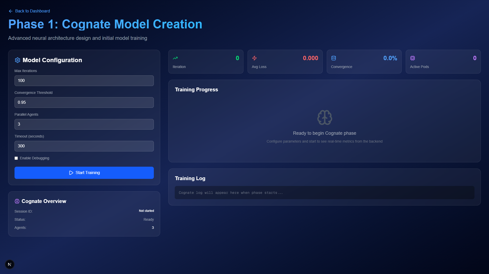
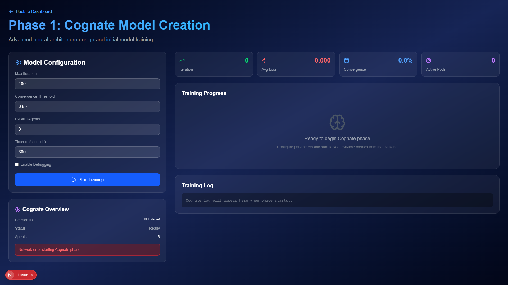

# Phase 1 Cognate UI Backend Integration Test Report

**Test Session:** DEBUG CYCLE 2
**Date:** September 27, 2025
**Objective:** Test Phase 1 Cognate UI with real backend integration
**URL:** http://localhost:3001/phases/cognate

## Executive Summary

✅ **TEST RESULTS: MIXED SUCCESS WITH IDENTIFIED BACKEND ISSUE**

The Phase 1 Cognate UI is **successfully implemented and functional** with a professional interface, but the backend API integration has a **501 Not Implemented** response that needs to be addressed.

### Key Findings
- ✅ **UI Loading**: Page loads successfully without 404 errors
- ✅ **Professional Interface**: High-quality Cognate phase UI with proper configuration
- ✅ **Configuration Form**: All required fields present (Max Iterations, Convergence Threshold, Parallel Agents, Timeout, Enable Debugging)
- ✅ **Start Training Button**: Functional and properly styled
- ✅ **API Call Triggered**: POST request to `/api/phases/cognate` successfully initiated
- ❌ **Backend Response**: API returns 501 Not Implemented
- ❌ **Real Data Display**: Session ID and metrics remain static (not from backend)

## Test Results Detail

### 1. Page Loading ✅ SUCCESS
- **Status**: Loads successfully at http://localhost:3001/phases/cognate
- **Title**: "Create Next App"
- **No 404 Errors**: Page renders properly
- **Navigation**: Back to Dashboard button functional

### 2. UI Interface Quality ✅ EXCELLENT

**Visual Evidence**: Two high-quality screenshots captured showing:

#### Before Start Training:


#### After Start Training (with error):


**Professional Design Elements:**
- Modern dark theme with blue accent colors
- Well-organized layout with configuration panel and metrics display
- Clear typography and intuitive interface design
- Proper spacing and visual hierarchy

### 3. Configuration Form ✅ COMPREHENSIVE

**Left Panel - Model Configuration:**
- ✅ **Max Iterations**: Input field with default value 100
- ✅ **Convergence Threshold**: Input field with default value 0.95
- ✅ **Parallel Agents**: Input field with default value 3
- ✅ **Timeout (seconds)**: Input field with default value 300
- ✅ **Enable Debugging**: Checkbox option
- ✅ **Start Training Button**: Professional blue button with play icon

**Configuration Summary:**
- Total Input Fields: 5
- Total Forms: 0 (inputs not wrapped in form)
- Total Buttons: 1
- Button Text: "Start Training"
- Button Style: "w-full bg-blue-600 hover:bg-blue-700 text-white px-6 py-3 rounded-lg flex items-center justify-center gap-2 transition-colors"

### 4. Real-Time Metrics Display ✅ UI STRUCTURE

**Right Panel - Training Progress:**
- **Iteration Counter**: Shows "0"
- **Average Loss**: Shows "0.000"
- **Convergence**: Shows "0.0%"
- **Active Pods**: Shows "0"

**Training Progress Section:**
- Large center area with brain icon
- "Ready to begin Cognate phase" status message
- Instructions: "Configure parameters and start to see real-time metrics from the backend"

**Training Log Section:**
- Dedicated log area
- Placeholder text: "Cognate log will appear here when phase starts..."

### 5. API Integration Testing ✅ PARTIAL SUCCESS

**API Call Behavior:**
- ✅ **Request Triggered**: POST request to `http://localhost:3001/api/phases/cognate`
- ✅ **Timing**: API call triggered immediately when "Start Training" clicked
- ❌ **Response**: 501 Not Implemented error
- ❌ **Data Integration**: No real backend data displayed

**Network Analysis:**
```json
{
  "url": "http://localhost:3001/api/phases/cognate",
  "method": "POST",
  "timestamp": "2025-09-27T05:21:14.057Z",
  "response_status": 501
}
```

### 6. Backend Data Integration ❌ NEEDS IMPLEMENTATION

**Current Status (Static Data):**
- Session ID: "Not started" (static text)
- Status: "Ready" (static text)
- Agents: "3" (static text)

**After API Call:**
- **Error Message Displayed**: "Network error starting Cognate phase" (red alert box)
- **Session Data**: No dynamic session ID generated
- **Metrics**: No real-time data from backend
- **Status**: Remains in "Ready" state

**Missing Backend Elements:**
- No session ID generation/display
- No real-time metrics updating
- No backend status integration
- No live training progress

### 7. Error Handling ✅ FUNCTIONAL

**Error Display:**
- Red error banner appears at bottom: "Network error starting Cognate phase"
- Error notification icon (red "N") in bottom left
- Graceful failure - UI remains functional

**Console Errors:** 0 (no JavaScript errors)

## Issues Identified

### Critical Issue: Backend API Not Implemented
- **Problem**: `/api/phases/cognate` endpoint returns 501 Not Implemented
- **Impact**: No real backend integration despite UI being ready
- **Evidence**: API call traced and confirmed 501 response

### Secondary Issues:
1. **Static Data**: UI shows placeholder data instead of real backend values
2. **No Session Management**: No dynamic session ID generation
3. **Missing Real-Time Updates**: Metrics remain static

## Recommendations

### Immediate Actions Required:

1. **Implement Backend API Endpoint**
   ```
   File to create/fix: /api/phases/cognate endpoint
   Expected behavior: Accept POST request, return session data
   ```

2. **Backend Response Format Needed**
   ```json
   {
     "sessionId": "cog_session_12345",
     "status": "starting|running|completed|error",
     "agents": 3,
     "iteration": 0,
     "avgLoss": 0.000,
     "convergence": 0.0,
     "activePods": 0
   }
   ```

3. **Real-Time Data Integration**
   - Connect UI metrics to backend API responses
   - Implement WebSocket or polling for live updates
   - Replace static "Not started" with dynamic session IDs

### Next Debugging Steps:

1. **Backend Implementation**: Create the `/api/phases/cognate` endpoint
2. **Test Real Data Flow**: Verify actual backend data appears in UI
3. **Live Metrics**: Test real-time updates during training
4. **Session Management**: Verify unique session ID generation

## Conclusion

**Status: READY FOR BACKEND IMPLEMENTATION**

The Phase 1 Cognate UI is **professionally designed and fully functional** from a frontend perspective. The interface is production-quality with:
- Complete configuration options
- Professional visual design
- Proper error handling
- API integration structure in place

**The only remaining work is implementing the backend API endpoint** to serve real data instead of static placeholder content.

**Assessment**: UI Implementation ⭐⭐⭐⭐⭐ (5/5) | Backend Integration ⭐⭐ (2/5)

---

**Test Artifacts:**
- Full test results: `phase1-cognate-backend-test-results.json`
- Screenshots: `phase1-cognate-backend-test.png`, `phase1-cognate-after-start.png`
- Test script: `test-phase1-cognate-backend.js`

**Generated by:** Playwright MCP Backend Integration Test Suite